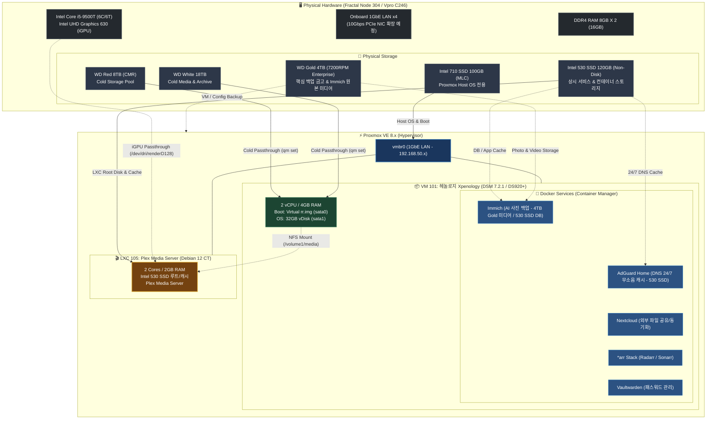

# 🗄️ NAS 프로젝트 모음

NAS 인프라 구축 및 클라우드 아키텍처 설계를 다루는 저장소입니다.

## 📂 프로젝트 구성

- [`self-nas/`](self-nas) — 자작 홈서버(MTK Studio) 구축 기록. 10Gbps 네트워크, Proxmox 가상화, Xpenology(헤놀로지) 기반 미디어/백업 서비스 구성.
- [`cloud-nas/`](cloud-nas) — Oracle Cloud Infrastructure 인스턴스 기반 NAS 아키텍처 설계 문서. Docker Compose, Spring Boot/Kotlin 백엔드, Vue 프론트엔드, 모니터링, CI/CD 포함.

---

## 🏗️ Self-NAS 아키텍처 및 구성도

자작 홈서버(`self-nas`)의 하드웨어 스펙 및 Proxmox VE 가상화(VM / LXC / Docker) 구성도입니다.

### 📋 주요 구성 요약

| 레이어 | 구성 요소 | 상세 내용 |
| :--- | :--- | :--- |
| **물리 하드웨어** | CPU / RAM / Storage | Intel i5-9500T (6C/6T, UHD 630 iGPU), DDR4 16GB, Intel 710 SSD(100GB), Intel 530 SSD(120GB), WD Gold 4TB, WD Red 8TB, WD White 18TB |
| **하이퍼바이저** | Proxmox VE 8.x | 베이스 OS (Intel 710 SSD 전용 구동), 가상 네트워크 브리지(`vmbr0`), 스토리지 & iGPU 패스스루 라우팅 |
| **가상 머신 (VM)** | VM 101: 헤놀로지 (DSM 7.2.1) | 2 Core / 4GB RAM, HDD Cold 패스스루(Red 8TB, White 18TB 전용), Docker 서비스(Immich, AdGuard, Nextcloud, *arr, Vaultwarden) |
| | *(선택 확장) Windows VM* | *(추후 필요 시에만 최소 리소스로 On-Demand 생성 예정)* |
| **LXC 컨테이너** | LXC 105: Plex Media Server | 2 Core / 2GB RAM (Debian 12), Intel 530 SSD 기반 루트/캐시, iGPU HW 트랜스코딩 가속, 헤놀로지 미디어 NFS 마운트 연동 |

### 💾 물리적 디스크 용도 및 역할 분담 (4-Tier Storage)

| 티어 (Tier) | 디스크 모델 | 연결 방식 / 마운트 위치 | 주요 용도 및 역할 |
| :--- | :--- | :--- | :--- |
| **`HOST OS 전용`** | **Intel 710 SSD 100GB** (MLC) | Proxmox 호스트 직접 설치 | - **Proxmox VE Host OS 전용** 구동 (초고내구성 HET-MLC 기반 안정성 극대화) - Host OS 외 일체 서비스 미설치 |
| **`상시 고속 서비스` *(Non-Disk)*** | **Intel 530 SSD 120GB** | Proxmox 로컬 고속 스토리지 / VM | - **24/7 상시 무소음 서비스 전용** (대형 HDD 스핀다운 유지) - **Plex Media Server (LXC 105)** 루트 컨테이너 및 메타데이터/트랜스코딩 캐시 - **Immich** 고속 앱 실행 및 PostgreSQL/벡터 메타데이터 DB I/O 가속 - **AdGuard Home** 24/7 DNS 쿼리 로그 및 필터 캐시 - *(추후 필요 시 경량 VM 가상 디스크 스토리지 겸용)* |
| **`사진 저장 & 백업 금고`** | **WD Gold 4TB** (7200RPM Enterprise) | Proxmox 로컬 스토리지 / 마운트 | - **Immich 원본 사진 및 고화질 동영상 저장소** - **핵심 백업 금고**: Proxmox VM 전체 스냅샷(`vzdump`), 헤놀로지 설정, Vaultwarden DB 백업 보관 - *(가장 튼튼한 엔터프라이즈 내구성 디스크로 핵심 데이터 보호)* |
| **`COLD (스토리지)`** | **WD Red 8TB** (CMR NAS 드라이브) | VM 101 (헤놀로지) Raw 패스스루 (`by-id`) | - **Cold Disk**: 헤놀로지 메인 스토리지 풀 및 개인 데이터 보관 - Nextcloud, Vaultwarden, *arr 등 일반 Docker 앱 영구 데이터 저장 |
| **`COLD (미디어)`** | **WD White 18TB** (대용량 드라이브) | VM 101 (헤놀로지) Raw 패스스루 (`by-id`) | - **Cold Disk**: 대용량 영상/음악 미디어 라이브러리 및 콜드 아카이빙 - Plex LXC에서 NFS 네트워크 마운트(`/volume1/media`)로 필요 시에만 호출 |

---

상세 구축 과정 및 세부 설정 가이드는 [`self-nas/README.md`](self-nas/README.md) 및 [`self-nas/POST_PROXMOX_SETUP_GUIDE.md`](self-nas/POST_PROXMOX_SETUP_GUIDE.md)를 참고하세요.
