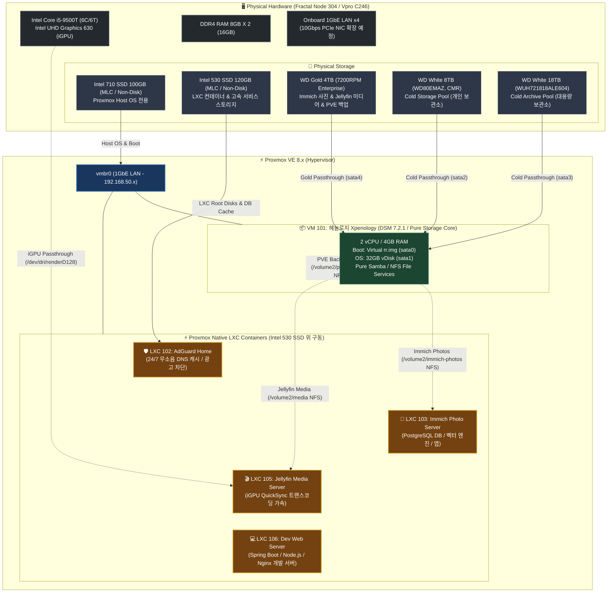

# 🗄️ NAS 프로젝트 모음

NAS 인프라 구축 및 클라우드 아키텍처 설계를 다루는 저장소입니다.

## 📂 프로젝트 구성

- [`self-nas/`](self-nas) — 자작 홈서버(MTK Studio) 구축 기록. 10Gbps 네트워크, Proxmox 가상화, Xpenology(헤놀로지) 기반 미디어/백업 서비스 구성.
- [`cloud-nas/`](cloud-nas) — Oracle Cloud Infrastructure 인스턴스 기반 NAS 아키텍처 설계 문서. Docker Compose, Spring Boot/Kotlin 백엔드, Vue 프론트엔드, 모니터링, CI/CD 포함.

---

## 🏗️ Self-NAS 아키텍처 및 구성도

자작 홈서버(`self-nas`)의 하드웨어 스펙 및 Proxmox VE 가상화(VM / LXC / Docker) 구성도입니다.

### 📋 주요 구성 요약

| 레이어 | 구성 요소 | 상세 내용 |
| :--- | :--- | :--- |
| **물리 하드웨어** | CPU / RAM / Storage | Intel i5-9500T (6C/6T, UHD 630 iGPU), DDR4 16GB, Intel 710 SSD 100GB (MLC, Non-Disk), Intel 530 SSD 120GB (MLC, Non-Disk), WD Gold 4TB, WD White 8TB (`WD80EMAZ-00WJTA0`), WD White 18TB (`WUH721818ALE604`) |
| **하이퍼바이저** | Proxmox VE 8.x | 베이스 OS (Intel 710 SSD 전용 구동), 가상 네트워크 브리지(`vmbr0`), 스토리지 & iGPU 패스스루 라우팅 |
| **가상 머신 (VM)** | **VM 101: 헤놀로지** *(Pure Storage Core)* | 2 Core / 4GB RAM, HDD 3대 Raw 패스스루(Gold 4TB, White 8TB, White 18TB), **순수 NAS 파일 공유 데몬(Samba / NFS) 전용** (도커 미구동으로 초경량/초안정성 유지) |
| | *(선택 확장) Windows VM* | *(추후 필요 시에만 최소 리소스로 On-Demand 생성 예정)* |
| **LXC 컨테이너** *(Intel 530 SSD 고속 구동)* | **LXC 102: AdGuard Home** | 1 Core / 512MB RAM, 24/7 무소음 DNS 쿼리 캐시 & 네트워크 광고 차단 |
| | **LXC 103: Immich Server** | 2 Core / 4GB RAM, AI 사진 백업 백엔드 + PostgreSQL + Vector DB (미디어 저장은 **헤놀로지 WD Gold 4TB** NFS 연동) |
| | **LXC 105: Jellyfin Server** | 2 Core / 2GB RAM, Intel UHD 630 iGPU QuickSync HW 가속 미디어 서버 (미디어 라이브러리는 **헤놀로지 WD Gold 4TB** NFS 연동) |
| | **LXC 106: Dev Web Server** | 2 Core / 2GB RAM, Spring Boot / Node.js / Nginx 개인 개발 및 테스트 웹 서버 |

### 💾 물리적 디스크 용도 및 역할 분담 (4-Tier Storage)

| 티어 (Tier) | 디스크 모델 | 연결 방식 / 마운트 위치 | 주요 용도 및 역할 |
| :--- | :--- | :--- | :--- |
| **`HOST OS 전용` *(Non-Disk)*** | **Intel 710 SSD 100GB** (eMLC, Non-Disk) | Proxmox 호스트 직접 설치 | - **Proxmox VE Host OS 전용** 구동 (초고내구성 eMLC 기반 안정성 극대화) - Host OS 외 일체 서비스 미설치 (시스템 로그 / RRD 통계 I/O 전담) |
| **`상시 고속 서비스` *(Non-Disk)*** | **Intel 530 SSD 120GB** (MLC, Non-Disk) | Proxmox 로컬 컨테이너 스토리지 | - **24/7 상시 무소음 LXC 컨테이너 전용** (SSD 무소음/고속 I/O, HDD 스핀다운 유지) - **LXC 102 (AdGuard Home)** DNS 로그 및 필터 캐시 - **LXC 103 (Immich)** PostgreSQL DB & 벡터 검색 엔진 I/O 초고속 가속 - **LXC (Navidrome)** 음악 메타데이터 SQLite DB & 앨범아트 캐시 - **LXC 105 (Jellyfin)** 루트 컨테이너 및 메타데이터/포스터/트랜스코딩 캐시 - **LXC 106 (Dev Web Server)** 개발용 웹 서버 및 앱 구동 환경 |
| **`홈 & 라이프 허브` *(24/7 Enterprise)* | **WD Gold 4TB** (7200RPM Enterprise) | Proxmox 직접 마운트 또는 헤놀로지 패스스루 | - **📸 사진 전체**: 개인 스마트폰 자동동기화 + 가족여행/기념일 사진 (Immich) - **🎥 라이프 영상**: 스마트폰 일상 영상 + 가족 기념행사 홈비디오 (Immich & Jellyfin 홈비디오) - **🎵 음원 라이브러리 전체**: 무손실 FLAC / MP3 음악 (Navidrome) - **📦 핵심 백업 금고**: Proxmox VM/LXC 일일 백업 (`vzdump`) **(🛡️ 3-2-1 핵심 백업 대상)** |
| **`엔터테인먼트 COLD` *(26TB 대용량)* | **WD White 8TB** + **WD White 18TB** (총 26TB CMR) | Proxmox 직접 마운트 (또는 MergerFS / 헤놀로지) | - **🎬 소비성 엔터테인먼트 미디어 전용**: 4K/1080p 영화, 국내외 TV 드라마 시리즈, 예능, 애니메이션 - **💤 완전 절전 (Spin-down)**: 평소 모터 정지(무소음/초절전), 시청 시에만 스핀업 - **🛡️ 백업 불필요**: 언제든 다시 채울 수 있는 소비성 미디어이므로 백업 대상 제외 (관리 포인트 최소화) |

---

상세 구축 과정 및 세부 설정 가이드는 [`self-nas/docs/08_storage_tiering_and_media_separation.md`](self-nas/docs/08_storage_tiering_and_media_separation.md), [`self-nas/README.md`](self-nas/README.md) 및 [`self-nas/POST_PROXMOX_SETUP_GUIDE.md`](self-nas/POST_PROXMOX_SETUP_GUIDE.md)를 참고하세요.
