# 📸🎬 Immich & Jellyfin 아키텍처 설계 및 통합 구축 가이드 (LXC Native 격리)

자작 홈서버(`self-nas`) 환경에서 **Immich(AI 사진 백업/검색)** 및 **Jellyfin(iGPU 가속 미디어 스트리밍)**을 최적의 성능과 안정성으로 구동하고, **시놀로지 공식 앱(Synology Photos, DS video)과도 원본 데이터를 100% 공유**할 수 있는 **상세 아키텍처 설계, Mermaid 구성도 및 배포 가이드**입니다.

---

## 🏗️ 1. 전체 시스템 설계 및 아키텍처 구성도

헤놀로지는 오직 **순수 NAS 스토리지 코어(NFS/Samba 서버)**로만 동작하며, 무거운 연산(AI 벡터 검색, 비디오 트랜스코딩)과 데이터베이스 처리는 **Proxmox Native LXC 컨테이너**가 인텔 530 고속 SSD 위에서 전담합니다.

```mermaid
flowchart TB
    %% Styles
    classDef hw fill:#24292e,stroke:#444d56,stroke-width:2px,color:#fff;
    classDef pve fill:#1a365d,stroke:#2b6cb0,stroke-width:2px,color:#fff;
    classDef vm fill:#1c4532,stroke:#276749,stroke-width:2px,color:#fff;
    classDef lxc fill:#744210,stroke:#d69e2e,stroke-width:2px,color:#fff;
    classDef service fill:#2c5282,stroke:#3182ce,stroke-width:1px,color:#fff;
    classDef storage fill:#2d3748,stroke:#4a5568,stroke-width:1px,color:#fff;
    classDef client fill:#3b3a30,stroke:#8c827a,stroke-width:1px,color:#fff;

    %% 1. Clients
    subgraph Clients["📱 사용자 클라이언트 (LAN / 외부 ASUS DDNS)"]
        Mobile_Immich["📱 스마트폰 (Immich AI 사진 백업 :2283)"]:::client
        Mobile_Syno["📱 스마트폰 (Synology Photos / DS file :5001)"]:::client
        SmartTV_Jelly["📺 스마트 TV / PC (Jellyfin 스트리밍 :8096)"]:::client
        SmartTV_DS["📺 스마트 TV (DS video :5001)"]:::client
    end

    %% 2. Physical Layer
    subgraph HW["🖥️ 물리 하드웨어 (Fractal Node 304 / Vpro C246)"]
        CPU_GPU["Intel Core i5-9500T (6C/6T)<br/>⚡ Intel UHD Graphics 630 (QuickSync QSV HW 가속)"]:::hw
        RAM["DDR4 16GB RAM"]:::hw
        SSD_530["⚡ Intel 530 SSD 120GB (MLC / Non-Disk)<br/>Proxmox 고속 LXC 스토리지"]:::storage
        WD_Gold["💾 WD Gold 4TB Enterprise (7200RPM)<br/>헤놀로지 sata4 Raw Passthrough"]:::storage
    end

    %% 3. Proxmox VE Hypervisor
    subgraph PVE["⚡ Proxmox VE 8.x (Hypervisor / 192.168.1.200)"]
        VMBR0["가상 네트워크 브리지 (vmbr0)"]:::pve

        %% VM 101: 헤놀로지
        subgraph VM101["📦 VM 101: 헤놀로지 (Pure Storage Core / 192.168.1.132)"]
            DSM_NFS["NFS & Samba 파일 서비스 데몬"]:::vm
            VOL_PHOTOS["📁 /volume1/photo<br/>(사진/동영상 통합 원본 저장소)"]:::storage
            VOL_MEDIA["📁 /volume1/video<br/>(영화/드라마/음악 통합 미디어 저장소)"]:::storage
        end

        %% LXC 103: Immich Photo Server
        subgraph LXC103["📸 LXC 103: Immich Server (192.168.1.103:2283)"]
            IMMICH_CORE["Immich Server & Microservices"]:::service
            IMMICH_ML["Immich Machine Learning<br/>(CLIP 이미지 분석 & 안면 인식)"]:::service
            IMMICH_DB["PostgreSQL 15+ & pgvector (SSD 위 고속 구동)"]:::service
            IMMICH_REDIS["Redis (작업 큐 & 캐시)"]:::service
            IMMICH_MNT["마운트: /mnt/photo (NFS)"]:::storage
        end

        %% LXC 105: Jellyfin Media Server
        subgraph LXC105["🎬 LXC 105: Jellyfin Server (192.168.1.105:8096)"]
            JELLYFIN_CORE["Jellyfin Media Server Engine"]:::service
            JELLYFIN_TRANSCODE["FFmpeg Transcoder Engine<br/>(Intel QuickSync QSV HW 가속)"]:::service
            JELLYFIN_CACHE["트랜스코딩 캐시 & 메타데이터 (SSD)"]:::storage
            JELLYFIN_MNT["마운트: /mnt/video (NFS)"]:::storage
        end
    end

    %% Storage & Hardware Routing
    WD_Gold ==>|"Raw Disk Passthrough (sata4)"| VM101
    SSD_530 -->|"LXC Root Disks & DB Storage"| LXC103
    SSD_530 -->|"LXC Root Disks & Cache"| LXC105
    CPU_GPU -.->|"iGPU Passthrough (/dev/dri/renderD128)"| JELLYFIN_TRANSCODE

    %% NFS Storage Mounts (Single Source of Truth)
    VOL_PHOTOS -.->|"NFS Export (/volume1/photo)"| IMMICH_MNT
    VOL_MEDIA -.->|"NFS Export (/volume1/video)"| JELLYFIN_MNT

    %% Internal App bindings
    IMMICH_CORE --- IMMICH_ML
    IMMICH_CORE --- IMMICH_DB
    IMMICH_CORE --- IMMICH_REDIS
    IMMICH_CORE --- IMMICH_MNT

    JELLYFIN_CORE --- JELLYFIN_TRANSCODE
    JELLYFIN_CORE --- JELLYFIN_CACHE
    JELLYFIN_CORE --- JELLYFIN_MNT

    %% Network Traffic Flow
    Mobile_Immich -->|"사진 자동 백업 (:2283)"| IMMICH_CORE
    Mobile_Syno -->|"Synology Photos 동시 열람 (:5001)"| DSM_NFS
    SmartTV_Jelly -->|"미디어 스트리밍 (:8096)"| JELLYFIN_CORE
    SmartTV_DS -->|"DS video 동시 재생 (:5001)"| DSM_NFS
    VMBR0 --- LXC103
    VMBR0 --- LXC105
    VMBR0 --- VM101
```



---

## 🌟 2. 시놀로지 공식 앱 + 오픈소스 동시 연동 원리 (Single Source of Truth)

하드디스크(4TB) 안의 데이터 원본은 **딱 1벌만 저장**하고, **두 앱이 동일한 표준 공유 폴더를 바라보도록** 구성합니다:

| 원본 데이터 경로 (WD Gold 4TB) | 주력 오픈소스 서비스 (Proxmox LXC) | 서브 시놀로지 공식 앱 (DSM 5001) | 장점 및 특징 |
| :--- | :--- | :--- | :--- |
| **`/volume1/photo`** | **`Immich`** (AI 얼굴/사물 검색, 초고속 백업) | **`Synology Photos`** (시놀로지 앨범/공유) | 원본 중복 저장 0%, 모바일은 Immich로 올리고 필요시 Synology Photos로 동시 열람 |
| **`/volume1/video`** | **`Jellyfin`** (iGPU 4K 트랜스코딩, 화려한 UI) | **`DS video`** (시놀로지 기본 플레이어) | 영화/드라마 1벌 저장으로 양쪽 플레이어에서 완벽 동시 재생 |

---

## 💾 3. 스토리지 계층화 (Tiering) 설계 원칙

| 서비스 | 데이터 종류 | 스토리지 위치 | 이유 및 장점 |
| :--- | :--- | :--- | :--- |
| **Immich** | **DB & 벡터 인덱스** | **Intel 530 SSD (120GB)** | PostgreSQL 트랜잭션, 안면 인식/CLIP 벡터 검색 시 초고속 I/O 응답 속도 보장. 무소음. |
| **Immich / Synology** | **사진/동영상 원본** | **WD Gold 4TB (NFS)** | 수백 GB~수 TB 단위 대용량 데이터 보관. 헤놀로지의 Btrfs 체크섬 무결성 보호 지원. |
| **Jellyfin** | **메타데이터 & 캐시** | **Intel 530 SSD (120GB)** | 영화 포스터 썸네일, NFO 정보, 실시간 트랜스코딩 임시 청크의 초고속 읽기/쓰기 (HDD 슬립 유지). |
| **Jellyfin / DS video** | **미디어 원본 (영화/음악)** | **WD Gold 4TB (NFS)** | 고용량 미디어 파일을 안정적으로 보관 및 순차 읽기 스트리밍. |

---

## 🌐 4. 네트워크 및 포트 할당 맵

| 서비스 | 컨테이너 ID / OS | 내부 IP & 포트 | 외부 접속 도메인 주소 |
| :--- | :--- | :--- | :--- |
| **헤놀로지 DSM** | VM 101 (DSM 7.2.x) | `192.168.1.132:5001` | `https://your-domain.asuscomm.com:5001` (🔒 SSL) |
| **Immich Web/API** | LXC 103 (Debian 12) | `192.168.1.103:2283` | `http://your-domain.asuscomm.com:2283` |
| **Jellyfin Web** | LXC 105 (Debian 12) | `192.168.1.105:8096` | `http://your-domain.asuscomm.com:8096` |
| **Proxmox 호스트** | PVE Host OS | `192.168.1.200:8006` | `https://192.168.1.200:8006` (내부 관리 전용) |

---

## 🚀 5. 복귀 후 바로 따라 하는 단계별 구축 가이드 (Step-by-Step)

---

### [1단계] 헤놀로지 DSM(192.168.1.132)에서 NFS 공유 폴더 생성

1. **NFS 서비스 활성화**:
   - DSM **[제어판] ➔ [파일 서비스] ➔ [NFS] 탭** ➔ **`NFS 서비스 활성화`** 체크 (NFSv4.1) ➔ [적용]
2. **`photo` 폴더 생성 & NFS 권한**:
   - **[제어판] ➔ [공유 폴더] ➔ [생성]**:
     - 이름: **`photo`** / 위치: **`볼륨 2 (4TB)`** ➔ [완료]
   - 생성된 `photo` 클릭 ➔ **[편집] ➔ [NFS 권한] 탭 ➔ [생성]**:
     - 호스트/IP: **`192.168.1.0/24`**
     - 권한: `읽기/쓰기` / Squash: `매핑 없음` / 비동기: `체크` ➔ [저장]
3. **`video` 폴더 생성 & NFS 권한**:
   - **[제어판] ➔ [공유 폴더] ➔ [생성]**:
     - 이름: **`video`** / 위치: **`볼륨 2 (4TB)`** ➔ [완료]
   - 생성된 `video` 클릭 ➔ **[편집] ➔ [NFS 권한] 탭 ➔ [생성]**:
     - 호스트/IP: **`192.168.1.0/24`**
     - 권한: `읽기/쓰기` / Squash: `매핑 없음` / 비동기: `체크` ➔ [저장]

---

### [2단계] Proxmox 호스트(192.168.1.200)에서 Immich LXC (103) 구축

Proxmox 웹 UI의 **`>_ Shell`** 콘솔에서 실행:

```bash
# 1. Immich용 초경량 LXC 103 생성
pct create 103 local:vztmpl/debian-12-standard_12.x_amd64.tar.zst \
  --hostname immich-server \
  --cores 2 \
  --memory 4096 \
  --swap 1024 \
  --rootfs local-lvm:16 \
  --net0 name=eth0,bridge=vmbr0,ip=192.168.1.103/24,gw=192.168.1.1 \
  --unprivileged 1 \
  --features nesting=1,keyctl=1

pct start 103

# 2. LXC 103 내부 진입 및 환경 구성
pct enter 103
apt update && apt install -y nfs-common curl docker.io docker-compose-v2

# 3. 4TB Gold photo 폴더 영구 마운트
mkdir -p /mnt/photo
echo "192.168.1.132:/volume1/photo /mnt/photo nfs defaults,_netdev 0 0" >> /etc/fstab
mount -a
df -h /mnt/photo

# 4. Immich Docker Compose 다운로드 및 실행
mkdir -p /opt/immich && cd /opt/immich
wget -O docker-compose.yml https://github.com/immich-app/immich/releases/latest/download/docker-compose.yml
wget -O .env https://github.com/immich-app/immich/releases/latest/download/example.env

# 업로드 저장소를 4TB NFS 마운트 경로로 변경
sed -i 's|UPLOAD_LOCATION=.*|UPLOAD_LOCATION=/mnt/photo|g' .env

docker compose up -d
exit
```

---

### [3단계] Proxmox 호스트(192.168.1.200)에서 Jellyfin LXC (105) 구축 & iGPU 가속

Proxmox **`>_ Shell`** 콘솔에서 실행:

```bash
# 1. Jellyfin용 LXC 105 생성
pct create 105 local:vztmpl/debian-12-standard_12.x_amd64.tar.zst \
  --hostname jellyfin-server \
  --cores 2 \
  --memory 2048 \
  --swap 512 \
  --rootfs local-lvm:12 \
  --net0 name=eth0,bridge=vmbr0,ip=192.168.1.105/24,gw=192.168.1.1 \
  --unprivileged 0 \
  --features nesting=1

# 2. Intel UHD 630 iGPU 하드웨어 가속 패스스루 설정 추가
cat << 'EOF' >> /etc/pve/lxc/105.conf
lxc.cgroup2.devices.allow: c 226:0 rwm
lxc.cgroup2.devices.allow: c 226:128 rwm
lxc.mount.entry: /dev/dri dev/dri none bind,optional,create=dir
EOF

pct start 105

# 3. LXC 105 내부 진입 및 4TB Gold video 폴더 마운트 & Jellyfin 설치
pct enter 105
apt update && apt install -y nfs-common curl gnupg

mkdir -p /mnt/video
echo "192.168.1.132:/volume1/video /mnt/video nfs defaults,_netdev 0 0" >> /etc/fstab
mount -a
df -h /mnt/video

# Jellyfin 공식 설치 스크립트 실행
curl https://repo.jellyfin.org/install-debuntu.sh | bash
exit
```

---

### [4단계] ASUS 공유기 포트포워딩 등록 및 외부 접속 확인

ASUS 관리자(`192.168.1.1`) ➔ **[WAN] ➔ [가상 서버 / 포트 포워딩]**에 2개 추가:
1. **Immich**: 외부 `2283` ➔ 내부 `192.168.1.103:2283` (TCP)
2. **Jellyfin**: 외부 `8096` ➔ 내부 `192.168.1.105:8096` (TCP)

---

### 📱 5. 최종 접속 확인 주소:
* **Immich 모바일 앱 / 웹**: `http://your-domain.asuscomm.com:2283` (초기 관리자 계정 생성)
* **Jellyfin 스마트TV / 웹**: `http://your-domain.asuscomm.com:8096` (라이브러리 경로 `/mnt/video` 등록 ➔ 관리자 대시보드에서 `Intel QuickSync (QSV)` 활성화)
* **Synology Photos / DS video**: `https://your-domain.asuscomm.com:5001` (동일 원본 데이터 동시 열람)
