# 📸🎬 Immich & Jellyfin 아키텍처 설계 및 구성도 (LXC Native 격리)

자작 홈서버(`self-nas`) 환경에서 **Immich(AI 사진 백업/검색)** 및 **Jellyfin(iGPU 가속 미디어 스트리밍)**을 최적의 성능과 안정성으로 구동하기 위한 **상세 아키텍처 설계, Mermaid 구성도 및 배포 가이드**입니다.

---

## 🏗️ 1. 전체 시스템 설계 및 아키텍처 구성도

헤놀로지는 오직 **순수 NAS 스토리지 코어(NFS 서버)**로만 동작하며, 무거운 연산(AI 벡터 검색, 비디오 트랜스코딩)과 데이터베이스 처리는 **Proxmox Native LXC 컨테이너**가 인텔 530 고속 SSD 위에서 전담합니다.

```mermaid
flowchart TB
    %% Styles
    classDef hw fill:#24292e,stroke:#444d56,stroke-width:2px,color:#fff;
    classDef pve fill:#1a365d,stroke:#2b6cb0,stroke-width:2px,color:#fff;
    classDef vm fill:#1c4532,stroke:#276749,stroke-width:2px,color:#fff;
    classDef lxc fill:#744210,stroke:#d69e2e,stroke-width:2px,color:#fff;
    classDef service fill:#2c5282,stroke:#3182ce,stroke-width:1px,color:#fff;
    classDef storage fill:#2d3748,stroke:#4a5568,stroke-width:1px,color:#fff;
    classDef client fill:#3b3a30,stroke:#8c827a,stroke-width:1px,color:#fff;

    %% 1. Clients
    subgraph Clients["📱 사용자 클라이언트 (LAN / ASUS WiFi 192.168.50.x)"]
        Mobile["📱 스마트폰 (Immich 모바일 앱 백업)"]:::client
        WebClient["💻 PC / Mac 브라우저 (Immich Web & Jellyfin Web)"]:::client
        SmartTV["📺 스마트 TV / 태블릿 (Jellyfin 스트리밍)"]:::client
    end

    %% 2. Physical Layer
    subgraph HW["🖥️ 물리 하드웨어 (Fractal Node 304 / Vpro C246)"]
        CPU_GPU["Intel Core i5-9500T (6C/6T)<br/>⚡ Intel UHD Graphics 630 (QuickSync QSV)"]:::hw
        RAM["DDR4 16GB RAM"]:::hw
        SSD_530["⚡ Intel 530 SSD 120GB (MLC / Non-Disk)<br/>Proxmox 고속 LXC 스토리지"]:::storage
        WD_Gold["💾 WD Gold 4TB Enterprise (7200RPM)<br/>헤놀로지 sata4 Raw Passthrough"]:::storage
    end

    %% 3. Proxmox VE Hypervisor
    subgraph PVE["⚡ Proxmox VE 8.x (Hypervisor / 192.168.50.2)"]
        VMBR0["가상 네트워크 브리지 (vmbr0)"]:::pve

        %% VM 101: 헤놀로지
        subgraph VM101["📦 VM 101: 헤놀로지 (Pure Storage Core / 192.168.50.101)"]
            DSM_NFS["NFS & Samba 파일 서비스 데몬"]:::vm
            VOL_PHOTOS["📁 /volume2/immich-photos<br/>(사진/동영상 원본 저장소)"]:::storage
            VOL_MEDIA["📁 /volume2/media<br/>(영화/드라마/음악 미디어 라이브러리)"]:::storage
        end

        %% LXC 103: Immich Photo Server
        subgraph LXC103["📸 LXC 103: Immich Server (192.168.50.103:2283)"]
            IMMICH_CORE["Immich Server & Microservices"]:::service
            IMMICH_ML["Immich Machine Learning<br/>(CLIP 이미지 분석 & 안면 인식)"]:::service
            IMMICH_DB["PostgreSQL 15+ & pgvector (SSD 위 고속 구동)"]:::service
            IMMICH_REDIS["Redis (작업 큐 & 캐시)"]:::service
            IMMICH_MNT["마운트: /mnt/immich-photos (NFS)"]:::storage
        end

        %% LXC 105: Jellyfin Media Server
        subgraph LXC105["🎬 LXC 105: Jellyfin Server (192.168.50.105:8096)"]
            JELLYFIN_CORE["Jellyfin Media Server Engine"]:::service
            JELLYFIN_TRANSCODE["FFmpeg Transcoder Engine<br/>(Intel QuickSync QSV HW 가속)"]:::service
            JELLYFIN_CACHE["트랜스코딩 캐시 & 메타데이터 (SSD)"]:::storage
            JELLYFIN_MNT["마운트: /mnt/media (NFS)"]:::storage
        end
    end

    %% Storage & Hardware Routing
    WD_Gold ==>|"Raw Disk Passthrough (sata4)"| VM101
    SSD_530 -->|"LXC Root Disks & DB Storage"| LXC103
    SSD_530 -->|"LXC Root Disks & Cache"| LXC105
    CPU_GPU -.->|"iGPU Passthrough (/dev/dri/renderD128)"| JELLYFIN_TRANSCODE

    %% NFS Storage Mounts
    VOL_PHOTOS -.->|"NFS Export (고속 10Gbps 내부 전송)"| IMMICH_MNT
    VOL_MEDIA -.->|"NFS Export (대용량 미디어 스트리밍)"| JELLYFIN_MNT

    %% Internal App bindings
    IMMICH_CORE --- IMMICH_ML
    IMMICH_CORE --- IMMICH_DB
    IMMICH_CORE --- IMMICH_REDIS
    IMMICH_CORE --- IMMICH_MNT

    JELLYFIN_CORE --- JELLYFIN_TRANSCODE
    JELLYFIN_CORE --- JELLYFIN_CACHE
    JELLYFIN_CORE --- JELLYFIN_MNT

    %% Network & Traffic Flow
    Mobile -->|"사진 자동 백업 (:2283)"| IMMICH_CORE
    WebClient -->|"사진/미디어 관리"| VMBR0
    SmartTV -->|"미디어 스트리밍 (:8096)"| JELLYFIN_CORE
    VMBR0 --- LXC103
    VMBR0 --- LXC105
    VMBR0 --- VM101
```



---

## 💾 2. 스토리지 계층화 (Tiering) 설계 원칙

성능과 소음, 디스크 수명을 최적화하기 위해 **"데이터 특성에 따른 철저한 스토리지 분리"**를 적용합니다.

| 서비스 | 데이터 종류 | 스토리지 위치 | 이유 및 장점 |
| :--- | :--- | :--- | :--- |
| **Immich** | **DB & 벡터 인덱스** | **Intel 530 SSD (120GB)** | PostgreSQL 트랜잭션, 안면 인식/CLIP 벡터 검색 시 초고속 I/O 응답 속도 보장. 무소음. |
| **Immich** | **사진/동영상 원본** | **WD Gold 4TB (NFS)** | 수백 GB~수 TB 단위 대용량 데이터 보관. 헤놀로지의 Btrfs 체크섬 무결성 보호 지원. |
| **Jellyfin** | **메타데이터 & 캐시** | **Intel 530 SSD (120GB)** | 영화 포스터 썸네일, NFO 정보, 실시간 트랜스코딩 임시 청크의 초고속 읽기/쓰기. |
| **Jellyfin** | **미디어 원본 (영화/음악)** | **WD Gold 4TB (NFS)** | 고용량 미디어 파일을 안정적으로 보관 및 순차 읽기 스트리밍. |

> 💡 **왜 헤놀로지에 직접 Docker를 띄우지 않는가?**
> 1. **무소음 환경**: DB 쿼리나 트랜스코딩 캐시 쓰기로 인해 대용량 HDD가 24시간 긁히는 소음을 방지합니다.
> 2. **안정성 및 경량화**: 헤놀로지는 순수 파일 시스템(Samba/NFS)에만 집중하여 다운타임이 0에 수렴합니다.
> 3. **하드웨어 가속**: Proxmox 호스트의 Intel iGPU(`/dev/dri`)를 LXC에 직접 연결하여 손실 없는 최고 효율의 하드웨어 트랜스코딩을 구현합니다.

---

## 🌐 3. 네트워크 및 포트 할당 맵

| 서비스 | 컨테이너 ID / OS | 내부 IP & 포트 | 프로토콜 / 역할 |
| :--- | :--- | :--- | :--- |
| **헤놀로지 NFS** | VM 101 (DSM 7.2.x) | `192.168.50.101:2049` | NFS v4 / 대용량 스토리지 공유 |
| **Immich Web/API** | LXC 103 (Debian 12) | `192.168.50.103:2283` | HTTP / 사진 백업 및 관리 웹 대시보드 |
| **Jellyfin Web** | LXC 105 (Debian 12) | `192.168.50.105:8096` | HTTP / 미디어 스트리밍 웹/앱 포트 |
| **Proxmox 호스트** | PVE Host OS | `192.168.50.2:8006` | HTTPS / 하이퍼바이저 관리 콘솔 |

---

## 🚀 4. 단계별 구축 및 설정 절차

### 1단계. 헤놀로지(VM 101) NFS 공유 폴더 준비
1. **헤놀로지 DSM** 접속 (`http://192.168.50.101:5000`)
2. **`제어판` ➔ `파일 서비스` ➔ `NFS` 탭**에서 **NFS 서비스 활성화** (NFSv4.1 활성화).
3. **`제어판` ➔ `공유 폴더`**에서 다음 2개 폴더 생성 및 NFS 권한 부여:
   - **`immich-photos`**: 호스트/IP `192.168.50.103` (또는 서브넷 `192.168.50.0/24`), 권한 `읽기/쓰기`, Squash `매핑 없음`, 비동기 활성화
   - **`media`**: 호스트/IP `192.168.50.105` (또는 서브넷 `192.168.50.0/24`), 권한 `읽기/쓰기`, Squash `매핑 없음`, 비동기 활성화

---

### 2단계. LXC 103 (Immich Photo Server) 구축

1. **LXC 생성 (Proxmox 호스트 셸)**:
   ```bash
   pct create 103 local:vztmpl/debian-12-standard_12.x_amd64.tar.zst \
     --hostname immich-server \
     --cores 2 \
     --memory 4096 \
     --swap 1024 \
     --rootfs local-lvm:16 \
     --net0 name=eth0,bridge=vmbr0,ip=192.168.50.103/24,gw=192.168.50.1 \
     --unprivileged 1 \
     --features nesting=1,keyctl=1
   pct start 103
   ```

2. **NFS 마운트 설정 (LXC 103 콘솔)**:
   ```bash
   pct enter 103
   apt update && apt install -y nfs-common curl docker.io docker-compose-v2
   
   # NFS 마운트 디렉터리 생성
   mkdir -p /mnt/immich-photos
   
   # fstab 자동 마운트 등록
   echo "192.168.50.101:/volume2/immich-photos /mnt/immich-photos nfs defaults,_netdev 0 0" >> /etc/fstab
   mount -a
   df -h /mnt/immich-photos
   ```

3. **Immich Docker Compose 배포**:
   - `/opt/immich` 디렉터리에 `docker-compose.yml` 및 `.env` 파일 구성
   - `UPLOAD_LOCATION=/mnt/immich-photos` 지정 (사진 원본은 4TB Gold로 저장)
   - PostgreSQL DB 볼륨은 컨테이너 내부(SSD 로컬)에 저장
   ```bash
   mkdir -p /opt/immich && cd /opt/immich
   wget -O docker-compose.yml https://github.com/immich-app/immich/releases/latest/download/docker-compose.yml
   wget -O .env https://github.com/immich-app/immich/releases/latest/download/example.env
   
   # .env 파일에서 UPLOAD_LOCATION=/mnt/immich-photos 로 수정
   sed -i 's|UPLOAD_LOCATION=.*|UPLOAD_LOCATION=/mnt/immich-photos|g' .env
   
   docker compose up -d
   ```

---

### 3단계. LXC 105 (Jellyfin Media Server) 구축 & iGPU HW 가속 설정

1. **LXC 생성 및 iGPU 패스스루 설정 (Proxmox 호스트 셸)**:
   ```bash
   pct create 105 local:vztmpl/debian-12-standard_12.x_amd64.tar.zst \
     --hostname jellyfin-server \
     --cores 2 \
     --memory 2048 \
     --swap 512 \
     --rootfs local-lvm:12 \
     --net0 name=eth0,bridge=vmbr0,ip=192.168.50.105/24,gw=192.168.50.1 \
     --unprivileged 0 \
     --features nesting=1
   ```

2. **Intel UHD 630 iGPU 패스스루 설정 (`/etc/pve/lxc/105.conf` 추가)**:
   ```ini
   lxc.cgroup2.devices.allow: c 226:0 rwm
   lxc.cgroup2.devices.allow: c 226:128 rwm
   lxc.mount.entry: /dev/dri dev/dri none bind,optional,create=dir
   ```
   설정 후 시작:
   ```bash
   pct start 105
   ```

3. **NFS 미디어 마운트 & Jellyfin 설치 (LXC 105 콘솔)**:
   ```bash
   pct enter 105
   apt update && apt install -y nfs-common curl gnupg
   
   mkdir -p /mnt/media
   echo "192.168.50.101:/volume2/media /mnt/media nfs defaults,_netdev 0 0" >> /etc/fstab
   mount -a
   
   # Jellyfin 공식 패키지 설치
   curl https://repo.jellyfin.org/install-debuntu.sh | bash
   ```

4. **Jellyfin 웹 설정**:
   - `http://192.168.50.105:8096` 접속 후 라이브러리 경로로 `/mnt/media` 등록
   - **`관리자 대시보드` ➔ `재생(Playback)` ➔ `하드웨어 가속`**: **Intel QuickSync (QSV)** 활성화

---

## 🎯 5. 최종 점검 체크리스트

- [ ] **헤놀로지 NFS**: `immich-photos`, `media` 공유 폴더가 정상 export 중인지 확인
- [ ] **Immich (LXC 103)**:
  - [ ] `http://192.168.50.103:2283` 정상 접속 및 계정 생성
  - [ ] 모바일 앱에서 테스트 사진 업로드 시 `/mnt/immich-photos` (헤놀로지 4TB Gold)에 파일 생성 확인
  - [ ] 안면 인식 및 머신러닝 벡터 검색 정상 동작 확인
- [ ] **Jellyfin (LXC 105)**:
  - [ ] `http://192.168.50.105:8096` 정상 접속
  - [ ] `/mnt/media` 내 영상 라이브러리 스캔 정상 동작
  - [ ] 4K/HEVC 영상 재생 시 iGPU QuickSync 하드웨어 트랜스코딩 동작(CPU 사용률 10% 미만 유지) 확인
