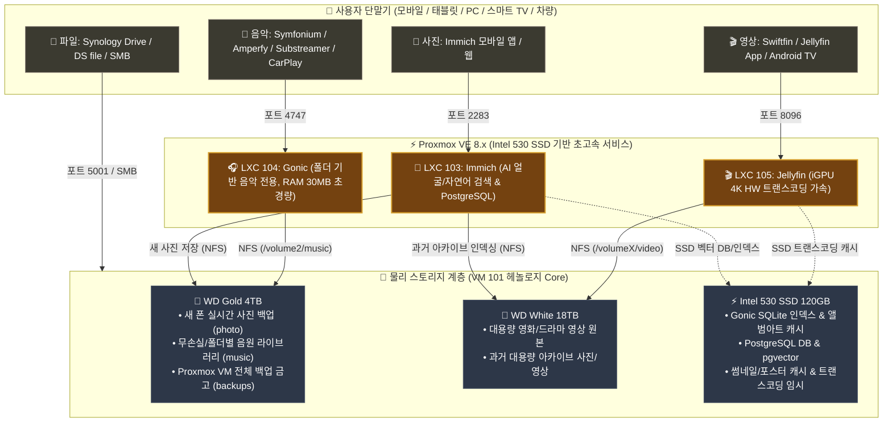

# 📱🎧🎬 NAS 미디어 서비스 통합 마스터 가이드 (음악 · 영상 · 사진 · 파일)

자작 홈서버(`self-nas`) 환경에서 **음악(Gonic/Jellyfin), 영상(Jellyfin), 사진(Immich), 파일 동기화(Synology Drive/DS file)**를 구축하고, **스마트폰 · 태블릿 · PC · 스마트 TV · 차량(CarPlay/Android Auto)**에서 매끄럽게 연결하기 위한 **통합 아키텍처 및 클라이언트/서버 세팅 가이드**입니다.

---

## 🏗️ 1. 전체 시스템 구성도



---

## 📊 2. 서비스별 상세 분석 및 클라이언트 / NAS 세팅 맵

---

### 1️⃣ 🎵 음악 (Music) : `Gonic` / `Jellyfin`

> **"사용자 정의 디렉토리(폴더) 구조 그대로 스트리밍 + 초경량 Subsonic API 호환"**

| 구분 | 상세 내용 |
| :--- | :--- |
| **추천 서버 솔루션** | **`Gonic`** (Go 기반 초경량 **디렉토리/폴더 트리 탐색 특화** 음악 서버, Subsonic API 호환, RAM 30MB) 또는 **`Jellyfin`** |
| **스토리지 위치** | **WD Gold 4TB** (`/volume2/music` 또는 18TB 보관 음원 NFS 마운트) |
| **📱 스마트폰 / 태블릿 접근** | • **안드로이드/갤럭시**: **`Symfonium`** (폴더 브라우징 완벽 지원, 오프라인 캐시), **`Substreamer`**<br/>• **아이폰/아이패드**: **`Amperfy`** (애플뮤직 스타일), **`play:Sub`**, **`Substreamer`**<br/>• **차량 연동**: **Apple CarPlay / Android Auto** 완벽 지원 (오프라인 다운로드 재생 가능) |
| **💻 PC / Mac 접근** | • **웹 브라우저**: `http://your-domain.asuscomm.com:4747`<br/>• **전용 데스크톱 앱**: **`Feishin`** (Mac / Windows 전용 고음질 무손실 플레이어) |
| **🛠️ NAS 설치 및 세팅** | 1. 헤놀로지 4TB(또는 18TB)의 `music` 공유 폴더에 NFS 권한 부여 (`192.168.1.0/24`)<br/>2. Proxmox에 초경량 LXC 컨테이너(104) 생성 후 `music` 폴더 NFS 마운트 ➔ Gonic 실행 |

---

### 2️⃣ 🎬 영상 (Video: 영화 / 드라마 / 예능) : `Jellyfin`

> **"넷플릭스 스타일 UI + Intel UHD 630 iGPU 4K 하드웨어 가속 스트리밍"**

| 구분 | 상세 내용 |
| :--- | :--- |
| **추천 서버 솔루션** | **`Jellyfin`** (Intel Core i5-9500T QuickSync QSV HW 트랜스코딩 가속) |
| **스토리지 위치** | • **영상 파일 원본**: **WD White 18TB** (`/volumeX/video` - 기존 대용량 영상 그대로)<br/>• **포스터/자막/트랜스코딩 캐시**: **Intel 530 SSD** (무소음, HDD 슬립 유지) |
| **📱 스마트폰 / 태블릿 접근** | • **아이폰/아이패드**: **`Swiftfin`** (네이티브 고성능 앱) 또는 **`Jellyfin Mobile`**<br/>• **안드로이드**: **`Jellyfin Mobile`** 또는 **`Findroid`** |
| **📺 스마트 TV / Apple TV** | • **`Jellyfin for Android TV`** (삼성/LG/구글TV 전용 앱) 또는 **`Jellyfin for Apple TV`** |
| **💻 PC / Mac 접근** | • **웹 브라우저**: `http://your-domain.asuscomm.com:8096`<br/>• **전용 데스크톱 앱**: **`Jellyfin Media Player`** (모든 4K HDR/자막 무변환 다이렉트 재생) |
| **🛠️ NAS 설치 및 세팅** | 1. 헤놀로지 18TB `video` 공유 폴더에 NFS 권한 부여<br/>2. Proxmox LXC 105에 `/dev/dri` iGPU 패스스루 등록<br/>3. LXC 105에 18TB `video` NFS 마운트 ➔ Jellyfin 공식 설치 |

---

### 3️⃣ 📸 사진 (Photo: 스마트폰 백업 & AI 앨범) : `Immich`

> **"구글 포토의 완전한 대체! 무제한 고화질 원본 백업 & 머신러닝 AI 검색"**

| 구분 | 상세 내용 |
| :--- | :--- |
| **추천 서버 솔루션** | **`Immich`** (CLIP AI 자연어 검색, 얼굴/인물 인식, 타임라인, 지도 뷰) |
| **스토리지 위치** | • **과거 보관 사진**: **WD White 18TB** (Immich 외부 라이브러리로 0초 인덱싱)<br/>• **새 스마트폰 사진 백업**: **WD Gold 4TB** (실시간 자동 업로드 백업)<br/>• **DB & AI 벡터 인덱스**: **Intel 530 SSD** (PostgreSQL + pgvector 초고속 연산) |
| **📱 스마트폰 / 태블릿 접근** | • **`Immich` 공식 모바일 앱** (iOS / Android)<br/>• 백그라운드 자동 사진/동영상 백업, 날짜별 줌인/줌아웃 타임라인, 가족 공유 앨범 |
| **💻 PC / Mac 접근** | • **웹 브라우저**: `http://your-domain.asuscomm.com:2283` (구글포토와 동일한 반응형 웹) |
| **🛠️ NAS 설치 및 세팅** | 1. 헤놀로지 4TB(`photo`) 및 18TB(과거사진)에 NFS 권한 부여<br/>2. Proxmox LXC 103에 Docker Compose로 Immich 배포 ➔ NFS 마운트 연결 |

---

### 4️⃣ 📁 파일 관리 & 클라우드 동기화 : `Synology Drive` / `DS file`

| 서비스 | 클라이언트 앱 | NAS 역할 및 접속 방식 |
| :--- | :--- | :--- |
| **`Synology Drive`** | 스마트폰 `Synology Drive` 앱 / PC 동기화 프로그램 | 구글 드라이브처럼 문서/작업 파일 실시간 동기화 (`:5001`) |
| **`DS file`** | 스마트폰 `DS file` 앱 | NAS 전체 드라이브(4TB, 8TB, 18TB) 원격 폴더 탐색기 (`:5001`) |
| **`Mac / Win 파일공유`** | Mac Finder (`Cmd+K`) / Windows 탐색기 | 집 안에서 10Gbps 초고속 Samba 직접 마운트 (`smb://192.168.1.132`) |

---

## 🌐 3. 네트워크 포트 및 접속 주소 총괄표

| 서비스명 | 내부 IP & 포트 | 외부 접속 주소 (ASUS DDNS) | 추천 클라이언트 앱 |
| :--- | :--- | :--- | :--- |
| **📸 사진 (Immich)** | `192.168.1.103:2283` | `http://your-domain.asuscomm.com:2283` | Immich (iOS / Android / Web) |
| **🎵 음악 (Gonic)** | `192.168.1.104:4747` | `http://your-domain.asuscomm.com:4747` | Symfonium, Amperfy, Substreamer, Feishin |
| **🎬 영상 (Jellyfin)** | `192.168.1.105:8096` | `http://your-domain.asuscomm.com:8096` | Swiftfin, Jellyfin Mobile, TV 앱 |
| **📁 DSM 관리 / Drive** | `192.168.1.132:5001` | `https://your-domain.asuscomm.com:5001` (🔒) | Synology Drive, DS file, 웹 브라우저 |
| **⚡ PVE 하이퍼바이저** | `192.168.1.200:8006` | `https://192.168.1.200:8006` | 웹 브라우저 (내부/VPN 전용) |

---

## 🚀 4. Proxmox 원클릭 자동 설치 명령어 요약

Proxmox 웹 UI(`https://192.168.1.200:8006`)의 **`>_ Shell`** 콘솔에서 각 서비스를 한 줄로 설치할 수 있습니다:

### 📸 1. Immich Photo Server (LXC 103)
```bash
curl -fsSL https://raw.githubusercontent.com/waceh/nas/main/self-nas/scripts/setup_immich_lxc.sh | bash
```

### 🎵 2. Gonic Music Server (LXC 104 - 폴더 기반 음악 스트리밍)
```bash
curl -fsSL https://raw.githubusercontent.com/waceh/nas/main/self-nas/scripts/setup_gonic_lxc.sh | bash
```

### 🎬 3. Jellyfin Media Server (LXC 105 - iGPU HW 가속)
```bash
curl -fsSL https://raw.githubusercontent.com/waceh/nas/main/self-nas/scripts/setup_jellyfin_lxc.sh | bash
```

---

## 💡 5. 데이터 마이그레이션 불필요 원칙 (핵심)

1. **기존 18TB 데이터 보존**: 기존 18TB에 있는 영상, 음악, 과거 사진을 4TB로 힘들게 복사할 필요 없이 **18TB 위치 그대로 NFS로 연결**합니다.
2. **4TB WD Gold의 명확한 역할**:
   - 새로 찍는 스마트폰 일상 사진 실시간 백업 저장소
   - Proxmox 전체 VM/LXC 일일 백업 금고 (`/volume2/pve-backups`)
   - 개인 주요 작업 파일 보관
3. **Intel 530 SSD의 역할**:
   - Immich PostgreSQL DB, 안면 인식 벡터 검색 I/O 처리
   - Jellyfin 포스터 썸네일 로딩 및 실시간 트랜스코딩 캐시 처리 (HDD 소음 및 수명 방어)
