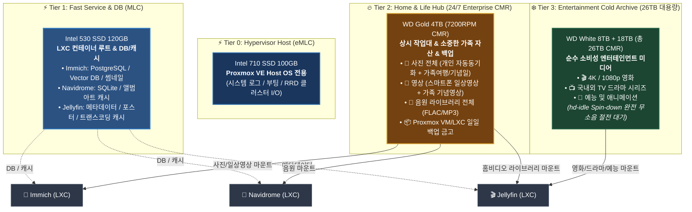

# 💾 스토리지 티어링 및 데이터·미디어 분류 설계 가이드

자작 홈서버(`self-nas`)의 물리 디스크 특성(SSD 내구성, 엔터프라이즈 HDD 신뢰성, 대용량 저전력 드라이브)과 **데이터의 성격(소중한 개인/가족 라이프 자산 vs 소비성 엔터테인먼트 미디어)**을 완벽하게 분리하여 최적의 성능, 초절전/무소음, 그리고 단순화된 백업 체계를 구축하는 종합 가이드입니다.

---

## 🏗️ 1. 전체 스토리지 계층화(Tiering) 아키텍처



---

## 📊 2. 물리 디스크 사양 및 역할 정의

| 드라이브 | 용량 / 규격 | 파일시스템 / 풀 | 주요 역할 및 보관 데이터 | 상시 / 절전 모드 |
| :--- | :--- | :--- | :--- | :---: |
| **Intel 710** | 100GB (eMLC) | `ext4` | **Proxmox VE Host OS**<br/>• 베이스 하이퍼바이저 OS, 시스템 로그, RRD 모니터링 I/O | 상시 (24/7) |
| **Intel 530** | 120GB (MLC) | `LVM-Thin` | **VM / LXC 고속 스토리지**<br/>• 컨테이너 Root, DB(PostgreSQL/Vector/SQLite), 썸네일/포스터 캐시 | 상시 (24/7) |
| **WD Gold** | 4TB (Enterprise) | `ext4` / `Btrfs` | **홈 & 라이프 허브 (Home & Life Hub)**<br/>• 📸 사진 전체 (개인 자동동기화 + 가족/기념일)<br/>• 🎥 영상 (스마트폰 일상영상 + 가족 기념영상)<br/>• 🎵 음악 라이브러리<br/>• 📦 Proxmox VM/LXC 일일 백업 금고 | 상시 (24/7) |
| **WD White** | 8TB (CMR) | `ext4` | **엔터테인먼트 콜드 스토리지 1**<br/>• 🎬 예능, 애니메이션, 소장용 시리즈 | **절전 (Spin-down)** |
| **WD White** | 18TB (Helium) | `ext4` | **엔터테인먼트 콜드 스토리지 2**<br/>• 🎬 4K HDR 영화, 대용량 드라마 시리즈 | **절전 (Spin-down)** |

---

## 🎯 3. 데이터 및 미디어 분류 상세 기준

### ① 사진 (Photo) ➔ `WD Gold 4TB` 집중
* **개인 스마트폰 자동 동기화 사진 (빈번 조회 / 빈번 쓰기)**:
  * 스마트폰 촬영 시 실시간/일일 백그라운드 자동 업로드 (Immich 앱).
  * 24/7 엔터프라이즈 신뢰성의 Gold 4TB에서 상시 처리.
* **가족 여행 / 기념일 사진 (간혹 조회 / 간혹 쓰기)**:
  * 가족 행사, 명절, 여행 고화질 원본 사진.
  * Immich의 **'공유 앨범(Shared Albums)'** 또는 **'파트너 공유'** 기능을 통해 부모님/가족 구성원에게 읽기/보기 권한 공유.

### ② 영상 (Video) ➔ 이원화 분리
* **라이프 영상 (스마트폰 일상영상 + 가족 기념영상) ➔ `WD Gold 4TB`**:
  * 아이/가족 일상 영상, 기념일 브이로그, 여행 홈비디오.
  * Immich 타임라인에서 사진과 함께 조회하거나, Jellyfin의 **'홈 비디오 및 사진'** 라이브러리로 등록하여 TV에서 편리하게 감상.
* **소비성 엔터테인먼트 영상 (영화 / 드라마 / 예능) ➔ `WD White 26TB`**:
  * 외부에서 다운로드/리핑한 영화, TV 드라마, 예능, 애니메이션.
  * Jellyfin의 **'영화(Movies)' / 'TV 프로그램(Shows)'** 라이브러리에 연결.
  * 시청할 때만 해당 콜드 드라이브가 깨어나(Spin-up) 재생.

### ③ 음악 (Music) ➔ `WD Gold 4TB`
* 무손실 FLAC / MP3 음원 라이브러리 전체.
* 음악 라이브러리는 용량이 크지 않으며(수십~수백 GB), 언제든 모바일/CarPlay/PC에서 즉시 스트리밍할 수 있도록 Gold 4TB에 배치.

---

## 💡 4. 이 아키텍처의 결정적 이점

### 1. 백업 관리의 극단적 단순화 (3-2-1 백업 완성)
* **백업 대상**: **`WD Gold 4TB` 단 1개** (소중한 사진, 가족영상, 음악, DB 백업).
* **백업 제외**: **`WD White 26TB`** (소비성 영화/드라마는 언제든 재구축 가능하므로 백업 대상에서 100% 제외).
* 용량이 수 TB 이내로 압축되므로, 외장 하드 1개 또는 소액 클라우드(Google Drive, OCI Object Storage 등)로 가볍고 완벽하게 백업 가능.

### 2. 콜드 스토리지의 완전한 무소음 & 초절전 (Spin-down) 유지
* 스마트폰 사진이 자동 백업되거나, 가족들이 사진/홈비디오를 보거나, 음악을 들을 때 **26TB 콜드 드라이브는 1초도 돌지 않고 대기 상태**를 유지합니다.
* 오직 거실 TV로 영화/드라마를 볼 때만 콜드 하드가 스핀업되므로 발열, 소음, 전기요금을 획기적으로 줄입니다.

### 3. 고속 브라우징과 무소음 경험 (SSD 분리 효과)
* Immich, Jellyfin, Navidrome의 **메타데이터, 썸네일, 포스터, 검색 인덱스 DB가 Intel 530 SSD**에 상주합니다.
* 앱에서 수만 장의 사진이나 영화 목록을 스크롤할 때 하드디스크를 긁지 않고 즉각 렌더링됩니다.

---

## 🛠️ 5. 서비스별 마운트 및 경로 구성표

### Proxmox 호스트 기준 마운트 포인트:
* `/mnt/gold` : WD Gold 4TB
* `/mnt/cold-8t` : WD White 8TB
* `/mnt/cold-18t` : WD White 18TB (또는 MergerFS로 `/mnt/cold-media` 가상 통합)

### LXC 컨테이너별 바인드 마운트 매핑:

| 서비스 (LXC) | 호스트 소스 경로 | LXC 내부 마운트 경로 | 접근 권한 | 용도 |
| :--- | :--- | :--- | :---: | :--- |
| **Immich** (LXC 103) | `/mnt/gold/photos` | `/mnt/photos` | `rw` (읽기/쓰기) | 개인 사진 + 가족 공유 사진/영상 |
| **Navidrome** (LXC 104) | `/mnt/gold/music` | `/mnt/music` | `ro` (읽기 전용) | 전체 음악 라이브러리 |
| **Jellyfin** (LXC 105) | `/mnt/gold/homevideos` | `/mnt/homevideos` | `ro` (읽기 전용) | **가족 여행 / 기념일 홈비디오** |
| | `/mnt/cold-media/movies` | `/mnt/media/movies` | `ro` (읽기 전용) | **영화 라이브러리 (4K/1080p)** |
| | `/mnt/cold-media/shows` | `/mnt/media/shows` | `ro` (읽기 전용) | **드라마 / 예능 라이브러리** |

---

## 💤 6. 콜드 스토리지 자동 절전 (`hd-idle`) 설정 가이드

Proxmox 호스트에서 소비성 미디어 드라이브(8TB, 18TB)에 독립적인 절전 타이머를 적용합니다:

```bash
# 1. hd-idle 설치
apt update && apt install -y hd-idle

# 2. 디스크 고유 ID 확인
ls -la /dev/disk/by-id/ | grep -v part

# 3. 설정 파일 수정 (/etc/default/hd-idle)
# 15분(900초) 동안 접근이 없으면 모터 정지(Spin-down)
START_HD_IDLE=true
HD_IDLE_OPTS="-i 0 -a /dev/disk/by-id/ata-WDC_WD80EMAZ-XXXX -i 900 -a /dev/disk/by-id/ata-WDC_WUH721818ALE604_YYYY -i 900"

# 4. 서비스 재시작
systemctl restart hd-idle
systemctl enable hd-idle
```
