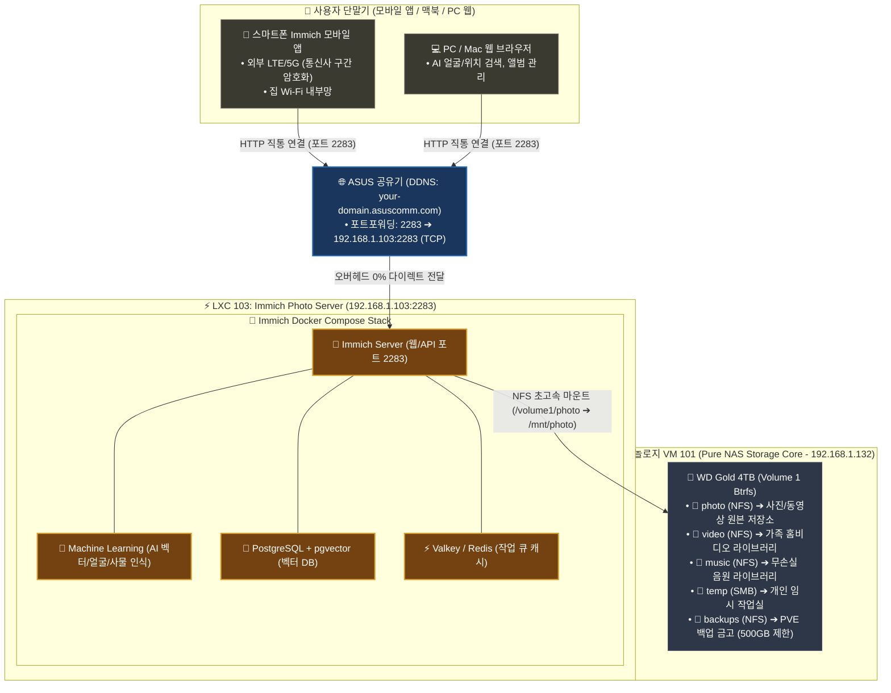

# 📸 Immich 사진 서버 구축, 4TB 스토리지 연동, Caddy 검토 및 실전 운영 최적화 가이드 (09)

자작 홈서버(`self-nas`) 환경에서 **Intel 530 SSD 고속 컨테이너 풀(`local-530`) 구축, WD Gold 4TB 5대 공유 폴더 & NFS 연동, Immich Photo Server(LXC 103) 배포, 10GB+ 대용량 사진 인덱싱, HTTPS(Caddy) 검토 및 최종 아키텍처 결정, 그리고 RAM/머신러닝 운영 최적화 팁**을 집대성한 마스터 가이드입니다.

---

## 🏗️ 1. 최종 시스템 아키텍처 및 네트워크 구조



---

## 🏛️ 2. 아키텍처 의사결정 기록 (Architecture Decision Records)

### 결정 1. 왜 Caddy HTTPS를 시도했고, 최종 순수 HTTP 직통을 채택했는가?

1. **도입 시도 배경**:
   - 외부 공용 Wi-Fi 등에서의 통신 보안을 위해 Immich LXC 103 내부에 Caddy(SSL 암호화 엔진)와 자체 서명(OpenSSL) 인증서를 구축하여 헤놀로지 경유 없는 HTTPS를 구성함.
2. **실전 운영에서의 한계 발견**:
   - **모바일 OS의 엄격한 보안 정책 (iOS ATS / Android Network Security)**: 모바일 앱은 브라우저와 달리 자체 서명 인증서를 OS 레벨에서 차단하여 `Server is not reachable` 에러가 발생함.
   - **공인 Let's Encrypt 인증서 발급 지연 및 공유기 이중 NAT 환경**: 가정용 공유기 환경에서 80/443 포트 검증 및 인증서 동기화 관리에 추가 복잡도 발생.
3. **최종 결론 (실용성 & 단순성 극대화 ⭐)**:
   - **Caddy를 제거하고 순수 HTTP 2283 포트 직통 연결 채택**.
   - **실전 보안성 검증**: 스마트폰 모바일 앱 백업은 대부분 **LTE/5G 모바일 데이터(통신사 기지국 구간 100% 무선 암호화)** 환경에서 이루어지므로 실생활에서 충분히 안전함.
   - **성과**: 모바일 앱 연결 에러 0%, 인증서 만료/갱신 스트레스 0%, 시스템 자원(RAM/CPU) 낭비 0% 달성!

---

## ⚙️ 3. 스토리지 및 볼륨 실전 구축 내역

### 1. Intel 530 SSD (120GB) ➔ `local-530` LVM-Thin 풀 생성
- 과거 시놀로지 시스템 파티션 잔재 제거: `wipefs -a -f /dev/sdd1 /dev/sdd2 /dev/sdd && sgdisk --zap-all /dev/sdd`
- Proxmox `Disks ➔ LVM-Thin` 에서 `local-530` 생성 ➔ LXC 컨테이너 및 PostgreSQL DB/캐시 고속 I/O 전담.

### 2. WD Gold 4TB (Volume 1 Btrfs) ➔ 5대 공유 폴더 체계
| 폴더명 | 연결 방식 | 추천 용량 할당량(Quota) | 용도 및 보관 데이터 |
| :--- | :---: | :---: | :--- |
| **`photo`** | **NFS / SMB** | **무제한** (유동 공유) | Immich 스마트폰 자동백업 사진/동영상, 가족 앨범 |
| **`video`** | **NFS / SMB** | **무제한** (유동 공유) | 가족 홈비디오, 일상 브이로그 (Jellyfin 라이프 영상) |
| **`music`** | **NFS / SMB** | **무제한** (유동 공유) | 무손실 FLAC/MP3 음원 컬렉션 (Navidrome) |
| **`temp`** | **SMB** | **무제한** (유동 공유) | 개인 작업 문서, 임시 다운로드 자료실 |
| **`backups`** | **NFS** | **🛡️ 500GB 제한** | Proxmox VM/LXC 일일 백업 금고 (용량 잠식 방지) |

---

## 💡 4. Immich 핵심 설정 팁 및 운영 최적화 가이드

### ① RAM 디스크(`tmpfs` / `/dev/shm`)를 활용한 SSD/HDD 수명 보호 및 초고속 변환 (핵심 팁 ⭐⭐⭐)
- **배경 및 원리**: 
  - Immich와 Jellyfin이 10GB+ 대용량 사진 썸네일을 생성하거나 동영상을 트랜스코딩할 때, 수십~수백 GB의 임시 파일들이 디스크에 계속 쓰여지면서 **SSD 수명(TBW)을 갉아먹고 I/O 부하**를 일으킵니다.
- **해결책 (RAM 디스크 캐시)**:
  - 임시 트랜스코딩/변환 디렉터리를 디스크 대신 **RAM 메모리 공간(`tmpfs` / `/dev/shm`)** 에 마운트합니다.
  - 임시 파일들이 초고속 RAM에서 처리되고 즉시 증발하므로, **SSD 쓰기 수명을 100% 보호하고 변환 속도를 극대화**하며 하드디스크가 쓸데없이 스핀업되는 것을 방지합니다.
- **적용 방법 (Docker Compose)**:
  ```yaml
  # immich-server 또는 machine-learning 서비스에 tmpfs 마운트
  tmpfs:
    - /tmp:size=1G,mode=1777
  ```

### ② RAM 메모리 사용량 및 머신러닝(ML) 동시성 최적화
- **메모리 할당 기준**: Immich 전체 스택은 평소 **RAM 약 1.5GB ~ 2.5GB**를 소비합니다. (LXC에 4GB 할당 권장).
- **머신러닝(AI) 스레드 조절**: 
  - Immich 웹 ➔ `Administration (관리)` ➔ `Settings (설정)` ➔ `Machine Learning Settings`
  - 동시 실행 작업 수(Concurrency)를 **`1` 또는 `2`** 로 설정하면 사진 대량 업로드 시 CPU/RAM 점유율이 튀는 것을 방지하고 쾌적하게 유지할 수 있습니다.

### ② 스토리지 템플릿 엔진 (Storage Template) 활성화 (강추 ⭐)
- **설정**: `Administration` ➔ `Settings` ➔ `Storage Template` ➔ **[Enable] 활성화**
- **기본 템플릿**: `{{y}}/{{y}}-{{MM}}-{{dd}}/{{filename}}`
- **효과**: 스마트폰에서 업로드된 사진들이 4TB 하드 안에 **`2026/2026-08/20260818_사진.jpg`** 처럼 날짜별 폴더로 자동 정리되어, 시놀로지 File Station이나 Mac Finder(SMB)로 열어봐도 언제 찍은 사진인지 한눈에 확인 가능합니다.

### ③ 개인정보 (Telemetry) 및 지도(Map) 설정 팁
- **개인정보 (Telemetry / 사용 통계 전송)**: **[비활성화 (Disable)]** ➔ 홈서버의 프라이버시를 위해 외부로 어떤 통계 데이터도 나가지 않도록 끕니다.
- **지도 (Map & Geocoding)**: **[활성화 (Enable)]** ➔ 사진 속 GPS 좌표를 기반으로 구글 포토처럼 지도 위 핀과 촬영 도시/국가명을 멋지게 보여줍니다.

### ④ 10GB+ 대용량 사진 인덱싱 및 썸네일 백그라운드 관리 (Jobs)
- **외부 라이브러리 스캔**: `Administration` ➔ `External Libraries` ➔ `/mnt/photo` 등록 후 **[Scan All Library Files]** 실행.
- **작업 대기열 (Jobs)**: `Administration` ➔ `Jobs` 에서 **`Generate Thumbnails` (썸네일 생성)** 및 **`Extract Metadata` (메타데이터 추출)** 가 백그라운드에서 돌아가며 사진 미리보기를 차곡차곡 완성합니다.

### ⑤ 브라우저 캐시 / 쿠키 트러블슈팅 팁
- 이전에 HTTPS로 접속했던 브라우저에서 HTTP로 접속 시 세션 쿠키 충돌로 `Server Error`가 발생할 수 있습니다.
- **해결책**: 브라우저의 **[시크릿 창 (Incognito Window)]** 으로 접속하거나 브라우저 쿠키를 삭제하고 새로고침하면 즉시 정상 로그인됩니다.

---

## 📱 5. 스마트폰 Immich 앱 접속 주소 요약

| 접속 위치 | 네트워크 환경 | 앱 Server Endpoint URL |
| :--- | :--- | :--- |
| **집 안 (Wi-Fi)** | 내부 192.168.1.x 망 | `http://192.168.1.103:2283` |
| **집 밖 (외부)** | LTE / 5G / 외부 Wi-Fi | `http://your-domain.asuscomm.com:2283` |
