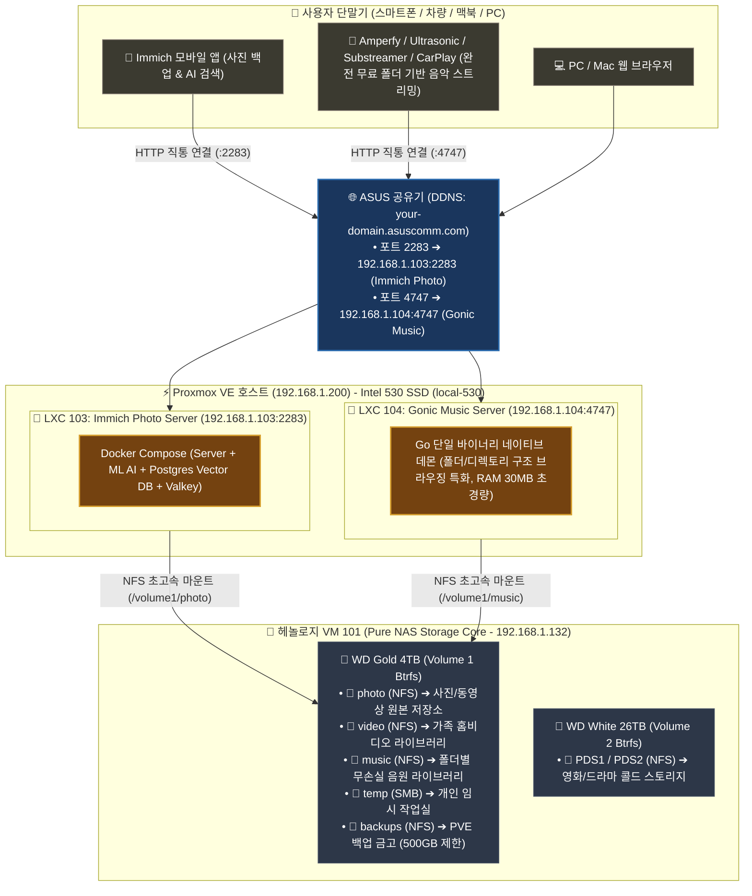

# 📸🎵 Immich 사진 & Gonic 음악 서버, 4TB 스토리지 연동 및 실전 운영 종합 가이드 (09)

자작 홈서버(`self-nas`) 환경에서 **Intel 530 SSD 고속 컨테이너 풀(`local-530`) 구축, WD Gold 4TB 5대 공유 폴더 & NFS 연동, Immich Photo Server(LXC 103) & Gonic Music Server(LXC 104) 배포, 10GB+ 사진 인덱싱, HTTPS(Caddy) 검토 및 최종 순수 직통 HTTP 아키텍처 결정, RAM 디스크(`tmpfs`) SSD 수명 보호, 폴더(디렉토리) 기반 스트리밍 및 음악 클라이언트 최적화**를 집대성한 마스터 문서입니다.

---

## 🏗️ 1. 현재까지 구축 완료된 전체 시스템 인프라 맵



---

## 🏛️ 2. 아키텍처 의사결정 기록 (ADR: Architecture Decision Records)

### 결정 1. 왜 Caddy HTTPS를 시도했고, 최종 순수 HTTP 직통을 채택했는가?
1. **도입 시도**: 외부 통신 보안을 위해 Immich 내부에 Caddy(TLS 1.3 암호화)와 자체 서명 인증서를 탑재함.
2. **실전 한계 발견**: 
   - **모바일 OS의 엄격한 보안 정책(iOS ATS / Android Network Security)**으로 인해 자체 서명 인증서는 브라우저와 달리 앱 연결 자체가 강제 차단됨(`Server is not reachable`).
   - 가정용 공유기 환경에서 공인 Let's Encrypt 발급/갱신 관리 복잡도 가중.
3. **최종 결론 (실용성 & 단순성 극대화 ⭐)**:
   - Caddy를 제거하고 **순수 HTTP 2283 포트 직통 연결 채택**.
   - 스마트폰 외부 접속은 **LTE/5G 통신사 기지국 100% 무선 암호화** 구간을 이용하므로 실생활에서 충분히 안전함.
   - **결과**: 모바일 앱 접속 에러 0%, 인증서 만료 스트레스 0%, 시스템 리소스 낭비 0% 달성!

### 결정 2. 왜 Navidrome 대신 Gonic을 음악 서버로 채택했는가?
1. **Navidrome의 한계**: ID3 메타데이터 태그 중심 인덱싱으로 인해, 태그가 정리되지 않은 음원, 믹스셋, 비정규 앨범, 사용자 정의 폴더 계층 구조 탐색에 한계가 있음.
2. **Gonic의 결정적 이점**:
   - **디렉토리(폴더) 트리 구조 브라우징을 완벽하게 지원**하여 폴더 정리 방식 그대로 음악 탐색 가능.
   - **Go 기반 초경량(RAM 30MB)** + **Subsonic/OpenSubsonic API 완전 호환**으로 기존의 수많은 고품질 클라이언트 앱을 그대로 사용 가능.

---

## 💡 3. 핵심 실전 운영 & 최적화 꿀팁 총정리

### ① RAM 디스크(`tmpfs` / `/dev/shm`)를 활용한 SSD/HDD 수명 보호 (핵심 팁 ⭐⭐⭐)
- **원리**: 10GB+ 대용량 사진 썸네일 생성이나 비디오 트랜스코딩 시 발생하는 수백 GB의 자잘한 임시 파일들을 디스크 대신 **RAM 메모리 공간(`tmpfs`)** 에서 처리하고 소멸시킵니다.
- **효과**: SSD 쓰기 수명(TBW) 100% 보호, 초고속 메모리 대역폭(수십 GB/s) 기반 무버벅임 변환, HDD 스핀다운 유지.
- **적용 (Immich Docker Compose)**:
  ```yaml
  tmpfs:
    - /tmp:size=1G,mode=1777
  ```

### ② Immich 스토리지 템플릿 & 백그라운드 작업 관리
- **스토리지 템플릿 (Storage Template)**: `Administration ➔ Settings ➔ Storage Template` 활성화
  - 패턴: `{{y}}/{{y}}-{{MM}}-{{dd}}/{{filename}}`
  - ➔ 업로드 사진이 4TB 하드에 `2026/2026-08/사진.jpg` 로 자동 정리되어 SMB/Finder에서도 깔끔하게 확인 가능.
- **머신러닝(AI) 동시성 조절**: `Machine Learning Settings ➔ Concurrency = 1` 로 설정하여 대량 업로드 시 CPU/RAM 피크 방지.
- **브라우저 쿠키 트러블슈팅**: HTTPS ➔ HTTP 전환 후 로그인 에러 시 **시크릿 창(Incognito)** 으로 접속하면 즉시 해결.

### ③ Gonic 폴더 기반 브라우징 & 100% 완전 무료 추천 앱

- **구형 MP3 한글 태그(EUC-KR ➔ UTF-8) 1초 일괄 복구 명령어**:
  ```bash
  pct exec 104 -- bash -c "apt-get update -qq && apt-get install -y -qq python3-mutagen && find /mnt/music -name '*.mp3' -exec mid3iconv -e euc-kr -d {} + && systemctl restart gonic"
  ```
- **100% 완전 무료 & 오픈소스(FOSS) 모바일 스트리밍 앱 (인앱결제/광고 0원)**:
  - 🍏 **iOS (아이폰/아이패드)**:
    - 🥇 **`Amperfy` (오픈소스 ⭐강추)**: 애플뮤직 스타일 세련된 UI, **폴더(Directories) 탐색 완벽 지원**, 오프라인 다운로드, **Apple CarPlay** 지원.
    - 🥈 **`Substreamer` (완전 무료)**: 가볍고 직관적인 UI, 폴더 뷰 탐색, 오프라인 캐시 및 CarPlay 지원.
  - 🤖 **Android (갤럭시/안드로이드)**:
    - 🥇 **`Ultrasonic` / `DSub` (오픈소스 ⭐강추)**: **폴더 트리 탐색 최강자**, 폴더 일괄 다운로드, **Android Auto** 지원.
    - 🥈 **`Substreamer` (완전 무료)**: 모던한 인터페이스, 폴더 탭 탐색, Android Auto 지원.
  - 💻 **PC / Mac**:
    - **`Feishin`** (Mac / Windows 전용 100% 무료 오픈소스 무손실 플레이어)

---

## 📋 4. 서비스 포트 및 접속 주소 요약

| 서비스 | 내부 접속 주소 | 외부 접속 주소 | 스토리지 위치 |
| :--- | :--- | :--- | :--- |
| **Immich Photo** | `http://192.168.1.103:2283` | `http://your-domain.asuscomm.com:2283` | **Intel 530 SSD** (LXC/DB)<br/>**WD Gold 4TB** (`/volume1/photo`) |
| **Gonic Music** | `http://192.168.1.104:4747` | `http://your-domain.asuscomm.com:4747` | **Intel 530 SSD** (LXC/DB)<br/>**WD Gold 4TB** (`/volume1/music`) |
| **헤놀로지 DSM** | `https://192.168.1.132:5001` | 내부망 전용 관리 | **WD Gold / White HDD** |
| **Proxmox Host** | `https://192.168.1.200:8006` | 내부망 전용 관리 | **Intel 710 SSD** (Host OS) |

---

### 🌐 공유기(ASUS) 포트포워딩 설정 & 포트 변경 가이드 (Navidrome ➔ Gonic)

외부(LTE/5G 모바일 앱, 차량 CarPlay)에서 Gonic 음악 서버에 접속하려면 **공유기 포트포워딩**을 업데이트해야 합니다:

#### 1. ASUS 공유기 설정 위치
- 브라우저 접속: `http://192.168.1.1` (또는 `http://router.asus.com`)
- 메뉴 이동: **고급 설정 ➔ WAN ➔ 가상 서버 / 포트 포워딩 (Port Forwarding)**

#### 2. 포트포워딩 규칙 등록표

| 서비스 이름 | 포트 범위 (외부) | 로컬 IP (내부) | 로컬 포트 (내부) | 프로토콜 | 비고 |
| :--- | :---: | :---: | :---: | :---: | :--- |
| **Immich Photo** | `2283` | `192.168.1.103` | `2283` | TCP | 사진 자동 백업 & AI 검색 |
| **Gonic Music** | **`4747`** | `192.168.1.104` | **`4747`** | TCP | **⭐ 기존 4533 삭제 후 4747 등록** |
| **Jellyfin Video** | `8096` | `192.168.1.105` | `8096` | TCP | 영상 스트리밍 (구축 시 등록) |

> 💡 **포트 전환 주의사항**:
> - 기존 Navidrome에서 쓰던 `4533` 포트포워딩 규칙은 삭제하거나 비활성화하고, **`4747` 포트 규칙을 새로 추가**해 주세요.
> - 모바일 앱(Amperfy, Ultrasonic, Substreamer 등)에서 서버 주소 입력 시 `http://your-domain.asuscomm.com:4747` 로 포트 번호를 지정하여 연결합니다.

---

## 🔄 5. Proxmox 호스트 재부팅 시 자동 기동 순서 (Boot Order)

정전 복구 및 호스트 재부팅 시 스토리지(NFS)가 먼저 열린 후 서비스들이 안전하게 마운트되도록 완벽한 부팅 시퀀스를 설정합니다:

```bash
# Proxmox 셸에서 1줄 설정
qm set 101 --onboot 1 --startup order=1,up=45
pct set 103 --onboot 1 --startup order=2,up=15
pct set 104 --onboot 1 --startup order=2,up=10
```

- **[1순위 (order=1, up=45)]**: **헤놀로지 VM 101** 먼저 기동 ➔ 45초간 Btrfs 마운트 및 NFS 데몬 정상화 대기
- **[2순위 (order=2)]**: **Immich (LXC 103)** & **Gonic (LXC 104)** 기동 ➔ 4TB Gold 하드의 `photo`/`music` NFS 즉시 마운트

---

## 🚀 6. 내일 이어서 진행할 작업 (Next Steps Checklist)

- [ ] **1. Jellyfin Media Server (LXC 105) 구축**:
  - Intel Core i5-9500T UHD 630 iGPU 하드웨어 가속(`/dev/dri` QuickSync 4K 트랜스코딩) 패스스루
  - WD Gold 4TB의 `/volume1/video` 및 WD White 26TB의 `PDS1`/`PDS2` NFS 마운트
  - 트랜스코딩 임시 경로에 `/dev/shm` (RAM 디스크) 적용
  - Finamp / Swiftfin / Infuse / 스마트 TV 앱 연동
- [ ] **2. Proxmox 자동 백업 스토리지 등록**:
  - 4TB Gold 하드의 `backups` 폴더(500GB Quota)를 Proxmox NFS 백업 저장소로 등록
  - VM 101, LXC 103, 104, 105에 대해 매일/매주 무중단 자동 백업 스케줄 설정 (`vzdump`)
- [ ] **3. (선택) AdGuard Home (LXC 102)** 로컬 DNS 캐시 및 24/7 무소음 네트워크 광고 차단기 구축
