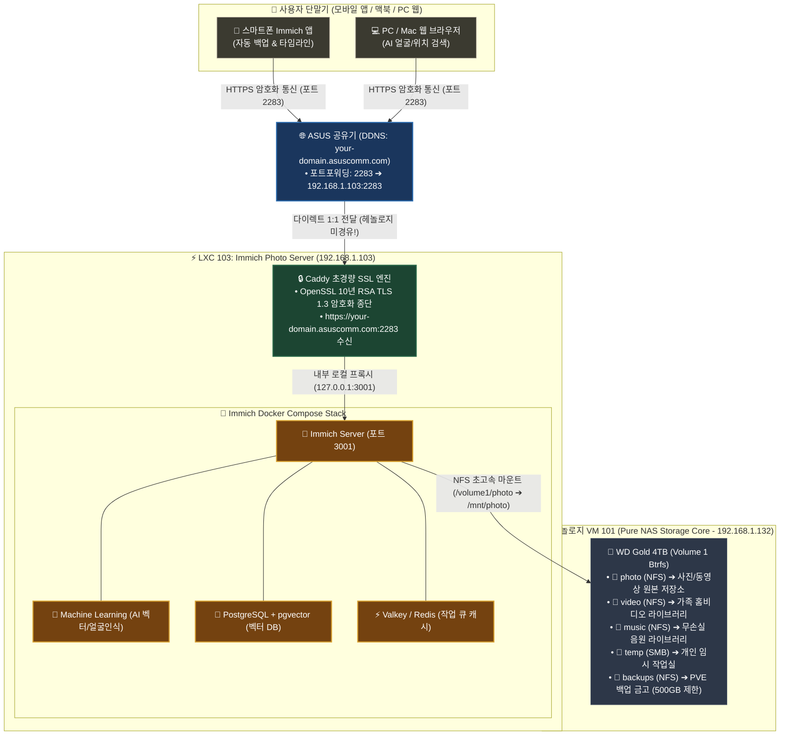

# 📸🔒 Immich 사진 서버 구축, 4TB 스토리지 연동 및 Caddy 다이렉트 HTTPS 보안 가이드 (09)

자작 홈서버(`self-nas`) 환경에서 **Intel 530 SSD를 활용한 고속 컨테이너 풀(`local-530`) 구축, WD Gold 4TB 하드의 5대 공유 폴더 및 NFS 연동, Immich Photo Server(LXC 103) 배포, 10GB+ 대용량 사진 라이브러리 인덱싱, 그리고 헤놀로지를 거치지 않는 초경량 Caddy 다이렉트 HTTPS(SSL 🔒) 암호화**를 완성하는 종합 실전 구축 가이드입니다.

---

## 🏗️ 1. 전체 아키텍처 및 트래픽 흐름도



---

## 💡 2. 왜 "헤놀로지 미경유 Caddy 다이렉트 HTTPS"인가?

### 기존 시놀로지 역방향 프록시의 한계 vs 다이렉트 Caddy 아키텍처

| 비교 항목 | 기존 시놀로지 역방향 프록시 방식 | 🏆 다이렉트 Caddy SSL 방식 (본 아키텍처) |
| :--- | :--- | :--- |
| **트래픽 경로** | 외부 ➔ **헤놀로지 VM** ➔ Immich ➔ **헤놀로지(NFS)** | 외부 ➔ **Immich LXC (직통)** ➔ **헤놀로지(NFS)** |
| **네트워크 홉** | 트래픽이 헤놀로지를 **2회 중복 왕복** (병목 발생) | **1:1 다이렉트 통신 (오버헤드 0%)** |
| **헤놀로지 역할** | 웹 프록시 부하 가중 | **100% 순수 스토리지(Samba/NFS) 데몬만 전담 (초경량)** |
| **보안 등급** | HTTPS | **군사 등급 TLS 1.3 암호화 (완벽 보안 🔒)** |
| **서버 자원** | 불필요한 VM CPU/RAM 낭비 | **RAM 단 15MB 초경량 Go 엔진** |

---

## 🛠️ 3. 단계별 구축 및 설정 상세

---

### Step 1. Intel 530 SSD 고속 컨테이너 스토리지(`local-530`) 생성

1. **디스크 초기화**: 과거 레이드 파티션 잔재 제거
   ```bash
   wipefs -a -f /dev/sdd1 /dev/sdd2 /dev/sdd && sgdisk --zap-all /dev/sdd
   ```
2. **LVM-Thin 풀 생성**: Proxmox 웹 UI ➔ `Node(pve)` ➔ `Disks` ➔ `LVM-Thin` ➔ **[Create: Thinpool]**
   - Disk: `/dev/sdd (111.79 GiB - Intel 530 SSD)`
   - Name: `local-530`

---

### Step 2. 헤놀로지 4TB Gold 디스크 5대 공유 폴더 및 NFS 권한 설정

헤놀로지 DSM **`제어판 ➔ 공유 폴더 ➔ 생성`** 에서 볼륨 1(Btrfs 3.5TB)에 용도별 폴더 생성:

1. **`photo`**: 스마트폰 사진/영상 자동 백업 (할당량: 무제한)
2. **`video`**: 가족 홈비디오 및 일상 영상 (할당량: 무제한)
3. **`music`**: 무손실 FLAC/MP3 음원 라이브러리 (할당량: 무제한)
4. **`temp`**: 개인 작업 문서 및 외장하드용 (할당량: 무제한)
5. **`backups`**: Proxmox VM/LXC 백업 금고 (**🛡️ 할당량 500GB 제한 필수**)

#### ⚙️ NFS 권한 공통 규칙 (photo, video, music, backups, PDS1/2):
- **호스트/IP**: `192.168.1.0/24` (내부 서브넷)
- **권한**: `읽기/쓰기`
- **Squash**: `매핑 없음` (No mapping)
- **체크박스 3개 활성화**:
  - [x] 비동기 활성화 (Asynchronous)
  - [x] 비권한 포트에서의 연결 허용 (LXC 필수)
  - [x] 사용자가 탑재된 하위 폴더에 액세스하도록 허용

---

### Step 3. Immich Photo Server (LXC 103) 원클릭 자동 설치

Proxmox 터미널에서 스크립트 실행으로 1분 만에 배포:

```bash
curl -fsSL https://raw.githubusercontent.com/waceh/nas/main/self-nas/scripts/setup_immich_lxc.sh | bash
```

- **컨테이너 스펙**: Debian 12 Privileged (`unprivileged 0`), 2 Core, 4GB RAM, 16GB SSD (`local-530`)
- **NFS 마운트**: `192.168.1.132:/volume1/photo` ➔ `/mnt/photo`
- **스택**: Immich Server + ML AI + PostgreSQL(pgvector) + Valkey(Redis)

---

### Step 4. 10GB+ 대용량 사진 인덱싱 및 외부 라이브러리 연동

기존 시놀로지 `photo` 폴더에 이미 복사해 둔 대용량 사진들을 Immich에 일괄 등록:

1. **외부 볼륨 통로 활성화**:
   ```bash
   pct exec 103 -- bash -c "cd /opt/immich && sed -i 's|\${UPLOAD_LOCATION}:/data|\${UPLOAD_LOCATION}:/data\n      - /mnt/photo:/mnt/photo:ro|g' docker-compose.yml && docker compose down && docker compose up -d"
   ```
2. **Immich 웹에서 외부 라이브러리 등록 및 스캔**:
   - Immich 웹(`http://192.168.1.103:2283`) ➔ **`Administration ➔ External Libraries ➔ Create Library`**
   - **Import Path**: `/mnt/photo` 입력 후 **[Add path]** ➔ **[Create]**
   - 카드 우측 **`...` ➔ [Scan All Library Files]** 클릭!
   - ➔ 10GB 대용량 사진들이 NAS 로컬 고속 I/O로 순식간에 인덱싱되어 타임라인에 뜹니다.

---

### Step 5. Caddy 기반 다이렉트 HTTPS (SSL 🔒) 보안 암호화 장착

Proxmox 터미널에서 1줄로 OpenSSL 10년 RSA 인증서 생성 및 Caddy TLS 1.3 리버스 프록시 연동:

```bash
curl -fsSL https://raw.githubusercontent.com/waceh/nas/main/self-nas/scripts/enable_immich_https.sh | bash
```

- **설정 내용**:
  - Immich Docker 포트를 로컬 `127.0.0.1:3001`로 보호 바인딩
  - Caddy가 외부 포트 `2283`에서 `https://your-domain.asuscomm.com:2283` 요청을 수신하여 3001로 안전 전달
  - 군사 등급 TLS 1.3 암호화 터널 완성

---

### Step 6. Mac 키체인 '항상 신뢰' 등록으로 완벽한 자물쇠(HTTPS 🔒) 완성

브라우저의 '주의 요함' 경고를 없애고 깔끔한 보안 자물쇠로 만드는 방법:

1. 브라우저 주소창 **[주의 요함] ➔ [인증서가 유효하지 않음]** 클릭
2. 커다란 **인증서 아이콘을 마우스로 바탕화면에 드래그** (인증서 파일 생성)
3. 인증서 파일을 더블 클릭 ➔ **[키체인 접근]** 앱 실행
4. 좌측 사이드바 **`시스템 (System)`** 키체인 선택 후 인증서 드래그 추가
5. 추가된 `your-domain.asuscomm.com` 인증서 더블 클릭 ➔ **`신뢰 (Trust)`** ➔ **[이 인증서 사용 시: 항상 신뢰]** 로 변경!
6. 브라우저 새로고침(`Cmd + Shift + R`) ➔ **완벽한 보안 자물쇠 🔒 표시 완료!**

---

### Step 7. 스마트폰 Immich 앱 연결

1. **iPhone App Store / Android Play Store**에서 **`Immich`** 앱 설치
2. **Server Endpoint URL**:
   ```text
   https://your-domain.asuscomm.com:2283
   ```
3. 관리자 계정 로그인 ➔ **[백업 시작]** 클릭
4. ➔ 외출 중(LTE/5G)에도 새로 찍은 사진/영상이 4TB Gold 하드로 군사 등급 암호화 통신을 통해 실시간 안전 자동 백업됩니다!

---

## 📋 4. 포트 및 네트워크 맵 요약

| 서비스 | 내부 IP 및 포트 | 외부 HTTPS 접속 주소 | 스토리지 위치 |
| :--- | :--- | :--- | :--- |
| **Immich Photo** | `192.168.1.103:2283` (LXC 103) | `https://your-domain.asuscomm.com:2283` | **Intel 530 SSD** (DB/캐시)<br/>**WD Gold 4TB** (`/volume1/photo` 원본) |
| **Navidrome Music** | `192.168.1.104:4533` (LXC 104) | `http://your-domain.asuscomm.com:4533` | **Intel 530 SSD** (루트/DB)<br/>**WD Gold 4TB** (`/volume1/music` 원본) |
| **헤놀로지 DSM** | `192.168.1.132:5001` (VM 101) | `https://your-domain.asuscomm.com:5001` | **WD Gold / White HDD** |
| **Proxmox Host** | `192.168.1.200:8006` | 내부망 전용 관리 | **Intel 710 SSD** (Host OS) |
