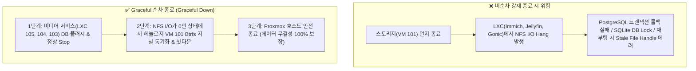

# ⚡ NAS Graceful 순차 기동·종료(Power Control) & Jellyfin(105) 구축 가이드 (10)

NAS를 24시간 켜두지 않고 **"작업할 때 켜고(On/Up), 사용 후 전원을 끄는(Off/Down) On-Demand 운영 패턴"**에서 발생할 수 있는 스토리지 I/O 락 및 데이터베이스 손상을 방지하기 위한 **Graceful 순차 전원 제어 및 Jellyfin 미디어 서버(LXC 105) 완벽 연동 가이드**입니다.

---

## 🛑 1. 왜 무작위 전원 끄기 대신 '순차 제어(Graceful Sequence)'가 필수적인가?

일반적인 Proxmox 일괄 종료 시 스토리지(헤놀로지 VM 101)가 먼저 꺼져버리면 다음과 같은 치명적인 문제가 발생합니다:



---

## 🎬 2. Jellyfin Media Server (LXC 105) 구축

Intel i5-9500T UHD 630 iGPU 하드웨어 가속(`/dev/dri`)과 4-Tier 스토리지(`video`, `music`, `PDS1`, `PDS2`)를 연동한 초경량 네이티브 컨테이너입니다.

### ① 설치 스크립트 실행 (Proxmox 호스트 루트)
```bash
curl -fsSL https://raw.githubusercontent.com/waceh/nas/main/self-nas/scripts/setup_jellyfin_lxc.sh | bash
```

### ② 주요 탑재 기능 & 최적화
- **Intel QuickSync iGPU 패스스루**: CPU 부하 없이 4K HEVC ➔ 1080p H.264 실시간 무부하 트랜스코딩 (QSV + VPP Tone Mapping)
- **RAM 디스크(`/dev/shm`) 트랜스코딩 캐시 영구화**: `systemd-tmpfiles` 연동으로 재부팅 시에도 RAM 캐시 자동 생성 및 SSD 수명(TBW) 100% 보호
- **NFSv3 (`vers=3,soft,intr,nolock`) 락-프리 4단 마운트**:
  - `/mnt/video` (WD Gold 4TB 비디오)
  - `/mnt/music` (WD Gold 4TB 음원)
  - `/mnt/pds1` (WD White 18TB 콜드 엔터테인먼트)
  - `/mnt/pds2` (WD White 8TB 콜드 엔터테인먼트)
- **한글 폰트(Noto CJK / Nanum) 기본 탑재**: 외부 자막 깨짐(네모 박스) 원천 방지
- **Graceful 종료 타임아웃(`down=15`)**: 종료 시 재생 세션 정리 및 메타데이터 안전 저장

---

## 🔄 3. Proxmox 순차 기동 & 종료 타임아웃 매핑표

Proxmox 호스트가 켜지거나 꺼질 때 자동으로 순서를 맞추도록 설정된 값입니다.

| 우선순위 | 서비스 / ID | 부팅 대기 (`up`) | 종료 대기 (`down`) | 역할 및 동작 원리 |
| :---: | :--- | :---: | :---: | :--- |
| **`order=1`** | **VM 101 (헤놀로지)** | **30초** | **30초** | • **부팅 시 1등**: Btrfs 마운트 및 NFS 데몬 기동 완료 대기<br>• **종료 시 꼴등**: 모든 서비스가 끝난 후 마지막에 디스크 캐시 플러시 후 종료 |
| **`order=2`** | **LXC 102 (AdGuard)** | **5초** | **10초** | DNS 캐시 기동 / 종료 |
| **`order=2`** | **LXC 103 (Immich)** | **10초** | **15초** | PostgreSQL DB 및 사진 원본 안전 플러시 |
| **`order=2`** | **LXC 104 (Gonic)** | **5초** | **10초** | SQLite DB 및 음악 세션 종료 |
| **`order=2`** | **LXC 105 (Jellyfin)** | **10초** | **15초** | 비디오 트랜스코딩 세션 정리 및 종료 |
| **`order=2`** | **LXC 106 (Dev Web)** | **5초** | **10초** | 개발 웹 서버 종료 |

---

## ⚡ 4. 원클릭 통합 전원 제어 도구 (`nas_power.sh`)

NAS를 쓸 때 켜고, 다 쓴 뒤 Proxmox 호스트까지 한 번에 안전하게 끄는 도구입니다.

### ① 스크립트 다운로드
```bash
curl -fsSL https://raw.githubusercontent.com/waceh/nas/main/self-nas/scripts/nas_power.sh -o /root/nas_power.sh
chmod +x /root/nas_power.sh
```

### ② 실전 사용 명령어

#### 1. 전체 상태 조회 (Status)
```bash
bash /root/nas_power.sh status
```

#### 2. 작업 시작 시 전체 순차 기동 (Graceful Up)
```bash
bash /root/nas_power.sh up
```
- 헤놀로지 VM 101 먼저 기동 ➔ ping/NFS 응답 확인 후 ➔ Immich, Gonic, Jellyfin, AdGuard 순차 기동

#### 3. 작업 종료 시 전체 순차 종료 (Graceful Down)
```bash
bash /root/nas_power.sh down
```
- Jellyfin, Gonic, Immich DB 안전 종료 ➔ 헤놀로지 VM 101 Btrfs 플러시 후 최종 종료

#### 4. 작업 끝나고 NAS 본체 전원까지 끄기 (Shutdown Host ⭐강추)
```bash
bash /root/nas_power.sh shutdown-host
```
- 모든 컨테이너와 헤놀로지를 안전 종료한 후 Proxmox 호스트 전원을 완전히 끕니다 (`poweroff`).

#### 5. Proxmox 자체 자동 부팅/종료 순서 일괄 등록
```bash
bash /root/nas_power.sh init-order
```

---

## 💡 5. 스마트폰 / 원격 전원 팁
- **켜기 (WOL)**: 스마트폰 공유기 앱(ASUS Router)에서 **Wake-on-LAN (WOL)** 버튼 터치 ➔ NAS PC 전원 켜짐 ➔ Proxmox가 `order=1 ➔ order=2`로 자동 순차 부팅!
- **끄기**: 스마트폰 SSH 앱(Termius 등)에서 단축어로 `bash /root/nas_power.sh shutdown-host` 실행 ➔ 1분 내로 모든 데이터 안전 저장 후 본체 전원 완전 Off!
