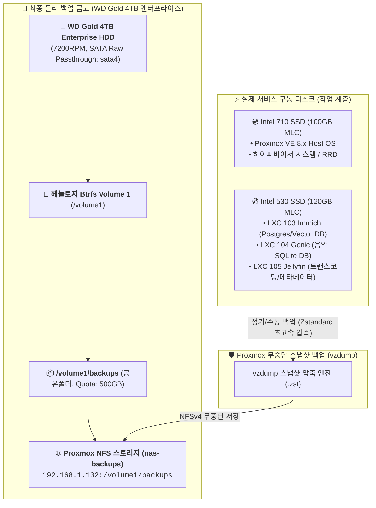

# 🛡️ Proxmox 백업 스토리지(물리 디스크 매핑) 및 재해 복구(Disaster Recovery) 가이드 (11)

> 💡 **본 문서는 자작 NAS의 전체 시스템(VM 101 헤놀로지, LXC 103~105 미디어 컨테이너)이 어디에 어떤 물리 디스크로 백업되는지, 그리고 시스템 장애 발생 시 1분 만에 완벽 복구하는 절차를 정리한 공식 백업/복구 매뉴얼입니다.**

---

## 💾 1. 백업 데이터 저장 위치 및 물리 디스크 계층 매핑

SSD가 물리적으로 고장 나거나 시스템 설정이 완전히 깨지더라도 백업 데이터가 안전하게 살아있도록 **구동 스토리지(SSD)와 백업 스토리지(엔터프라이즈 HDD)를 물리적으로 완벽히 분리**하여 보관합니다.



---

### 📌 물리 디스크 및 저장 경로 상세

| 구분 | 상세 내용 |
| :--- | :--- |
| **물리 하드웨어 디스크** | **WD Gold 4TB Enterprise HDD** (7200RPM CMR 엔터프라이즈 / `by-id` 헤놀로지 `sata4` 직결) |
| **헤놀로지 파일시스템** | **Btrfs 볼륨 1 (`/volume1`)** — 비트라트(Bit-rot) 데이터 손상 자동 복구 지원 |
| **헤놀로지 공유 폴더** | **`/volume1/backups`** (500GB 디스크 용량 제한 Quota 설정 완료) |
| **Proxmox 마운트 스토리지명** | **`nas-backups`** (`192.168.1.132:/volume1/backups`, NFSv4, `nolock`) |
| **Proxmox 호스트 내부 마운트 경로** | **`/mnt/pve/nas-backups/dump/`** |
| **백업 파일 저장 형태** | • `vzdump-qemu-101-*.vma.zst` (헤놀로지 VM 101 전체 이미지)<br>• `vzdump-lxc-103-*.tar.zst` (Immich DB 및 설정 전체)<br>• `vzdump-lxc-104-*.tar.zst` (Gonic 음악 서버 전체)<br>• `vzdump-lxc-105-*.tar.zst` (Jellyfin 미디어 서버 전체) |

---

## ⚙️ 2. 백업 수행 방법 (자동 & 수동)

### ① 자동 백업 스케줄 설정 (Proxmox 웹 GUI)

Proxmox 웹 콘솔(`https://192.168.1.200:8006`)에서 한 번만 등록해 두면 매주 자동으로 헤놀로지 4TB Gold 금고에 백업이 쌓입니다.

1. 좌측 최상단 **`Datacenter`** 클릭 ➔ **`[Backup]` (백업)** 메뉴 선택
2. 상단 **`[Add]`** 클릭 후 아래와 같이 입력:
   - **Node**: `All`
   - **Storage**: **`nas-backups`**
   - **Selection mode**: `All guests` (모든 VM/LXC 일괄 선택)
   - **Schedule**: `Sun 03:00` (매주 일요일 새벽 3시)
   - **Mode**: `Snapshot` (서비스 중단 없는 실시간 라이브 백업)
   - **Compression**: `Zstandard (fast)` (초고속 압축)
   - **Retention (보관 정책)**: `Keep Last: 3` *(최신 3개만 남기고 이전 백업은 자동 삭제하여 500GB 한도 내 상시 100~200GB 수준 유지)*
3. **[Create]** 클릭 ➔ 설정 완료!

---

### ② 지금 즉시 수동 백업하기 (CLI 원클릭)

주요 업그레이드나 설정 변경 전, Proxmox 호스트 셸에서 바로 전체 백업을 뜨는 명령어입니다:

```bash
# 전체 VM 101 및 LXC 103, 104, 105 즉시 무중단 백업
vzdump 101 103 104 105 --storage nas-backups --mode snapshot --compress zstd
```

*(특정 컨테이너만 백업할 때: `vzdump 105 --storage nas-backups --mode snapshot --compress zstd`)*

---

## 🔄 3. 재해 발생 시 복구 가이드 (Disaster Recovery)

---

### 🚨 시나리오 A. 특정 컨테이너(예: Jellyfin 105 또는 Immich 103) 설정이 꼬였거나 파일이 손상되었을 때 (1분 복구)

#### 방법 1: Proxmox 웹 GUI에서 클릭 복구 (추천 ⭐)
1. Proxmox 웹 콘솔 좌측 트리에서 **`nas-backups`** 스토리지 클릭
2. **`[Backups]`** 탭 클릭 ➔ 백업 파일 목록 확인
3. 복구하고 싶은 백업 파일(예: `vzdump-lxc-105-...`) 선택 ➔ 상단 **`[Restore]`** 클릭
4. **Target Storage**: **`local-530`** (Intel 530 고속 SSD 풀) 지정
5. **[Restore]** 버튼 클릭 ➔ **1분 내로 장애 발생 전 상태로 100% 롤백 완료!**

#### 방법 2: Proxmox 호스트 셸(CLI)에서 복구
```bash
# 1. 고장 난 컨테이너 정지 및 삭제
pct stop 105
pct destroy 105 --force --purge

# 2. 백업 파일로부터 원클릭 복원 (local-530 스토리지 위로 복원)
pct restore 105 /mnt/pve/nas-backups/dump/vzdump-lxc-105-*.tar.zst --storage local-530

# 3. 컨테이너 시작
pct start 105
```

---

### 🚨 시나리오 B. Intel 530 SSD가 물리적으로 고장 나서 새 SSD로 교체했을 때

1. 새 SSD 장착 후 Proxmox에서 `local-530` LVM-Thin 풀 생성
2. `nas-backups` 스토리지는 **WD Gold 4TB HDD**에 보관되어 있으므로 백업 파일이 100% 무사함
3. Proxmox GUI `nas-backups` ➔ `Backups` 탭에서 LXC 103, 104, 105를 새 SSD(`local-530`)로 원클릭 `Restore`
4. 즉시 모든 사진 DB, 음악 서버, Jellyfin 설정이 데이터 유실 0%로 완벽 복원됨!

---

### 🚨 시나리오 C. Proxmox Host OS(Intel 710 SSD)가 사망하여 PVE를 새로 설치했을 때

1. Intel 710 SSD에 Proxmox VE 8.x 재설치 (10분 소요)
2. 네트워크(`vmbr0`) 설정 후 헤놀로지 백업 스토리지 1줄 재등록:
   ```bash
   pvesm add nfs nas-backups --server 192.168.1.132 --export /volume1/backups --content backup --options "vers=4,nolock"
   ```
3. 백업 스토리지 안에 있던 `vzdump-qemu-101-*.vma.zst`와 `vzdump-lxc-*.tar.zst`를 Proxmox GUI에서 `Restore` 클릭
4. VM 101에 HDD 3대 `qm set` 패스스루 다시 연결 ➔ **전체 홈서버가 사고 이전과 완전히 동일하게 부활!**

---

## 📋 4. 백업 상태 점검 명령어 요약

```bash
# 1. Proxmox 백업 스토리지 연결 상태 확인
pvesm status

# 2. 현재 저장된 백업 파일 목록 및 용량 확인
ls -lh /mnt/pve/nas-backups/dump/

# 3. 헤놀로지 4TB Gold 백업 폴더 실시간 사용량 확인
df -h /mnt/pve/nas-backups
```
