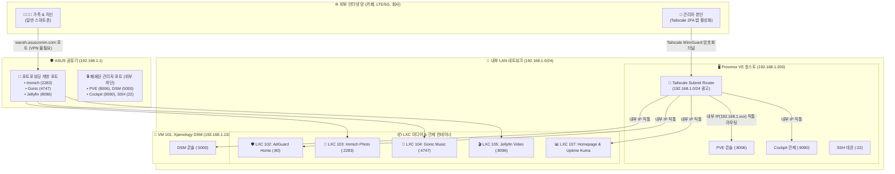

# 🔐 Tailscale WireGuard 하이브리드 보안망 및 원격 접속 가이드 (15)

> 💡 **본 문서는 Proxmox VE 자작 NAS 환경에서 Tailscale Subnet Router를 구축하여 관리자 포트를 외부 해킹 위협으로부터 100% 은폐하고, 외부 어디서나 집 안 내부 IP(`192.168.1.xxx`)로 안전하게 0초 접속하는 공식 보안/원격 접속 매뉴얼입니다.**

---

## 🏛️ 1. 하이브리드 보안 아키텍처 개요

가족들이 사용하는 미디어 서비스는 앱을 통한 간편 접속을 보장하고, 해킹 위험이 있는 핵심 관리자 콘솔은 외부 인터넷 포트포워딩을 폐쇄하여 **Tailscale WireGuard 2FA 암호화 터널**로만 접근을 허용하는 **엔터프라이즈 2원화 하이브리드 망**입니다.

---

## 🚀 2. 원격 접속 가이드

스마트폰이나 노트북에서 **`Tailscale` 앱을 [ON]**으로 켠 후, 집 안에서 사용하는 내부 IP로 직접 접속합니다:

| 서비스 | 접속 주소 (집 안 IP 그대로) | 접근 권한 |
| :--- | :--- | :---: |
| **🖥️ Proxmox VE** | `https://192.168.1.200:8006` | 관리자 전용 (Tailscale 필수) |
| **💾 Xpenology DSM** | `http://192.168.1.132:5000` | 관리자 전용 (Tailscale 필수) |
| **🌡️ Cockpit 디스크 관제** | `https://192.168.1.200:9090` | 관리자 전용 (Tailscale 필수) |
| **🛡️ AdGuard Home DNS** | `http://192.168.1.102` | 관리자 전용 (Tailscale 필수) |
| **📊 Homepage 대시보드** | `http://192.168.1.107:3000` | 전체 / 관리자 |
| **🔔 Uptime Kuma** | `http://192.168.1.107:3001` | 전체 / 관리자 |

---

## 📱 3. 일상 미디어 앱 설정 가이드 (가족 공용)

가족 구성원은 VPN을 켤 필요 없이 앱에 아래 주소를 입력하여 사용합니다:

- **📸 Immich iOS/Android 앱**: `http://waceh.asuscomm.com:2283`
- **🎵 Amperfy (음악) iOS 앱**: `http://waceh.asuscomm.com:4747`
- **🎬 Swiftfin / Jellyfin 비디오 앱**: `http://waceh.asuscomm.com:8096`

---

## 🛠️ 4. 관련 관리 스크립트

- [`setup_tailscale_subnet_router.sh`](../scripts/setup_tailscale_subnet_router.sh): Proxmox 호스트 커널 IP 포워딩 및 Tailscale 서브넷 라우터 자동 설치 스크립트
