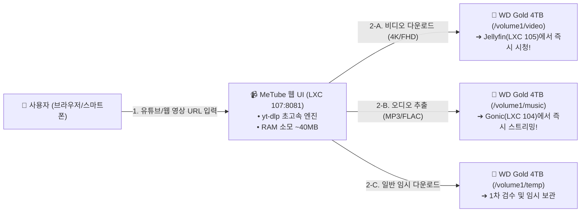

# 📹 MeTube 고화질 영상/음원 원클릭 웹 다운로더 구축 가이드 (16)

> 💡 **MeTube**는 최신 `yt-dlp` 엔진을 탑载한 초경량(~40MB RAM) 오픈소스 미디어 다운로더입니다. 웹 브라우저에서 유튜브, 치지직, 인스타그램, 틱톡 등의 영상 URL만 붙여넣으면 **최고화질(4K/1080p) 비디오** 또는 **최고음질(320k MP3/FLAC) 음원**을 내 자작 NAS의 **WD Gold 4TB**에 즉시 저장합니다.

---

## 🎯 1. 핵심 구축 목적 및 스토리지 연동 아키텍처



### 🌟 MeTube 도입의 3대 특장점
1. **음원 추출 즉시 Gonic 스트리밍 연동**:
   - Suno AI, 유튜브 라이브 음원, 믹스셋을 MP3로 다운로드하면 즉시 **LXC 104 Gonic 음악 서버에 반영**되어 스마트폰 Amperfy 및 CarPlay에서 바로 감상 가능.
2. **고화질 영상 Jellyfin 미디어 라이브러리 자동 반영**:
   - 유튜브 다큐멘터리, 고화질 영상 클립이 다운로드 즉시 **LXC 105 Jellyfin 홈비디오/유튜브 라이브러리**에 등록.
3. **초경량 리소스 소모**:
   - Docker 컨테이너 기준 평상시 **RAM 40MB 내외**만 소모하여 LXC 107(Homepage/Uptime Kuma)과 함께 완벽하게 공존.

---

## 🚀 2. 원클릭 자동 설치 스크립트 실행

Proxmox VE 호스트의 쉘(Web Shell 또는 SSH)에서 아래 명령어를 복사하여 실행합니다:

```bash
curl -fsSL https://raw.githubusercontent.com/waceh/nas/main/self-nas/scripts/setup_metube_lxc.sh | bash
```

---

## ⚙️ 3. 접속 주소 및 포트 정보

| 서비스 명칭 | 내부 접속 URL | 외부 접속 URL (ASUS DDNS) | 소모 RAM | 기본 직통 저장 경로 |
| :--- | :--- | :--- | :---: | :--- |
| 📹 **MeTube 웹 UI** | `http://192.168.1.107:8081` | `http://waceh.asuscomm.com:8081` | ~40 MB | **동영상**: `/volume1/video/downloads`<br/>**음원**: `/volume1/music/downloads`<br/>**임시**: `/volume1/temp/downloads` |

---

## 🇰🇷 4. MeTube 웹 UI 100% 한국어 패치 엔진

MeTube 공식 이미지는 영문만 지원하지만, DOM을 실시간 번역하는 한국어 패치가 내장되어 있습니다. 단독 실행 시:

```bash
curl -fsSL https://raw.githubusercontent.com/waceh/nas/main/self-nas/scripts/patch_metube_korean.sh | bash
```

* `Add` ➔ **`다운로드 추가`**
* `Format` ➔ **`포맷 선택`**
* `Quality` ➔ **`화질 / 음질`**
* `Downloads` ➔ **`다운로드 목록`**
* `Clear finished` ➔ **`완료 목록 지우기`**

---

## 💻 5. 실전 활용법 및 팁

### 1) 최고화질 비디오 다운로드 (WD Gold video/downloads 직통)
1. 브라우저에서 `http://192.168.1.107:8081` 접속.
2. 다운로드할 유튜브/웹 영상 URL 붙여넣기.
3. 포맷 선택에서 `동영상 (최고화질)` 선택 후 **`다운로드 추가`** 클릭.
4. **WD Gold 4TB `/volume1/video/downloads`**에 자동 저장되어 **[Jellyfin](http://192.168.1.105:8096)**에서 즉시 시청 가능.

### 2) 음원(MP3/FLAC) 추출 (WD Gold music/downloads 직통)
1. 포맷 선택에서 **`음원 추출 (MP3/FLAC)`** 선택 후 **`다운로드 추가`** 클릭.
2. **WD Gold 4TB `/volume1/music/downloads`**에 자동 저장되어 **[Gonic 음악 앱](http://192.168.1.104:4747)**에서 즉시 무손실 스트리밍 가능.

### 3) 크롬 / 사파리 북마클릿(Bookmarklet) 원클릭 등록
브라우저 북마크에 아래 자바스크립트를 등록해두면, 유튜브를 보다가 클릭 한 번으로 현재 보고 있는 영상을 NAS로 다운로드 전송할 수 있습니다:

```javascript
javascript:(function(){window.open('http://192.168.1.107:8081/add?url='+encodeURIComponent(location.href));})();
```

---

## 🛠️ 5. 트러블슈팅 및 유지보수

* **MeTube 컨테이너 상태 확인**:
  ```bash
  pct exec 107 -- docker ps -a | grep metube
  ```
* **MeTube 실시간 다운로드 로그 확인**:
  ```bash
  pct exec 107 -- docker logs -f metube
  ```
* **yt-dlp 엔진 최신 버전 업데이트**:
  ```bash
  pct exec 107 -- bash -c "cd /opt/metube && docker compose pull && docker compose up -d"
  ```
