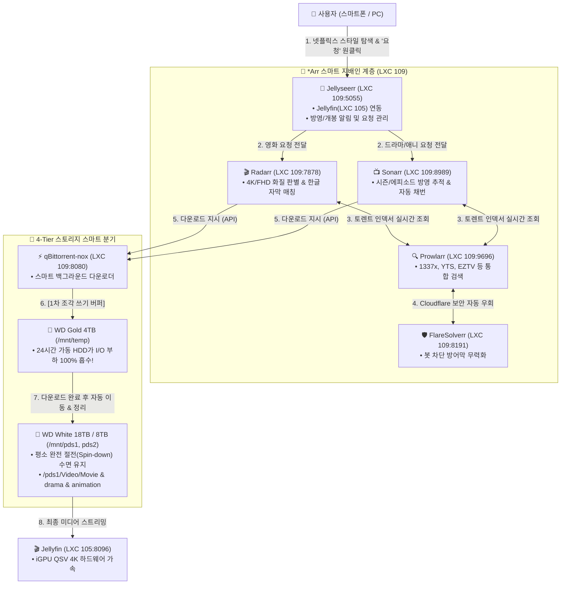

# 🍿 미디어 완전 자동화 풀스택 가이드: Jellyseerr · Radarr · Sonarr · Prowlarr · FlareSolverr · qBittorrent (17)

> 💡 **Jellyseerr**를 프론트엔드로 삼고, **Radarr(영화)**, **Sonarr(드라마/애니)**, **Prowlarr(토렌트 허브)**, **FlareSolverr(차단 우회)**, **qBittorrent(다운로더)**를 유기적으로 결합하여 **"넷플릭스 스타일 UI에서 요청 버튼 하나만 누르면 최고화질 영상과 자막이 내 26TB 하드로 전자동 수집·분류되는 완전 무인 미디어 자동화 파이프라인"**을 구축합니다.
> 
> 특히 **'스마트 버퍼링(Smart Buffering)' 전략**을 적용하여, 토렌트의 자잘한 조각 파일 쓰기 부하는 **24시간 가동되는 WD Gold 4TB 엔터프라이즈 하드**에서 100% 흡수하고, **26TB WD White 대용량 콜드 하드는 모터를 끄고 깊은 절전(Spin-down) 수면을 유지**하다가 완성된 파일만 예쁘게 전달받습니다.

---

## 🎯 1. 완전 자동화 풀스택 아키텍처 다이어그램



---

## 🌟 2. 6대 서비스 포트 및 역할 정의

| 서비스 명칭 | 내부 접속 포트 | 외부 접속 포트 (ASUS DDNS) | 소모 RAM | 핵심 역할 |
| :--- | :--- | :--- | :---: | :--- |
| 🍿 **Jellyseerr** | `http://192.168.1.109:5055` | `http://waceh.asuscomm.com:5055` | ~100 MB | 넷플릭스 스타일 미디어 탐색 및 원클릭 요청 UI |
| 🤖 **Radarr** | `http://192.168.1.109:7878` | - | ~90 MB | 영화 전담 자동 탐색, 화질 매칭 및 `/pds1/Video/Movie` 자동 분류 |
| 📺 **Sonarr** | `http://192.168.1.109:8989` | - | ~90 MB | 드라마/예능/애니 전담 에피소드 추적 및 `/pds1/Video/drama` 자동 분류 |
| 🔍 **Prowlarr** | `http://192.168.1.109:9696` | - | ~80 MB | 1337x, YTS, EZTV 등 전 세계 토렌트 인덱서 통합 관리 및 Radarr/Sonarr 자동 공급 |
| 🛡️ **FlareSolverr** | `http://192.168.1.109:8191` | - | ~90 MB | 국내 통신사 SNI 차단 및 Cloudflare 봇 방어벽 자동 우회 프록시 |
| ⚡ **qBittorrent** | `http://192.168.1.109:8080` | `http://waceh.asuscomm.com:8080` | ~80 MB | 스마트 버퍼링 다운로더 (WD Gold 4TB 임시 조각 쓰기) |

---

## 🚀 3. 원클릭 자동 배포 명령어

Proxmox VE 호스트 쉘(Web Shell 또는 SSH)에서 아래 명령어를 실행하여 LXC 109에 6대 풀스택을 한 번에 배포합니다:

```bash
curl -fsSL https://raw.githubusercontent.com/waceh/nas/main/self-nas/scripts/setup_media_automation_lxc.sh | bash
```

---

## 🛠️ 4. 실전 상호 연동 가이드

### 1) qBittorrent 보안 차단 해제 및 스핀다운 보호
* **API CSRF 보호 해제**: Radarr/Sonarr의 API 통신을 위해 `WebUI\CSRFProtection=false` 설정 완료.
* **스핀다운 보호 (하드 수명 극대화)**:
  * [http://192.168.1.109:8080](http://192.168.1.109:8080) ➔ **`도구` ➔ `옵션` ➔ `BitTorrent`**:
  * `공유 비율이 다음에 도달할 때:` 체크 ➔ **`0.00`** 입력 ➔ `작업:` **`토렌트 일시 중지`** 선택.

### 2) Radarr (영화 봇) 설정
1. [http://192.168.1.109:7878](http://192.168.1.109:7878) 접속 ➔ `Settings` ➔ `Media Management` ➔ `Root Folders`:
   * **루트 폴더**: **`/movies/Video/Movie`** (18TB White 하드) 추가.
2. `Settings` ➔ `Download Clients` ➔ `+` ➔ `qBittorrent`:
   * **Host**: `qbittorrent` (또는 `192.168.1.109`), **Port**: `8080`, **User/Pass**: `admin`/비밀번호 ➔ `Test & Save`.

### 3) Sonarr (드라마/애니 봇) 설정
1. [http://192.168.1.109:8989](http://192.168.1.109:8989) 접속 ➔ `Settings` ➔ `Media Management` ➔ `Root Folders`:
   * **드라마 루트 폴더**: **`/pds1/Video/drama`**
   * **예능 루트 폴더**: **`/pds1/Video/entertainment`**
   * **애니 루트 폴더**: **`/pds1/Video/animation`** 추가.
2. `Settings` ➔ `Download Clients` ➔ `+` ➔ `qBittorrent` 추가 ➔ `Test & Save`.

### 4) Prowlarr (토렌트 허브 & FlareSolverr & 통신사 SNI 우회 연동)
1. **통신사 SNI 차단 무력화 (인증서 검증 해제)**:
   * `Settings` ➔ `General` ➔ 상단 `Show Advanced: Shown` ➔ `Security` 항목:
   * **`Certificate Validation`**: **`Disabled`** (또는 `Permissive`) 선택 후 `Save`.
2. **FlareSolverr 프록시 등록 & 태그 지정**:
   * `Settings` ➔ `Indexers` ➔ `Proxies +` ➔ `FlareSolverr` 선택:
   * **Host**: `http://flaresolverr:8191` (또는 `http://192.168.1.109:8191`)
   * **Tags**: **`flaresolverr`** 입력 후 `Test & Save`.
3. **토렌트 인덱서 추가 (Indexers ➔ + Add Indexer)**:
   * **`1337x`**: Tags에 **`flaresolverr`** 입력 후 `Save` (Cloudflare 우회)
   * **`EZTV`**: Tags에 **`flaresolverr`** 입력 후 `Save` (Cloudflare 우회)
   * **`TorrentGalaxy`**: Tags에 **`flaresolverr`** 입력 후 `Save` (Cloudflare 우회)
   * **`YTS`**, **`ThePirateBay`**, **`SolidTorrents`**, **`LimeTorrents`**: Tags 없이 즉시 `Save`.
4. **Radarr & Sonarr 앱 자동 동기화 (`Settings` ➔ `Apps` ➔ `+`)**:
   * **Radarr 연동**: Host `http://radarr:7878`, API Key 입력 ➔ `Test & Save`.
   * **Sonarr 연동**: Host `http://sonarr:8989`, API Key 입력 ➔ `Test & Save`.

### 5) Jellyseerr (요청 UI) 설정
1. [http://192.168.1.109:5055](http://192.168.1.109:5055) 접속 ➔ `설정` ➔ `일반`:
   * 표시 언어: **`한국어`**, 탐색 지역: **`대한민국`**, 탐색 언어: **`한국어 (ko)`**.
2. `설정` ➔ `서비스`:
   * **Radarr 추가**: 호스트 `192.168.1.109`, 포트 `7878`, API Key, 루트 폴더 `/movies/Video/Movie`, 프로필 `HD-1080p`.
   * **Sonarr 추가**: 호스트 `192.168.1.109`, 포트 `8989`, API Key, 루트 폴더 `/pds1/Video/drama`, 프로필 `HD-1080p`.

---

## 📁 5. 스토리지 저장 경로 최종 맵핑표

| 서비스 | 컨테이너 내부 경로 | 실제 NAS 스토리지 매핑 | 용도 |
| :--- | :--- | :--- | :--- |
| **qBittorrent** | `/downloads/temp` | **WD Gold 4TB (`/volume1/temp`)** | 1차 토렌트 조각 파일 쓰기 버퍼 |
| **Radarr** | `/movies/Video/Movie` | **WD White 18TB (`/volume2/PDS1/Video/Movie`)** | 최종 완성 영화 영구 보관 |
| **Sonarr** | `/pds1/Video/drama` | **WD White 18TB (`/volume2/PDS1/Video/drama`)** | 최종 드라마 시리즈 영구 보관 |
| **Sonarr** | `/pds1/Video/entertainment` | **WD White 18TB (`/volume2/PDS1/Video/entertainment`)** | 최종 TV 예능 프로그램 보관 |
| **Sonarr** | `/pds1/Video/animation` | **WD White 18TB (`/volume2/PDS1/Video/animation`)** | 최종 애니메이션 시리즈 보관 |

---

---

## 🔍 6. 컨테이너 상태 점검 및 유지보수

```bash
# LXC 109 컨테이너 상태 및 6대 도커 프로세스 확인
pct status 109
pct exec 109 -- docker compose -f /opt/media-stack/docker-compose.yml ps

# NFS 마운트 상태 확인
pct exec 109 -- df -h | grep -E "temp|video|pds"

# 서비스 전체 재기동
pct exec 109 -- bash -c "cd /opt/media-stack && docker compose restart"
```

---

## 💡 7. 실전 미디어 수집 & 운영 꿀팁

### 1) 자동 검색(Auto Search) vs 대화형 검색(Interactive Search)
* **자동 검색 (`돋보기 아이콘`)**:
  - Jellyseerr에서 "요청" 버튼을 누르거나 Radarr/Sonarr에서 돋보기를 누르면, 5대 토렌트 사이트에서 **시더(배포자)가 가장 많고 1080p 고화질인 최적의 릴리즈를 스스로 골라 qBittorrent로 자동 전송**합니다.
* **대화형 검색 (`사람+돋보기 아이콘`)**:
  - 특정 릴리즈 그룹(SubsPlease, Erai-raws, 자막 내장본 등)이나 용량/화질을 직접 눈으로 보고 고르고 싶을 때 클릭합니다.
  - 검색된 토렌트 목록 중 마음에 드는 항목의 **`다운로드(구름 아이콘)`**를 누르면 즉시 qBittorrent로 꽂힙니다.

### 2) 한국 드라마 / K-콘텐츠 검색 팁 (TheTVDB 고유 번호)
* 한국 드라마는 영문 제목 매칭이 간혹 어긋날 수 있습니다 (예: 《괴물》 = *Beyond Evil*).
* 이때 Sonarr 검색창에 **`tvdb:393636`** 처럼 TheTVDB 고유 ID나 영문명을 입력하면 1초 만에 100% 정확하게 검색 및 등록됩니다.

### 3) 대용량 시리즈(원피스, 나루토 등) 수집 팁
* 수백~수천 화에 달하는 애니메이션은 전체를 한 번에 긁기보다, **원하는 시즌(Season 10 등) 우측의 돋보기 버튼**을 눌러 시즌 팩(Season Pack) 단위로 다운로드하면 빠르고 안정적입니다.

### 4) 초기 라이브러리 색인(Sync)과 속도
* 최초 Jellyfin 라이브러리 동기화(`Sync Libraries`) 시에는 수천 장의 포스터와 메타데이터를 다운로드하느라 일시적으로 굼뜰 수 있습니다.
* 색인이 1회 완료되어 Intel 530 SSD에 캐시가 저장되고 나면, **이후에는 넷플릭스 앱처럼 0.1초 만에 팍팍 뜨는 쾌적한 속도**를 자랑합니다.
