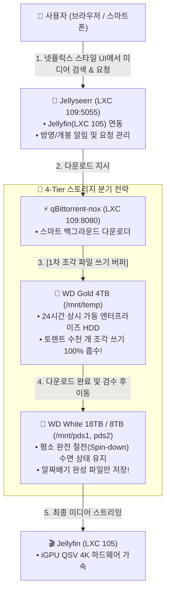

# 🍿 Jellyseerr & qBittorrent 스마트 미디어 자동 수집 스택 가이드 (17)

> 💡 **Jellyseerr**와 **qBittorrent-nox**를 결합하여, 넷플릭스 스타일 웹 포털에서 보고 싶은 영화/드라마를 검색하고 "요청" 버튼만 누르면 백그라운드에서 전자동으로 다운로드 및 분류되는 미디어 자동화 스택을 구축합니다.
> 
> 특히 **'스마트 버퍼링(Smart Buffering)' 아키텍처**를 적용하여, 토렌트 조각 파일 쓰기 부하를 **WD Gold 4TB Enterprise 하드**에서 1차로 모두 흡수함으로써 **26TB WD White 콜드 하드의 모터 수명과 스핀다운 절전 상태를 완벽하게 보호**합니다.

---

## 🎯 1. '스마트 버퍼링(Smart Buffering)' 아키텍처 다이어그램



---

## 🌟 2. 왜 스마트 버퍼링이 필수적인가?

1. **26TB 대용량 하드의 불필요한 스핀업 방지**:
   - 토렌트 다운로드는 수시간 동안 작은 블록 단위로 지속적인 디스크 I/O를 발생시킵니다.
   - 이를 대용량 콜드 하드에 직접 쓰면 모터가 계속 돌면서 발열과 마모가 생깁니다.
   - **24시간 상시 깨어있는 WD Gold 4TB의 `/volume1/temp`를 1차 버퍼로 사용**하면 26TB White 하드는 다운로드 내내 모터를 끄고 깊은 수면을 취할 수 있습니다.
2. **가짜/낚시 파일 1차 필터링**:
   - 4TB 임시 폴더에서 자막 싱크와 영상 품질을 확인한 후 안전한 파일만 26TB 보관소로 깔끔하게 이전할 수 있습니다.
3. **다운로드 완료 즉시 시딩 중지**:
   - 불필요한 네트워크 대역폭 소모 및 저작권 추적 위험을 원천 차단하기 위해 다운로드 완료 즉시 시딩을 정지(비율 0)하도록 설정합니다.

---

## 🚀 3. 원클릭 자동 설치 스크립트 실행

Proxmox VE 호스트의 쉘(Web Shell 또는 SSH)에서 아래 명령어를 복사하여 실행합니다:

```bash
curl -fsSL https://raw.githubusercontent.com/waceh/nas/main/self-nas/scripts/setup_media_automation_lxc.sh | bash
```

---

## ⚙️ 4. 접속 주소 및 포트 정보

| 서비스 명칭 | 내부 접속 URL | 외부 접속 URL (ASUS DDNS) | 소모 RAM | 주요 역할 |
| :--- | :--- | :--- | :---: | :--- |
| 🍿 **Jellyseerr** | `http://192.168.1.109:5055` | `http://waceh.asuscomm.com:5055` | ~100 MB | 넷플릭스 스타일 미디어 탐색 및 원클릭 요청 UI |
| ⚡ **qBittorrent** | `http://192.168.1.109:8080` | `http://waceh.asuscomm.com:8080` | ~80 MB | 스마트 백그라운드 토렌트 다운로더 |

---

## 🛠️ 5. 초기 연동 및 실전 설정 가이드

### 1) Jellyseerr 최초 설정 (Jellyfin 연동)
1. 브라우저에서 `http://192.168.1.109:5055` 접속.
2. 미디어 서버 선택 화면에서 **`Jellyfin`** 선택.
3. **Jellyfin 서버 URL**: `http://192.168.1.105:8096` 입력.
4. Jellyfin 관리자 계정 ID/PW 입력 후 라이브러리 동기화 클릭.
5. 이제 넷플릭스 화면처럼 트렌딩 영화/시리즈가 표출되며, 이미 다운로드된 영상은 `Available`, 없는 영상은 `Request` 버튼이 활성화됩니다.

### 2) qBittorrent 초기 로그인 및 카테고리 설정
1. 브라우저에서 `http://192.168.1.109:8080` 접속.
2. 초기 사용자명: `admin`
3. 초기 임시 비밀번호 확인:
   ```bash
   pct exec 109 -- docker logs qbittorrent | grep "temporary password"
   ```
4. 로그인 후 **도구 ➔ 옵션 ➔ 웹 UI**에서 나만의 영구 비밀번호로 변경.
5. **다운로드 경로 설정 (카테고리 분기)**:
   - **기본 다운로드 경로**: `/downloads/temp` (WD Gold 4TB 1차 버퍼)
   - **카테고리 `movies`**: `/downloads/pds1/Movies` (WD White 18TB)
   - **카테고리 `tv`**: `/downloads/pds2/TV` (WD White 8TB)

### 3) 다운로드 완료 즉시 시딩 중지 (스핀다운 보호)
* **옵션 ➔ BitTorrent ➔ 시딩 제한**:
  * `공유 비율이 다음에 도달할 때:` 체크 ➔ **`0.00`** 입력
  * `작업:` ➔ **`토렌트 일시 중지`** 선택

---

## 🔍 6. 컨테이너 관리 및 문제 해결

* **LXC 109 컨테이너 상태 점검**:
  ```bash
  pct status 109
  pct exec 109 -- docker ps
  ```
* **NFS 스토리지 마운트 확인**:
  ```bash
  pct exec 109 -- df -h | grep -E "temp|video|pds"
  ```
* **서비스 재기동**:
  ```bash
  pct exec 109 -- bash -c "cd /opt/media-stack && docker compose restart"
  ```
