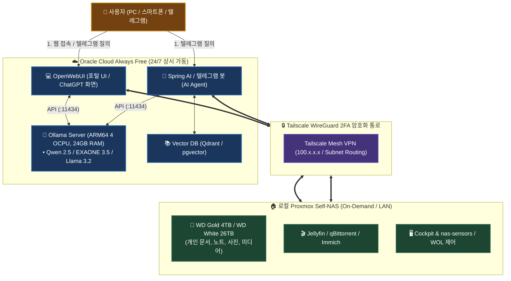
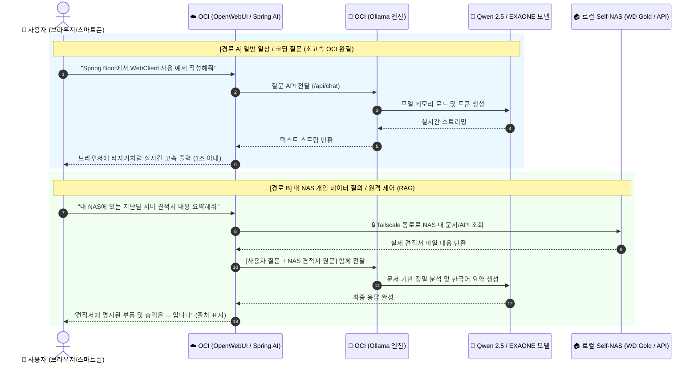

# 🤖 OCI 하이브리드 AI 서비스 및 Ollama 아키텍처 가이드 (97)

> 💡 **본 문서는 24/7 상시 가동되는 Oracle Cloud Infrastructure (OCI Always Free)의 컴퓨팅 파워와 로컬 홈서버(Proxmox Self-NAS)의 거대 스토리지를 Tailscale WireGuard 암호화 망으로 연동하여, 비용 0원으로 나만의 프라이빗 AI 생태계(Ollama, OpenWebUI, Spring AI, RAG)를 구축하는 마스터 아키텍처 가이드입니다.**

---

## 📌 1. 하이브리드 AI 아키텍처 핵심 개요



---

## ⚖️ 2. AI 모델 생태계 및 엔진 비교 분석

### 1) 상용 클라우드 모델 vs 오픈소스 로컬 모델

| 비교 항목 | 🏢 상용 클라우드 모델 (API) | 🦙 Ollama 오픈소스 모델 (Self-Hosted) |
| :--- | :--- | :--- |
| **대표 모델** | **Claude 3.5 Sonnet**, GPT-4o, Gemini 1.5 Pro | **Qwen 2.5**, **EXAONE 3.5**, **Llama 3.2**, **Gemma 2** |
| **개발사** | Anthropic, OpenAI, Google | 알리바바(Alibaba), LG AI연구원, 메타(Meta), 구글 |
| **구동 환경** | 빅테크 데이터센터 슈퍼컴퓨터 | **내 OCI 인스턴스 (ARM64 4코어, 24GB RAM)** |
| **비용** | 토큰당 과금 (또는 월 $20 구독) | **100% 완전 무료, 무제한 질의** |
| **데이터 보안** | 대화 데이터가 외부 회사 서버로 전송 | **내 서버 내부에서만 완결 (100% 프라이빗)** |

> 💡 **핵심**: Claude 3.5 Sonnet 같은 독점 모델은 소스가 비공개되어 직접 설치할 수 없지만, **최신 오픈소스 모델(Qwen 2.5, EXAONE 3.5)을 Ollama로 구동하면 무료로 고품질의 추론/코딩/한국어 답변을 무제한 생성**할 수 있습니다.

---

### 2) Ollama vs LM Studio 비교 (서버 환경 관점)

| 항목 | 🦙 **Ollama (서버 환경 적극 권장 ⭐⭐⭐⭐⭐)** | 🖥️ **LM Studio (개인 데스크톱용 ⚠️)** |
| :--- | :--- | :--- |
| **태생 및 목적** | **리눅스 서버 / 백그라운드 데몬 / REST API** | **macOS/Windows 개인 PC용 GUI 앱** |
| **OCI 리눅스 호환** | Docker 컨테이너 및 CLI 네이티브 완벽 지원 | GUI 앱이라 헤드리스 리눅스 서버 운영 부적합 |
| **ARM64 가속** | OCI Ampere A1 (ARM64 NEON) 네이티브 가속 | ARM 리눅스 지원 제약 |
| **외부 확장성** | OpenAI 표준 규격 (`:11434`) 지원 (Spring AI, LangChain 등) | 로컬 프록시 기능 있으나 서버 통합에 한계 |
| **웹 UI 제공** | **OpenWebUI**와 결합하여 모바일/웹 완벽 지원 | 별도 웹 클라이언트 연동 번거로움 |

---

## 🧠 3. OCI Always Free 추천 오픈소스 모델 맵

OCI Always Free(4 OCPU, 24GB RAM, CPU 추론) 환경에서 **초당 15~30토큰(사람 읽는 속도 이상)의 쾌적한 속도**를 내는 추천 모델 목록입니다.

| 모델명 | 최적 크기 | 특화 분야 | 다운로드 및 실행 명령어 |
| :--- | :---: | :--- | :--- |
| 🇨🇳 **Qwen 2.5** | `7b` / `3b` | **코딩, 수학, 다국어 추론, RAG 1위 (현재 오픈소스 최강)** | `ollama run qwen2.5:7b` |
| 🇰🇷 **EXAONE 3.5** | `7.8b` / `2.4b` | **LG 개발 한국어 최고 특화 모델 (자연스러운 한국어/문맥)** | `ollama run exaone3.5:7.8b` |
| 🇺🇸 **Llama 3.2** | `3b` / `1b` | **초경량 초고속 모델 (텔레그램 봇 및 가벼운 질의 최적)** | `ollama run llama3.2:3b` |
| 🇬 **Gemma 2** | `9b` / `2b` | **구글 딥마인드 고성능 언어 모델** | `ollama run gemma2:9b` |
| 👁️ **MiniCPM-V** | `8b` | **이미지/사진 분석 및 텍스트 추출 (Vision AI)** | `ollama run minicpm-v` |

---

## 🗺️ 4. 데이터 질의 흐름 및 작동 시퀀스



---

## 🛠️ 5. OCI 원클릭 배포 가이드 (`docker-compose.yml`)

OCI 인스턴스에 접속하여 아래 설정을 배포하면 **Ollama + OpenWebUI**가 즉시 구동됩니다.

```yaml
version: '3.8'

services:
  # 1. Ollama LLM 엔진
  ollama:
    image: ollama/ollama:latest
    container_name: ollama
    restart: unless-stopped
    ports:
      - "11434:11434"
    volumes:
      - ./ollama_data:/root/.ollama
    environment:
      - OLLAMA_KEEP_ALIVE=24h        # 모델 메모리 상주로 즉시 응답
      - OLLAMA_NUM_PARALLEL=2        # 동시 2개 요청 병렬 처리

  # 2. OpenWebUI (ChatGPT 스타일 고품질 웹 포털)
  open-webui:
    image: ghcr.io/open-webui/open-webui:main
    container_name: open-webui
    restart: unless-stopped
    ports:
      - "3000:8080"
    environment:
      - OLLAMA_BASE_URL=http://ollama:11434
      - WEBUI_SECRET_KEY=generate_your_random_secret_here
    volumes:
      - ./openwebui_data:/app/backend/data
    depends_on:
      - ollama
```

---

## 🌟 6. 핵심 기대 효과 및 실전 운영 팁

1. **완전한 홈 네트워크 보안 은폐**:
   - 외부 웹 트래픽은 24시간 OCI가 모두 받아내며, 집의 Proxmox NAS는 **Tailscale 2FA 암호화 통로로만 안전하게 데이터를 공급**합니다.
2. **NAS 전원 절약 (On-Demand 완벽 호환)**:
   - 일상적인 코딩, 번역, AI 질의는 OCI 혼자 24시간 처리하므로, 집의 대용량 NAS는 필요 없을 때 꺼두거나 절전 상태를 유지할 수 있습니다.
3. **하이브리드 모델 스위칭 (꿀조합)**:
   - OpenWebUI 설정에 **Anthropic API 키(Claude 3.5 Sonnet)**나 **Google Gemini API 키**를 등록하면, 
   - 평소 가벼운 질의는 **무료 Ollama(Qwen 2.5 / EXAONE)**로 무제한 사용하고,
   - 고난도 아키텍처 설계 시에만 상단 메뉴에서 **Claude 3.5 Sonnet**을 선택하여 한 화면에서 통합 사용할 수 있습니다.
