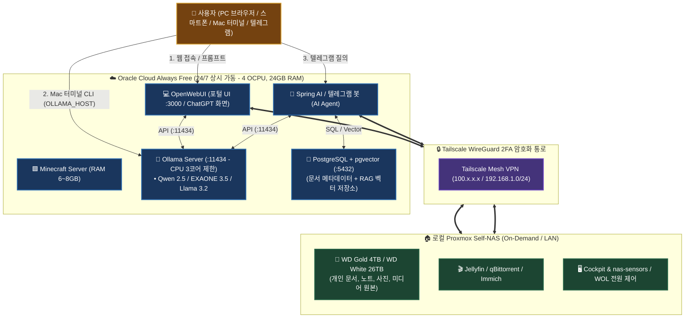
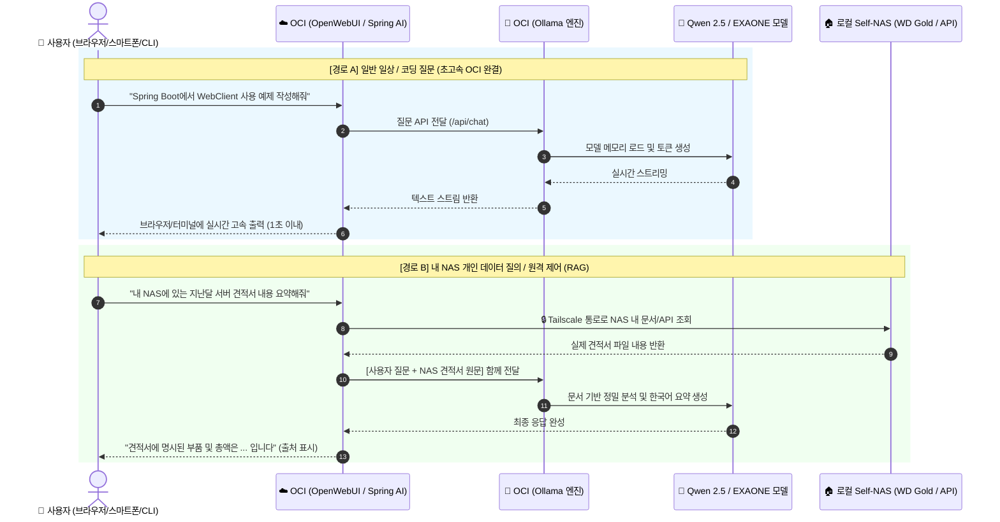

# 🤖 OCI 하이브리드 AI 서비스 및 Ollama 아키텍처 가이드 (97)

> 💡 **본 문서는 24/7 상시 가동되는 Oracle Cloud Infrastructure (OCI Always Free: 4 OCPU, 24GB RAM)와 로컬 홈서버(Proxmox Self-NAS: 30TB Storage)를 Tailscale WireGuard 암호화 망으로 연동하여, 비용 0원으로 나만의 프라이빗 AI 생태계(Ollama, OpenWebUI, Spring AI, PostgreSQL pgvector RAG)를 구축하고 기존 마인크래프트 서버와 평화롭게 공존시키는 마스터 가이드입니다.**

---

## 📌 1. 하이브리드 AI 아키텍처 핵심 개요



---

## 🎮 2. OCI 마인크래프트 서버 공존(Co-existence) 리소스 분배 & 렉 방지

OCI Always Free의 **Ampere A1 (ARM64 4 OCPU, 24GB RAM)**은 마인크래프트 서버와 AI 스택을 동시에 돌리기에 매우 넉넉합니다.

### 1) 24GB RAM 분배 견적

| 서비스 | 할당 권장 RAM | 비고 |
| :--- | :---: | :--- |
| 🟩 **마인크래프트 서버 (PaperMC / Fabric)** | **6 ~ 8 GB** | 5~10명 동시 접속에도 쾌적한 힙 메모리 |
| 🦙 **Ollama (Qwen 2.5 7B / EXAONE 3.5)** | **~5 GB** | 질의 시에만 활성화, 평소 RAM 상주 (빠른 응답) |
| 💻 **OpenWebUI** | **~300 MB** | ChatGPT 스타일 웹 인터페이스 |
| 🐘 **PostgreSQL + pgvector** | **~200 MB** | RAG 벡터 및 문서 메타데이터 통합 저장소 |
| 🐧 **Ubuntu OS 및 시스템 여유 버퍼** | **~10 GB** | **완전 넉넉한 잉여 버퍼 메모리 (스왑 발생 0%)** |
| **합계** | **약 14 GB 사용 / 10 GB 여유** | **전체 24GB 중 60% 미만 점유** |

### 2) 마인크래프트 렉(Tick Drop) 방지 핵심 CPU 격리 설정
마인크래프트는 **20 TPS 틱 유지(싱글 코어 순간 연산)**가 생명입니다. AI가 질문을 처리할 때 CPU를 100% 독점하여 게임 렉이 생기지 않도록, **Ollama 컨테이너의 CPU 사용량을 3.0 코어로 제한**합니다.
```yaml
# docker-compose.yml
services:
  ollama:
    ...
    cpus: 3.0   # 4개 코어 중 최대 3개까지만 AI가 사용 (1개 코어는 마크 전용 보장!)
```

---

## ⚖️ 3. AI 모델 생태계 및 엔진 비교 분석

### 1) 상용 클라우드 모델 vs 오픈소스 로컬 모델

| 비교 항목 | 🏢 상용 클라우드 모델 (API) | 🦙 Ollama 오픈소스 모델 (Self-Hosted) |
| :--- | :--- | :--- |
| **대표 모델** | **Claude 3.5 Sonnet**, GPT-4o, Gemini 1.5 Pro | **Qwen 2.5**, **EXAONE 3.5**, **Llama 3.2**, **Gemma 2** |
| **개발사** | Anthropic, OpenAI, Google | 알리바바(Alibaba), LG AI연구원, 메타(Meta), 구글 |
| **구동 원리** | 빅테크 원격 서버에 질문 전송 | **내 OCI 서버 내부 CPU/RAM에서 100% 자체 연산** |
| **비용** | 토큰당 과금 (또는 월 $20 구독) | **100% 완전 무료, 무제한 질의** |
| **데이터 보안** | 질문 내용이 외부 회사 서버로 전송 | **내 서버 내부에서만 완결 (개인정보/기밀 100% 보호)** |

> 💡 **핵심**: Claude 3.5 Sonnet 같은 독점 모델은 소스가 비공개되어 직접 다운로드할 수 없지만, **Qwen 2.5나 EXAONE 3.5를 Ollama로 구동하면 무료로 고품질의 한국어/코딩 답변을 무제한 생성**할 수 있습니다.

### 2) Ollama vs LM Studio 비교 (서버 관점)
- **🦙 Ollama (적극 권장 ⭐⭐⭐⭐⭐)**: 리눅스 서버/헤드리스 환경에 최적화된 백그라운드 REST API 데몬. ARM64 NEON 가속 및 Docker 1줄 배포 완벽 지원.
- **🖥️ LM Studio (서버 부적합 ⚠️)**: 개인 데스크톱 GUI 프로그램. 서버에 띄우기 번거롭고 ARM 리눅스 제약이 있음.

---

## 🧠 4. OCI Always Free 추천 오픈소스 모델 맵

| 모델명 | 크기 | 특화 분야 | 터미널 다운로드 및 실행 명령어 |
| :--- | :---: | :--- | :--- |
| 🇨🇳 **Qwen 2.5** | `7b` / `3b` | **코딩, 수학, 다국어 추론, RAG 1위 (현재 오픈소스 최강)** | `ollama run qwen2.5:7b` |
| 🇰🇷 **EXAONE 3.5** | `7.8b` / `2.4b` | **LG 개발 한국어 최고 특화 모델 (자연스러운 한국어 어조/문맥)** | `ollama run exaone3.5:7.8b` |
| 🇺🇸 **Llama 3.2** | `3b` / `1b` | **초경량 초고속 모델 (텔레그램 봇 / 가벼운 질의 최적)** | `ollama run llama3.2:3b` |
| 🇬 **Gemma 2** | `9b` / `2b` | **구글 딥마인드 고성능 언어 모델** | `ollama run gemma2:9b` |
| 👁️ **MiniCPM-V** | `8b` | **이미지/사진 분석 및 텍스트 추출 (Vision AI)** | `ollama run minicpm-v` |

---

## 📚 5. RAG (검색 증강 생성) & Vector DB 심층 분석

### 1) RAG 데이터의 실제 용량 (오해와 진실)
RAG 데이터는 사진/동영상 파일 원본을 넣는 것이 아니라, **500자 텍스트 조각(1KB) + 숫자 벡터 좌표(6KB) = 청크당 약 7KB**만 저장됩니다.
- **A4 용지 100장 (메모, 계약서)**: 약 `3.5 MB`
- **A4 용지 10,000장 (방대한 도서/매뉴얼)**: 약 `350 MB (~0.35 GB)`
- ➔ 즉, 방대한 개인 문서를 전부 넣어도 용량은 **1GB 미만**으로 매우 가볍습니다.

### 2) PostgreSQL (pgvector) vs Qdrant vs Elasticsearch 비교

| 비교 항목 | 🐘 **PostgreSQL + pgvector (최종 추천 ⭐⭐⭐⭐⭐)** | 🦀 **Qdrant (전용 Vector DB)** | 🔎 **Elasticsearch (ES)** |
| :--- | :--- | :--- | :--- |
| **적합 규모** | **소규모 ~ 수천만 건 (개인/홈서버 종결)** | **수백만 ~ 수억 건** | **10억 건+ (다나와급 대규모 필터링)** |
| **메모리(RAM)** | **~150 MB (초경량)** | **~50 MB (Rust 기반 초경량)** | 2GB ~ 4GB+ (Java JVM 기반 무거움) |
| **데이터 결합** | **SQL JOIN으로 일반 메타데이터와 결합 완벽** | JSON 메타데이터 필터링 | NoSQL 역색인 검색 |
| **트랜잭션(ACID)**| **파일 삭제 시 메타데이터+벡터 원자적 1회 삭제** | DB가 분리되어 동기화 코드 필요 | 별도 파이프라인 필요 |
| **Spring AI 연동**| `PgVectorStore` (1등 시민 공식 지원) | `QdrantVectorStore` (공식 지원) | 복잡한 인덱스 매핑 필요 |

> 💡 **현업 인사이트**: Spring AI 프레임워크가 DB 접근을 `vectorStore.similaritySearch()`로 완전히 추상화해주므로, 어차피 사람이 직접 DB를 조회할 일이 없습니다. 따라서 **DB를 2개로 쪼개지 않고 단 1개의 DB로 트랜잭션과 백업을 끝낼 수 있는 `PostgreSQL + pgvector`가 가장 실용적인 정답**입니다.

---

## 🗺️ 6. 데이터 질의 흐름 시퀀스



---

## 💻 7. CLI 실전 활용 가이드 (Mac 터미널 연동)

내 맥북의 리소스는 1도 쓰지 않고, **OCI 클라우드의 Qwen을 맥북 터미널에서 바로 실행**할 수 있습니다.

### 1) 맥북 터미널에서 OCI 원격 호출 (`OLLAMA_HOST`)
```bash
# 내 맥북 ~/.zshrc 에 환경변수 등록 (Tailscale IP 지정)
export OLLAMA_HOST="http://100.x.x.x:11434"

# 맥북 터미널에서 바로 실행
ollama run qwen2.5:7b
```

### 2) 터미널 파이프(`|`) 기반 개발자 자동화
```bash
# 1. 에러 로그 즉시 원인 분석
cat /var/log/nginx/error.log | ollama run qwen2.5 "이 에러 원인과 해결법 3줄 요약해줘"

# 2. Git 변경점(diff) 기반 커밋 메시지 자동 생성
git diff | ollama run qwen2.5 "Conventional Commits 형식으로 한국어 커밋 메시지 1줄 작성해줘"
```

---

## 🛠️ 8. OCI 프로덕션 원클릭 배포 파일 (`docker-compose.yml`)

마인크래프트 서버가 돌고 있는 OCI 인스턴스의 빈 디렉토리(예: `~/ai-stack`)에 아래 파일을 생성하고 `docker compose up -d`를 실행합니다.

```yaml
version: '3.8'

services:
  # 1. Ollama LLM 추론 엔진
  ollama:
    image: ollama/ollama:latest
    container_name: ollama
    restart: unless-stopped
    cpus: 3.0 # 마인크래프트 렉 방지 (최대 3코어 제한)
    ports:
      - "11434:11434"
    volumes:
      - ./ollama_data:/root/.ollama
    environment:
      - OLLAMA_KEEP_ALIVE=24h        # 모델 메모리 상주 (즉시 응답)
      - OLLAMA_NUM_PARALLEL=2        # 동시 2개 질의 병렬 처리

  # 2. OpenWebUI (ChatGPT 스타일 웹 포털)
  open-webui:
    image: ghcr.io/open-webui/open-webui:main
    container_name: open-webui
    restart: unless-stopped
    ports:
      - "3000:8080"
    environment:
      - OLLAMA_BASE_URL=http://ollama:11434
      - WEBUI_SECRET_KEY=mtk_nas_ai_secret_key_change_me
    volumes:
      - ./openwebui_data:/app/backend/data
    depends_on:
      - ollama

  # 3. PostgreSQL + pgvector (RAG 벡터 및 문서 메타데이터 저장소)
  pgvector:
    image: pgvector/pgvector:pg16
    container_name: pgvector
    restart: unless-stopped
    ports:
      - "5432:5432"
    environment:
      - POSTGRES_DB=nas_ai
      - POSTGRES_USER=nas_user
      - POSTGRES_PASSWORD=your_strong_postgres_password
    volumes:
      - ./pgvector_data:/var/lib/postgresql/data
```

---

## 🚀 9. 향후 실전 작업 체크리스트 (Action Plan)

- [ ] **Step 1 (OCI 사전 준비)**: OCI 인스턴스 보안 목록(Security List)에서 필요한 포트(OpenWebUI: 3000) 오픈 확인.
- [ ] **Step 2 (Docker Compose 실행)**: OCI 서버 `~/ai-stack` 폴더에서 `docker compose up -d` 기동.
- [ ] **Step 3 (추천 모델 다운로드)**:
  ```bash
  docker exec -it ollama ollama run qwen2.5:7b
  docker exec -it ollama ollama run exaone3.5:7.8b
  ```
- [ ] **Step 4 (OpenWebUI 브라우저 접속)**: `http://oci-ip:3000` 접속 후 관리자 계정 생성 및 Qwen 대화 테스트.
- [ ] **Step 5 (상용 API 키 하이브리드 등록 - 선택)**: OpenWebUI 설정에 Anthropic API 키 등록 ➔ 평소에는 Qwen 2.5 쓰다가 필요 시 Claude 3.5 Sonnet 원클릭 전환.
- [ ] **Step 6 (Tailscale 연동)**: OCI 인스턴스에 Tailscale 설치하여 홈서버 Proxmox Subnet(`192.168.1.0/24`) 직통 연결.
