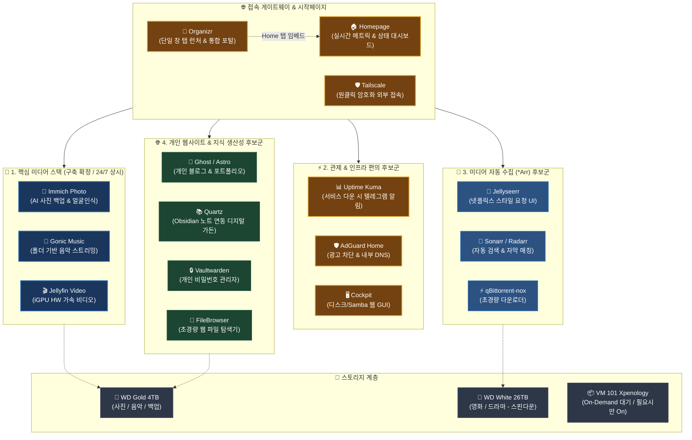
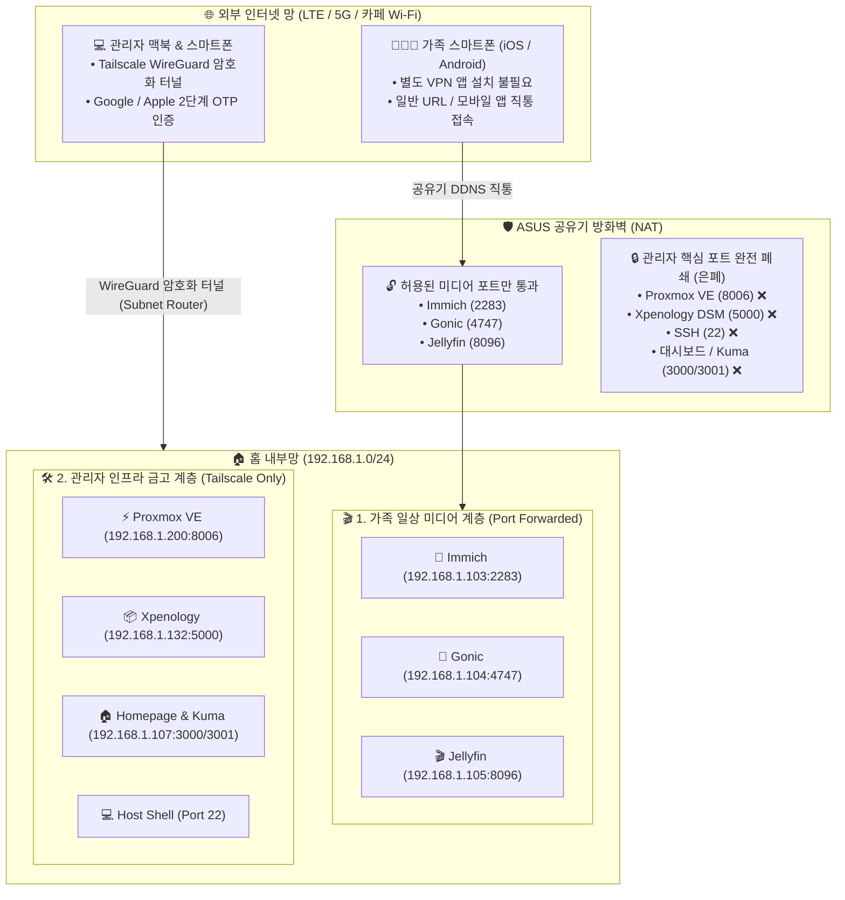
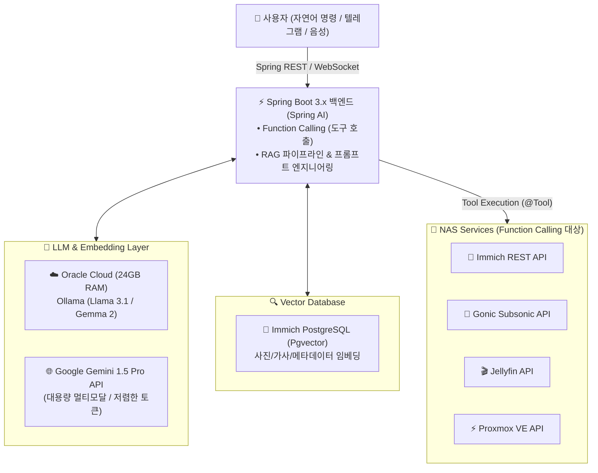
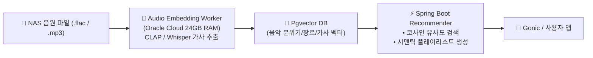

# 🧭 홈서버 확장 서비스 후보군 및 아키텍처 검토 가이드 (참고용) (98)

> ⚠️ **본 문서는 확정된 필수 구성이 아니며, 향후 홈서버 편의성 개선 및 기능 확장을 고려할 때 참고하기 위한 '검토용(Candidate & Reference)' 문서입니다.**

---

## 🏗️ 1. 확장 후보 서비스 종합 인프라 맵



---

## 📋 2. 카테고리별 후보 서비스 상세 분석

### ① ⚡ 홈서버 관제 & 인프라 편의 (삶의 질 향상 ⭐⭐⭐)
| 서비스 | 권장 구동 환경 | 소모 RAM | 주요 특징 및 추천 이유 |
| :--- | :---: | :---: | :--- |
| 📑 **Organizr** | LXC / Docker | ~50 MB | • **통합 탭 런처 & 가족 포털**: 여러 웹 서비스를 새 탭 없이 한 화면에서 iframe 탭 전환<br>• Plex/Jellyfin SSO 로그인 연동, 사용자/역할별 탭 권한 제어 |
| 🏠 **Homepage** | LXC / Docker | ~50 MB | • **홈서버 올인원 시작페이지**: Next.js 기반 초경량 대시보드<br>• Proxmox CPU/RAM 게이지, Immich 사진 장수, Jellyfin 시청자 수 실시간 위젯 표시<br>• DB 불필요, 간단한 YAML 설정으로 관리 |
| 📊 **Uptime Kuma** | LXC / Docker | ~50 MB | • Proxmox 호스트, VM 101, Immich, Gonic, 네트워크 상태를 1분마다 모니터링<br>• 서버 장애 발생 시 **텔레그램 / 디스코드로 즉시 푸시 알림** 발송 |
| 🛡️ **Tailscale** | LXC / PVE | ~30 MB | • 공유기 포트포워딩 없이 외부(LTE/카페/해외)에서 집안 로컬 IP로 암호화 직결 |
| 🛡️ **AdGuard Home** | LXC 102 | ~100 MB | • 집안 모든 기기(스마트폰, 스마트TV, PC) 광고/추적기 원천 차단<br>• `photo.home`, `music.home` 등 내부 로컬 도메인 DNS 매핑 |
| 🖥️ **Cockpit** | PVE Host 패키지 | ~20 MB | • Proxmox 호스트(Debian)에 웹 GUI 추가 (`:9090`)<br>• 하드 디스크 건강도(S.M.A.R.T), 온도 확인 및 클릭으로 Samba 공유 폴더 관리 |

#### 💡 [심층 분석] Homepage + Organizr 듀얼 대시보드 시너지 (추천 조합)
- **왜 둘을 함께 쓰면 좋은가?**:
  - **Homepage 단독**: 시스템 리소스 및 위젯 메트릭 보기는 최강이지만, 링크 클릭 시 새 브라우저 창/탭이 계속 열림.
  - **Organizr 단독**: 브라우저 단일 창에서 탭 전환하며 쓰기는 좋지만, 자체 위젯 대시보드 디자인이 다소 투박함.
  - **결합 형태 (Best Practice)**: **Organizr를 브라우저 메인 포털로 두고, Home 탭에 Homepage를 iframe으로 임베드**하여 `실시간 관제(Homepage) + 단일 화면 작업(Organizr)`을 완벽히 양립.
- **실전 팁 & 주의사항**:
  - Proxmox 웹 콘솔이나 일부 보안 헤더(`X-Frame-Options`)가 걸린 서비스는 iframe 대신 Organizr 내 **'새 탭으로 열기'** 옵션 지정.
  - 두 서비스 합산 메모리 소모량은 **100MB 미만**으로 하드웨어 리소스 부담이 전혀 없음.

---

#### 🛡️ [심층 분석] Tailscale 기반 '하이브리드 외부 접속 보안' 아키텍처

> **"가족의 일상 미디어 편의성은 100% 유지하면서, 관리자 핵심 인프라는 전 세계 해커로부터 완전히 숨긴다."**



##### 1. 왜 '하이브리드(2-Tier)' 방식이 가장 이상적인가?
1. **가족 사용성 100% 보장 (No Friction)**:
   - 부모님이나 배우자의 스마트폰에 복잡한 VPN 앱을 켜게 할 필요 없이, **Immich(사진 백업), Amperfy(음악), Swiftfin(영상)** 앱이 집 밖에서도 자동으로 원활하게 통신합니다.
2. **치명적인 관리자 침투 경로 100% 차단 (Zero Attack Surface)**:
   - 해커가 가장 탐내는 **Proxmox 하이퍼바이저 셸(22/8006)**과 **헤놀로지 관리자(5000)** 포트를 외부에서 아예 닫아버리므로, 전 세계 봇 스캐너에 우리 집 서버는 **단단한 콘크리트 벽**으로 인식됩니다.

##### 2. 모바일 클라이언트 앱(iOS/Android) 실전 운영 팁
- **관리자 기기 (Tailscale On-Demand VPN)**:
  - iOS Tailscale 앱의 **[On-Demand VPN]**을 켜두면 셀룰러(LTE/5G)나 외부 Wi-Fi 연결 시 배터리 소모 없이 백그라운드에서 자동 활성화됩니다.
  - 앱 서버 주소를 `http://192.168.1.xxx:포트`로 통일하여 **집안/집밖 구분 없이 단일 내부 IP로 완벽하게 이용**할 수 있습니다.
- **Tailscale Subnet Router 1줄 활성화 (Proxmox 호스트 또는 LXC)**:
  ```bash
  # 192.168.1.0/24 대역 전체를 Tailscale 암호화 망으로 라우팅
  tailscale up --advertise-routes=192.168.1.0/24 --accept-routes
  ```

---

### ② 🍿 미디어 자동 수집 & 정리 스택 (Jellyfin 연동 후보 ⭐⭐)
| 서비스 | 권장 구동 환경 | 소모 RAM | 주요 특징 및 추천 이유 |
| :--- | :---: | :---: | :--- |
| 🍿 **Jellyseerr** | LXC / Docker | ~150 MB | • 넷플릭스 스타일 UI에서 보고 싶은 영화/드라마 검색 후 원클릭 '요청' |
| 🤖 **Sonarr / Radarr** | LXC / Docker | ~300 MB | • 방영/개봉 일정 추적, 한글 자막 자동 매칭 및 WD White 26TB 자동 분류 |
| ⚡ **qBittorrent-nox** | LXC / Docker | ~100 MB | • 웹 UI 지원 토렌트 클라이언트<br>• 다운로드 완료 후 자동 시딩 중지 ➔ **WD White HDD 스핀다운 유지** |

---

### ③ 🌐 개인 웹사이트 & 지식 생산성 (나만의 공간 후보 ⭐⭐)
| 서비스 | 권장 구동 환경 | 소모 RAM | 주요 특징 및 추천 이유 |
| :--- | :---: | :---: | :--- |
| 📝 **Ghost** (또는 Astro) | LXC / Docker | ~150 MB (Astro는 10MB) | • **개인 기술 블로그 / 포트폴리오 웹사이트**<br>• 깔끔하고 모던한 에디터, 모바일 최적화 웹페이지 외부 공개 |
| 📚 **Quartz** | LXC / Nginx | ~15 MB | • **Obsidian(옵시디언) 연동 디지털 가든**<br>• 개인 로컬 마크다운 노트를 예쁜 위키 웹사이트로 자동 빌드 및 호스팅 |
| 🔒 **Vaultwarden** | LXC / Docker | ~20 MB | • **초경량 개인 비밀번호 관리자** (Bitwarden 오픈소스 Rust 버전)<br>• 크롬 익스텐션, iOS/Android 자동 완성 완벽 호환 |
| 📁 **FileBrowser** | LXC / Docker | ~15 MB | • 단일 바이너리 초경량 **웹 파일 탐색기**<br>• 웹 브라우저에서 NAS 파일 바로 탐색, 다운로드, 임시 공유 링크 생성 |

---

## 🏛️ 3. 아키텍처 & 리소스 운영 전략 (On-Demand)

### 💡 Xpenology(VM 101)의 On-Demand 대기 운영 철학
- **평소 (24/7 상시 운영)**:
  - VM 101은 **정지(`Stopped`) 상태**로 유지.
  - 상시 점유 메모리: **0 MB** (16GB 중 0% 점유).
  - Immich, Gonic, Jellyfin 등 상시 서비스는 Proxmox 호스트가 디스크를 마운트하여 **바인드 마운트(`mp0`)**로 직접 연결하므로 헤놀로지가 꺼져 있어도 24시간 완벽 작동.
- **필요 시 (On-Demand 부팅)**:
  - Synology Active Backup으로 PC 백업을 수행하거나 시놀로지 전용 도구가 필요할 때만 `qm start 101`로 기동.
  - 작업 완료 후 `qm shutdown 101`로 다시 정상 종료.

---

## 📊 4. 16GB RAM 기준 통합 리소스 배치 시뮬레이션

| 순번 | VM / LXC 컨테이너 명칭 | 포함 서비스 | vCPU | RAM 할당 | 스토리지 위치 |
| :---: | :--- | :--- | :---: | :---: | :--- |
| **VM 101** | **Xpenology** *(On-Demand)* | 순수 백업 / 스토리지 툴 | 2 Core | **(평소 0 MB)** | Intel 710 SSD |
| **LXC 102** | **Network Core** | AdGuard Home + Tailscale | 1 Core | **0.5 GB** | Intel 530 SSD (`local-530`) |
| **LXC 103** | **Photo Core** | Immich (Server + ML + Postgres + Valkey) | 2 Core | **4.0 GB** | Intel 530 SSD + WD Gold |
| **LXC 104** | **Music Core** | Gonic (초경량 Go 데몬) | 1 Core | **0.5 GB** | Intel 530 SSD + WD Gold |
| **LXC 105** | **Media Core** | Jellyfin (iGPU QuickSync Passthrough) | 2 Core | **2.0 GB** | Intel 530 SSD + WD Gold/White |
| **LXC 107** | **Dashboard & Monitor** *(후보)* | Organizr + Homepage + Uptime Kuma + Vaultwarden + FileBrowser | 1 Core | **1.0 GB** | Intel 530 SSD (`local-530`) |
| **LXC 108** | **Personal Web** *(후보)* | Ghost(블로그) or Quartz(위키) | 1 Core | **0.5 GB** | Intel 530 SSD (`local-530`) |
| **LXC 109** | **Media Auto** *(후보)* | Jellyseerr + *Arr + qBittorrent | 2 Core | **1.5 GB** | Intel 530 SSD + WD White |
| **Host** | **Proxmox VE 8.x** | Host OS + ZFS/ARC + Linux Page Cache | - | **~6.0 GB** | Intel 710 SSD |
| **합계** | **전체 풀가동 기준** | | | **~16.0 GB** | **16GB 메모리 완벽 최적화** |

---

## 🤖 5. Java-Spring 백엔드 & AI 기술 접목 후보군 (고급 아키텍처)

**Spring Boot 3.x / Spring AI**, **NAS의 방대한 개인 미디어 데이터**, 그리고 **Oracle Cloud(24GB RAM Ampere) + Self-NAS 하이브리드 인프라**를 접목한 고수준 AI 아키텍처 후보군입니다.

---

### ① Spring AI 기반 'NAS 통합 멀티모달 자비스' (RAG + Function Calling ⭐⭐⭐)
Spring Boot 3.x의 공식 **Spring AI** 프레임워크를 활용하여, 자연어 명령으로 홈서버의 모든 서비스(Immich, Gonic, Jellyfin, Proxmox)를 제어하고 질의하는 개인 AI 에이전트.



- **실제 활용 시나리오**:
  - *"작년 가을에 가족들이랑 바닷가 가서 찍은 사진들 골라서 보여줘"* ➔ **Immich Vector API 호출** 후 사진 URL 목록 반환
  - *"비 오는 날 듣기 좋은 재즈 플레이리스트 짜서 Gonic 재생 큐에 넣어줘"* ➔ LLM이 선곡 후 **Gonic Subsonic API**로 재생 목록 자동 생성
  - *"지금 서버 CPU/RAM 상태 어때? 헤놀로지 켜져 있어?"* ➔ **Proxmox API** 호출 후 자연어로 현황 브리핑
- **기술적 핵심 포인트**:
  - **Spring AI `@Tool` (Function Calling)**: Spring Service 빈을 LLM의 호출 도구로 등록하여 자율 에이전트화
  - **Pgvector (PostgreSQL)**: RAG 파이프라인을 위한 임베딩 벡터 저장소 구축

---

### ② Spring Boot 기반 '홈서버 MCP (Model Context Protocol) Server' 구현 ⭐⭐⭐
Anthropic, Google, OpenAI가 주도하는 최신 AI 표준 프로토콜인 **MCP Server**를 Spring Boot로 직접 구축.

- **개념**: Cursor, Claude Desktop, Antigravity 등의 AI 도구가 내 NAS의 파일, DB, 미디어, 서버 제어권을 표준화된 JSON-RPC/SSE 프로토콜로 안전하게 호출할 수 있는 백엔드 게이트웨이 제작.
- **주요 Tools 정의**:
  - `search_photo_library(keywords, date_range)`: Immich 사진 검색
  - `control_music_playback(action, track_id)`: Gonic 음악 제어
  - `manage_proxmox_vm(vmid, action)`: PVE VM/LXC 전원 제어

---

### ③ AI 기반 '무드 & 시맨틱 음악 추천 엔진' (Music Semantic Vector Engine ⭐⭐)
4TB WD Gold 하드에 저장된 수만 곡의 무손실 음원(FLAC/MP3)을 AI로 분석하여 멜론/스포티파이 수준의 개인화 추천 백엔드를 구축.



- **구현 방식**:
  - **배치 파이프라인**: 새 음원 업로드 시 Oracle Cloud에서 **Whisper**(가사 텍스트 추출) 및 **CLAP**(오디오 벡터 임베딩) 모델 구동.
  - **Spring 백엔드**: "새벽 드라이브에 어울리는 몽환적인 R&B", "90년대 신나는 댄스곡" 등 자연어 질의를 벡터 유사도 검색하여 Gonic에 맞춤 큐 전달.

---

### ④ Hybrid Cloud (Oracle Cloud Always Free + Self-NAS) 비동기 파이프라인 ⭐⭐
- **인프라 분담**:
  - **Self-NAS (홈)**: 대용량 데이터 보관(WD Gold/White), 로컬 빠른 미디어 스트리밍 (i5-9500T)
  - **Oracle Cloud (OCI 24GB RAM Ampere A1)**: 24/7 공인 IP 게이트웨이, 고사양 AI 연산 Worker (Ollama, Whisper, Spring Boot 메인 API)
- **백엔드 통신**:
  - 홈서버와 OCI 간 **gRPC** 또는 **Kafka / RabbitMQ** 기반 이벤트 드리븐 비동기 메시징 구축
  - 홈비디오 업로드 시 ➔ OCI Worker가 수신하여 자동 요약, AI 자막(.srt) 생성 후 홈서버로 콜백

---

## 🚀 6. 단계별 검토 및 도입 로드맵 (권장 순서)

1. **1단계 (기본 확정 스택 완성)**:
   - `Xpenology(On-Demand)` + `Immich` + `Gonic` + `Jellyfin` 셋업 완료 및 안정성 확인
2. **2단계 (관리 편의성 & 대시보드 검토)**:
   - `Organizr + Homepage`(통합 탭 포털 & 실시간 대시보드) + `Uptime Kuma`(상태 모니터링/장애알림) + `Tailscale` 연동
3. **3단계 (개인 공간 & 생산성 검토)**:
   - `Ghost` / `Quartz`(개인 블로그/지식위키) + `Vaultwarden`(비밀번호 관리)
4. **4단계 (미디어 자동 수집 검토)**:
   - `Jellyseerr` + `*Arr` + `qBittorrent-nox` 자동화 구성
5. **5단계 (Spring AI & Hybrid Cloud 접목 검토)**:
   - `Spring Boot 3.x (Spring AI)` 기반 홈서버 Function Calling 에이전트 및 OCI 하이브리드 파이프라인 구축
