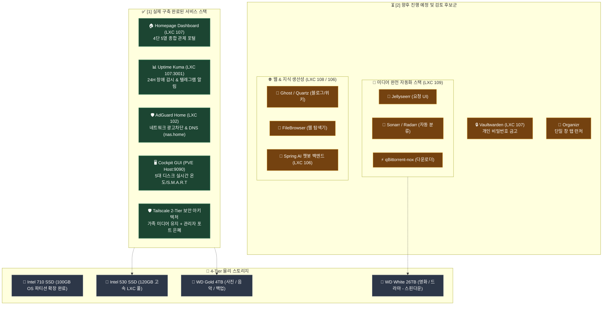
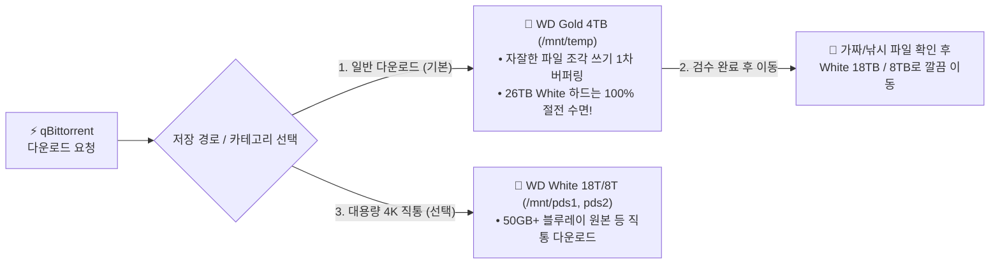

# 🧭 홈서버 서비스 구축 현황 및 확장 후보군 검토 가이드 (98)

> 💡 **본 문서는 실제 구축이 완료된 서비스 내역(✅)과 향후 홈서버 편의성 개선 및 기능 확장을 위해 검토 중인 진행 예정 후보군(⏳)을 한눈에 구분하여 파악할 수 있는 로드맵 가이드입니다.**

---

## 📊 1. 전체 서비스 구축 현황 & 진행 예정 후보군 총괄표

| 구분 | 서비스 명칭 | 권장 환경 / ID | 소모 RAM | 현재 상태 | 주요 역할 및 상세 가이드 |
| :---: | :--- | :---: | :---: | :---: | :--- |
| **인프라/관제** | **🏠 Homepage Dashboard** | LXC 107 | ~50 MB | **✅ 실제 구축 완료** | 4단 5열 올인원 포털 & 5대 스토리지 실시간 관제 ([가이드 12](12_homepage_dashboard_and_disk_architecture.md)) |
| **인프라/관제** | **📊 Uptime Kuma** | LXC 107 (`:3001`) | ~40 MB | **✅ 실제 구축 완료** | 24시간 서비스 장애/복구 모니터링 & 텔레그램 알림 ([가이드 12](12_homepage_dashboard_and_disk_architecture.md)) |
| **인프라/관제** | **🛡️ AdGuard Home** | LXC 102 (`:80/53`)| ~40 MB | **✅ 실제 구축 완료** | 집안 전체 기기 광고/트래커 차단 & 내부 DNS 매핑 ([가이드 13](13_adguard_home_dns_setup.md)) |
| **인프라/관제** | **🖥️ Cockpit Web GUI** | PVE Host (`:9090`) | ~10 MB | **✅ 실제 구축 완료** | 5대 물리 디스크 실시간 온도 & S.M.A.R.T 건강도 관제 ([가이드 14](14_cockpit_disk_monitoring_guide.md)) |
| **네트워크/보안** | **🛡️ Tailscale Subnet Router** | PVE / LXC | ~20 MB | **✅ 설계 & 문서화 완료** *(구축 대기)* | 관리자 포트(PVE, DSM, SSH) 완전 은폐 & 가족 미디어 포트포워딩 유지 |
| **접속/런처** | **📑 Organizr** | LXC / Docker | ~50 MB | **⏳ 진행 예정 후보** | 단일 창 탭 런처 포털 (Home 탭에 Homepage 임베드 검토) |
| **보안/금고** | **🔒 Vaultwarden** | LXC 107 (Docker) | ~20 MB | **⏳ 진행 예정 후보** | 1Password 대체 나만의 초경량 비밀번호/보안메모 금고 |
| **미디어 자동화** | **🍿 Jellyseerr** | LXC 109 | ~150 MB | **⏳ 진행 예정 후보** | 넷플릭스 스타일 웹 화면에서 영화/드라마 원클릭 요청 UI |
| **미디어 자동화** | **🤖 Sonarr / Radarr** | LXC 109 | ~300 MB | **⏳ 진행 예정 후보** | 방영/개봉 일정 추적, 한글 자막 매칭 및 26TB White 하드 자동 분류 |
| **미디어 자동화** | **⚡ qBittorrent-nox** | LXC 109 | ~100 MB | **⏳ 진행 예정 후보** | 백그라운드 토렌트 다운로드 및 완료 후 자동 시딩 중지 (스핀다운 보호) |
| **지식/웹사이트** | **📝 Ghost / Astro** | LXC 108 | ~150 MB | **⏳ 진행 예정 후보** | 개인 기술 블로그 & 포트폴리오 웹사이트 |
| **지식/웹사이트** | **📚 Quartz** | LXC 108 | ~50 MB | **⏳ 진행 예정 후보** | Obsidian(옵시디언) 마크다운 노트를 예쁜 웹 지식 위키로 호스팅 |
| **파일 관리** | **📁 FileBrowser** | LXC 107 / 독립 | ~15 MB | **⏳ 진행 예정 후보** | 웹 브라우저 기반 파일 탐색기 & 임시 다운로드 링크 공유기 |
| **AI / 개발** | **🤖 Spring AI Backend** | LXC 106 | ~500 MB | **⏳ 진행 예정 후보** | Java 21 + Spring Boot 기반 개인 AI 챗봇 및 NAS 제어 백엔드 |

---

## 🏗️ 2. 시스템 아키텍처 다이어그램

---

## 📋 3. 카테고리별 상세 분석 및 가이드

---

### ① ⚡ 관제 & 인프라 (Monitoring & Infrastructure)

#### ✅ [실제 구축 완료] 🏠 Homepage 올인원 대시보드 (LXC 107)
- **상태**: 구축 완료 (`http://192.168.1.107:3000` / `http://waceh.asuscomm.com:3000`)
- **특징**: 4단 5열 대칭 레이아웃, 호스트 전체 CPU/RAM 바인드 마운트, 5대 물리 스토리지 여유 용량 관제.
- **상세 가이드**: [`docs/12_homepage_dashboard_and_disk_architecture.md`](12_homepage_dashboard_and_disk_architecture.md)

#### ✅ [실제 구축 완료] 📊 Uptime Kuma 24H 장애 관제 (LXC 107)
- **상태**: 구축 완료 (`http://192.168.1.107:3001`)
- **특징**: RAM 단 40MB 소모, 서버 다운 시 텔레그램 봇으로 1초 만에 스마트폰 알림 발송.

#### ✅ [실제 구축 완료] 🛡️ AdGuard Home 광고 차단 & 로컬 DNS (LXC 102)
- **상태**: 구축 완료 (`http://192.168.1.102:3000` ➔ `:80/53`)
- **특징**: Go Native 초경량 구동(RAM 40MB), 집안 모든 기기 광고 차단, `nas.home` 예쁜 내부 도메인 매핑.
- **상세 가이드**: [`docs/13_adguard_home_dns_setup.md`](13_adguard_home_dns_setup.md)

#### ✅ [실제 구축 완료] 🖥️ Cockpit 웹 시스템 & 디스크 S.M.A.R.T 관제 (Host OS)
- **상태**: 설치 완료 (`https://192.168.1.200:9090`)
- **특징**: 5대 물리 디스크 실시간 온도(°C), S.M.A.R.T 건강도, 불량 섹터 웹 GUI 모니터링.
- **상세 가이드**: [`docs/14_cockpit_disk_monitoring_guide.md`](14_cockpit_disk_monitoring_guide.md)

#### ⏳ [진행 예정 후보] 📑 Organizr (단일 창 탭 런처 포털)
- **특징**: 여러 웹 서비스를 새 탭 없이 브라우저 창 1개 안에서 iframe 탭으로 전환.
- **검토 결과**: 메인 포털로 두고 Home 탭에 Homepage 대시보드를 임베드하는 듀얼 조합 가능.

---

### ② 🛡️ 네트워크 & 보안 (Security & Remote Access)

#### ✅ [설계 & 문서화 완료] 🛡️ Tailscale 기반 '하이브리드 2-Tier 외부 접속 보안'
- **핵심 아키텍처**:
  - **가족 미디어 계층**: Immich(2283), Gonic(4747), Jellyfin(8096) ➔ 공유기 포트포워딩 유지 (가족 사용성 100% 보장).
  - **관리자 인프라 계층**: Proxmox(8006), DSM(5000), SSH(22) ➔ 외부 포트포워딩 완전 폐쇄 & **Tailscale WireGuard 2FA 망**으로 완전 은폐.
- **모바일 클라이언트 운영**:
  - iOS Tailscale의 **On-Demand VPN** 활성화 시 셀룰러/외부 Wi-Fi에서 배터리 소모 없이 `192.168.1.xxx` 단일 내부 IP로 직통 연결.

---

### ③ 🍿 미디어 자동 수집 스택 (*Arr + qBittorrent - ⏳ 진행 예정 후보)

| 서비스 | 권장 환경 | 소모 RAM | 주요 특징 |
| :--- | :---: | :---: | :--- |
| 🍿 **Jellyseerr** | LXC 109 | ~150 MB | • 넷플릭스 스타일 UI에서 영화/드라마 검색 후 원클릭 '요청' |
| 🤖 **Sonarr / Radarr** | LXC 109 | ~300 MB | • 방영/개봉 일정 추적, 한글 자막 매칭 및 WD White 26TB 자동 분류 |
| ⚡ **qBittorrent-nox** | LXC 109 | ~100 MB | • 웹 UI 지원 다운로더, 다운로드 완료 즉시 시딩 중지 ➔ **26TB HDD 스핀다운 보호** |

#### 💡 [심층 분석] '스마트 버퍼링(Smart Buffering)' 다운로드 전략
> **"평소에는 고내구성 4TB Gold에서 다운로드 & 1차 검수 ➔ 26TB White 콜드 하드는 불필요한 스핀업 방지!"**

##### 1. 스마트 버퍼링이 최고의 전략인 이유:
1. **26TB White 하드 수명 극대화 (스핀다운 완벽 유지)**:
   - 토렌트 다운로드는 수천 개의 조각 파일을 쓰기 때문에 하드디스크 모터와 헤드에 지속적 부하를 줍니다.
   - 상시 음악/사진용으로 깨어있는 **WD Gold 4TB Enterprise 하드가 1차 버퍼로 다운로드를 전부 받아내므로, 26TB 거대 하드는 다운로드받는 몇 시간 동안 모터를 끄고 편안히 휴식**합니다.
2. **가짜/낚시 파일 1차 검수 및 깔끔한 정리**:
   - 4TB의 `temp` 폴더에서 영상 정상 여부, 자막 싱크를 먼저 확인한 뒤 알짜배기 원본만 18TB/8TB로 이동시키므로 콜드 스토리지가 항상 깨끗하게 유지됩니다.
3. **qBittorrent 카테고리 원클릭 분기 지원**:
   - 마그넷 링크 추가 시 카테고리만 지정하면 원하는 하드로 직통 다운로드 가능:
     - `📁 [일반 / 검수용 (기본값)]` ➔ `/volume1/temp` (WD Gold 4TB)
     - `🎬 [PDS1 대용량 직통]` ➔ `/volume2/PDS1` (WD White 18TB)
     - `🎬 [PDS2 대용량 직통]` ➔ `/volume3/PDS2` (WD White 8TB)

> ⚠️ **검토 주의사항**: 토렌트 인덱서 연동 시 저작권 IP 노출을 방지하기 위해 **VPN 프록시(Gluetun) 연동** 또는 **비율 0 즉시 시딩 중지** 설정이 동반되어야 안전합니다.

---

### ④ 🌐 개인 웹사이트 & 지식 생산성 (⏳ 진행 예정 후보)

| 서비스 | 권장 환경 | 소모 RAM | 주요 특징 |
| :--- | :---: | :---: | :--- |
| 🔒 **Vaultwarden** | LXC 107 | ~20 MB | • 1Password 대체 초경량 비밀번호/보안메모 금고 (Chrome/Safari/iOS FaceID 지원) |
| 📝 **Ghost / Astro** | LXC 108 | ~150 MB | • 마크다운 기반 개인 기술 블로그 & 포트폴리오 사이트 |
| 📚 **Quartz** | LXC 108 | ~50 MB | • Obsidian(옵시디언) 마크다운 노트를 예쁜 웹 지식 위키(디지털 가든)로 호스팅 |
| 📁 **FileBrowser** | LXC 107 | ~15 MB | • 브라우저에서 NAS 파일을 열람/업로드/공유 링크 생성하는 초경량 웹 탐색기 |

---

### ⑤ 🤖 Spring AI & 백엔드 개발 환경 (LXC 106 - ⏳ 진행 예정 후보)

* **배치 환경**: `LXC 106` (Debian 12, 2 Core, 2GB RAM on `local-530`)
* **핵심 기능**:
  1. **Java 21 + Spring Boot 3.x** 기반 개인 백엔드 API 서버 구동.
  2. **Spring AI 챗봇 연동**: OpenAI / Claude / 로컬 LLM(Ollama)과 연동하여 NAS 상태를 제어하거나 개인 지식을 질의응답하는 AI 챗봇 백엔드 구축.
