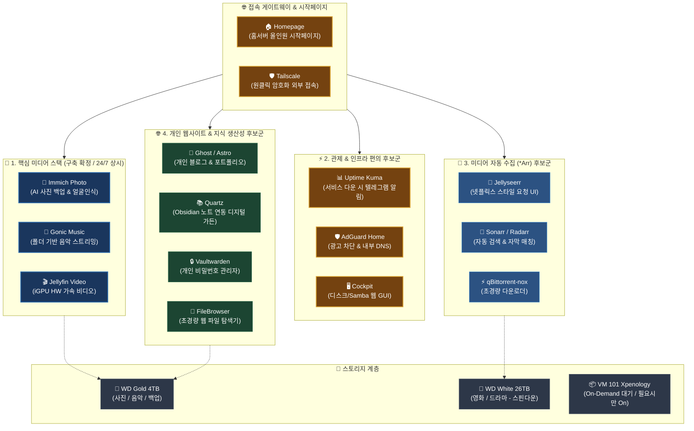

# 🧭 홈서버 확장 서비스 후보군 및 아키텍처 검토 가이드 (참고용) (98)

> ⚠️ **본 문서는 확정된 필수 구성이 아니며, 향후 홈서버 편의성 개선 및 기능 확장을 고려할 때 참고하기 위한 '검토용(Candidate & Reference)' 문서입니다.**

---

## 🏗️ 1. 확장 후보 서비스 종합 인프라 맵

---

## 📋 2. 카테고리별 후보 서비스 상세 분석

### ① ⚡ 홈서버 관제 & 인프라 편의 (삶의 질 향상 ⭐⭐⭐)
| 서비스 | 권장 구동 환경 | 소모 RAM | 주요 특징 및 추천 이유 |
| :--- | :---: | :---: | :--- |
| 🏠 **Homepage** | LXC / Docker | ~50 MB | • **홈서버 올인원 시작페이지**: Next.js 기반 초경량 대시보드 • Proxmox CPU/RAM 게이지, Immich 사진 장수, Jellyfin 시청자 수 실시간 위젯 표시 • DB 불필요, 간단한 YAML 설정으로 관리 |
| 📊 **Uptime Kuma** | LXC / Docker | ~50 MB | • Proxmox 호스트, VM 101, Immich, Gonic, 네트워크 상태를 1분마다 모니터링 • 서버 장애 발생 시 **텔레그램 / 디스코드로 즉시 푸시 알림** 발송 |
| 🛡️ **Tailscale** | LXC / PVE | ~30 MB | • 공유기 포트포워딩 없이 외부(LTE/카페/해외)에서 집안 로컬 IP로 암호화 직결 |
| 🛡️ **AdGuard Home** | LXC 102 | ~100 MB | • 집안 모든 기기(스마트폰, 스마트TV, PC) 광고/추적기 원천 차단 • `photo.home`, `music.home` 등 내부 로컬 도메인 DNS 매핑 |
| 🖥️ **Cockpit** | PVE Host 패키지 | ~20 MB | • Proxmox 호스트(Debian)에 웹 GUI 추가 (`:9090`) • 하드 디스크 건강도(S.M.A.R.T), 온도 확인 및 클릭으로 Samba 공유 폴더 관리 |

---

### ② 🍿 미디어 자동 수집 & 정리 스택 (Jellyfin 연동 후보 ⭐⭐)
| 서비스 | 권장 구동 환경 | 소모 RAM | 주요 특징 및 추천 이유 |
| :--- | :---: | :---: | :--- |
| 🍿 **Jellyseerr** | LXC / Docker | ~150 MB | • 넷플릭스 스타일 UI에서 보고 싶은 영화/드라마 검색 후 원클릭 '요청' |
| 🤖 **Sonarr / Radarr** | LXC / Docker | ~300 MB | • 방영/개봉 일정 추적, 한글 자막 자동 매칭 및 WD White 26TB 자동 분류 |
| ⚡ **qBittorrent-nox** | LXC / Docker | ~100 MB | • 웹 UI 지원 토렌트 클라이언트 • 다운로드 완료 후 자동 시딩 중지 ➔ **WD White HDD 스핀다운 유지** |

---

### ③ 🌐 개인 웹사이트 & 지식 생산성 (나만의 공간 후보 ⭐⭐)
| 서비스 | 권장 구동 환경 | 소모 RAM | 주요 특징 및 추천 이유 |
| :--- | :---: | :---: | :--- |
| 📝 **Ghost** (또는 Astro) | LXC / Docker | ~150 MB (Astro는 10MB) | • **개인 기술 블로그 / 포트폴리오 웹사이트** • 깔끔하고 모던한 에디터, 모바일 최적화 웹페이지 외부 공개 |
| 📚 **Quartz** | LXC / Nginx | ~15 MB | • **Obsidian(옵시디언) 연동 디지털 가든** • 개인 로컬 마크다운 노트를 예쁜 위키 웹사이트로 자동 빌드 및 호스팅 |
| 🔒 **Vaultwarden** | LXC / Docker | ~20 MB | • **초경량 개인 비밀번호 관리자** (Bitwarden 오픈소스 Rust 버전) • 크롬 익스텐션, iOS/Android 자동 완성 완벽 호환 |
| 📁 **FileBrowser** | LXC / Docker | ~15 MB | • 단일 바이너리 초경량 **웹 파일 탐색기** • 웹 브라우저에서 NAS 파일 바로 탐색, 다운로드, 임시 공유 링크 생성 |

---

## 🏛️ 3. 아키텍처 & 리소스 운영 전략 (On-Demand)

### 💡 Xpenology(VM 101)의 On-Demand 대기 운영 철학
- **평소 (24/7 상시 운영)**:
  - VM 101은 **정지(`Stopped`) 상태**로 유지.
  - 상시 점유 메모리: **0 MB** (16GB 중 0% 점유).
  - Immich, Gonic, Jellyfin 등 상시 서비스는 Proxmox 호스트가 디스크를 마운트하여 **바인드 마운트(`mp0`)**로 직접 연결하므로 헤놀로지가 꺼져 있어도 24시간 완벽 작동.
- **필요 시 (On-Demand 부팅)**:
  - Synology Active Backup으로 PC 백업을 수행하거나 시놀로지 전용 도구가 필요할 때만 `qm start 101`로 기동.
  - 작업 완료 후 `qm shutdown 101`로 다시 정상 종료.

---

## 📊 4. 16GB RAM 기준 통합 리소스 배치 시뮬레이션

| 순번 | VM / LXC 컨테이너 명칭 | 포함 서비스 | vCPU | RAM 할당 | 스토리지 위치 |
| :---: | :--- | :--- | :---: | :---: | :--- |
| **VM 101** | **Xpenology** *(On-Demand)* | 순수 백업 / 스토리지 툴 | 2 Core | **(평소 0 MB)** | Intel 710 SSD |
| **LXC 102** | **Network Core** | AdGuard Home + Tailscale | 1 Core | **0.5 GB** | Intel 530 SSD (`local-530`) |
| **LXC 103** | **Photo Core** | Immich (Server + ML + Postgres + Valkey) | 2 Core | **4.0 GB** | Intel 530 SSD + WD Gold |
| **LXC 104** | **Music Core** | Gonic (초경량 Go 데몬) | 1 Core | **0.5 GB** | Intel 530 SSD + WD Gold |
| **LXC 105** | **Media Core** | Jellyfin (iGPU QuickSync Passthrough) | 2 Core | **2.0 GB** | Intel 530 SSD + WD Gold/White |
| **LXC 107** | **Dashboard & Monitor** *(후보)* | Homepage + Uptime Kuma + Vaultwarden + FileBrowser | 1 Core | **1.0 GB** | Intel 530 SSD (`local-530`) |
| **LXC 108** | **Personal Web** *(후보)* | Ghost(블로그) or Quartz(위키) | 1 Core | **0.5 GB** | Intel 530 SSD (`local-530`) |
| **LXC 109** | **Media Auto** *(후보)* | Jellyseerr + *Arr + qBittorrent | 2 Core | **1.5 GB** | Intel 530 SSD + WD White |
| **Host** | **Proxmox VE 8.x** | Host OS + ZFS/ARC + Linux Page Cache | - | **~6.0 GB** | Intel 710 SSD |
| **합계** | **전체 풀가동 기준** | | | **~16.0 GB** | **16GB 메모리 완벽 최적화** |

---

## 🚀 5. 단계별 검토 및 도입 로드맵 (권장 순서)

1. **1단계 (기본 확정 스택 완성)**:
   - `Xpenology(On-Demand)` + `Immich` + `Gonic` + `Jellyfin` 셋업 완료 및 안정성 확인
2. **2단계 (관리 편의성 & 대시보드 검토)**:
   - `Homepage`(홈서버 시작페이지) + `Uptime Kuma`(상태 모니터링/장애알림) + `Tailscale` 연동
3. **3단계 (개인 공간 & 생산성 검토)**:
   - `Ghost` / `Quartz`(개인 블로그/지식위키) + `Vaultwarden`(비밀번호 관리)
4. **4단계 (미디어 자동 수집 검토)**:
   - `Jellyseerr` + `*Arr` + `qBittorrent-nox` 자동화 구성
