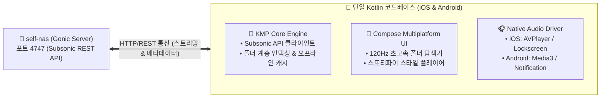
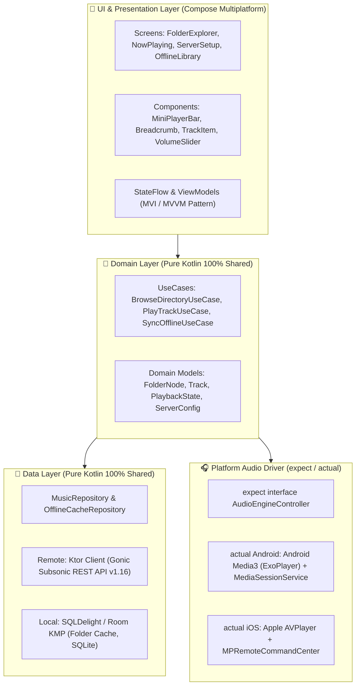
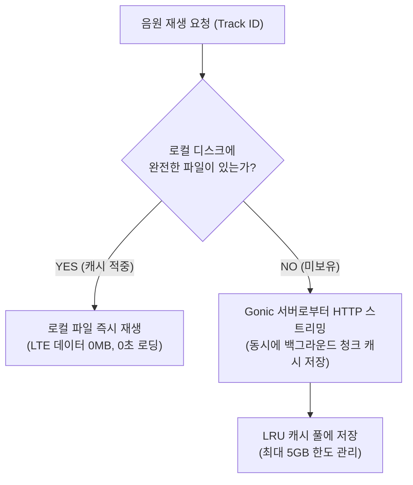

# 📱 Kotlin Multiplatform 기반 Gonic 전용 폴더 스트리밍 음악 앱 아키텍처 설계서 (99)

> **[번외편] 자작 NAS(`self-nas`)의 Gonic 서버와 연동하여, 디렉토리(폴더) 구조 그대로 무손실 음원을 스트리밍 및 오프라인 재생하는 iOS & Android 네이티브 모바일 앱(KMP) 설계 및 아키텍처 가이드입니다.**

---

## 🎯 1. 프로젝트 비전 및 핵심 목표



1. **폴더(디렉토리) 중심 UX**: 태그가 엉망이거나 비정규 앨범이라도 NAS의 4TB 하드에 정리된 폴더 구조 그대로 직관적 탐색 및 재생.
2. **백엔드 엔지니어링 기반 견고한 아키텍처**: KMP(Kotlin Multiplatform)를 통해 비즈니스 로직, DTO, 캐싱 정책을 100% 공유하고, OS 종속 오디오 서비스만 최소한으로 바인딩.
3. **완벽한 백그라운드 & 잠금화면 제어**: 화면이 꺼지거나 주머니에 넣어도 끊김 없는 백그라운드 재생, 잠금화면 앨범아트, 에어팟/블루투스 핸들 리모컨 연동.
4. **스마트 오프라인 캐싱**: 한 번 스트리밍한 곡 및 지정한 폴더 전체를 기기에 암호화/압축 캐싱하여 LTE 데이터 소모 0MB 달성.

---

## 🏗️ 2. 전체 시스템 아키텍처 (Clean Architecture)



---

## 📡 3. Gonic (Subsonic REST API) 연동 명세

Gonic은 표준 Subsonic REST API 규격을 준수하므로, 초경량 비동기 HTTP 클라이언트인 **Ktor Client**를 사용하여 연동합니다:

### 🔑 주요 API 엔드포인트 맵

| 기능 | Gonic REST API 엔드포인트 | 전달 파라미터 | 반환 데이터 |
| :--- | :--- | :--- | :--- |
| **연결 인증 / 핑** | `GET /rest/ping.view` | `u, t, s, v=1.16.1, f=json` | 서버 상태 및 버전 |
| **최상위 폴더 목록** | `GET /rest/getMusicFolders.view` | `u, t, s, v=1.16.1, f=json` | 4TB `/volume1/music` 루트 |
| **디렉토리 계층 조회** | `GET /rest/getMusicDirectory.view` | `id={folderId}` | 하위 폴더 목록 + 음원 파일 목록 |
| **음원 스트리밍** | `GET /rest/stream.view` | `id={trackId}, maxBitRate=0` | 오디오 바이너리 스트림 (FLAC/MP3) |
| **앨범아트 로딩** | `GET /rest/getCoverArt.view` | `id={coverArtId}, size=600` | 이미지 바이너리 (JPEG/PNG) |

> 💡 **인증 방식 (Token Auth)**: 비밀번호 원문 대신 `token = md5(password + salt)` 방식으로 안전하게 암호화하여 전송합니다.

---

## 🎧 4. 플랫폼별 오디오 엔진 설계 (`expect / actual`)

### 1) 공통 인터페이스 (`commonMain`)
```kotlin
// shared/src/commonMain/kotlin/com/nas/music/audio/AudioEngineController.kt
expect class AudioEngineController {
    val playbackState: StateFlow<PlaybackState>
    fun loadAndPlay(track: Track, startPositionMs: Long = 0)
    fun pause()
    fun resume()
    fun seekTo(positionMs: Long)
    fun setVolume(volume: Float)
}

data class PlaybackState(
    val currentTrack: Track?,
    val isPlaying: Boolean,
    val currentPositionMs: Long,
    val durationMs: Long,
    val isBuffering: Boolean
)
```

### 2) Android 구현 (`androidMain`)
- **엔진**: `androidx.media3:media3-exoplayer`
- **백그라운드 서비스**: `MediaSessionService` 등록을 통해 안드로이드 알림바(Notification)에 실시간 컨트롤러 및 앨범아트 렌더링.
- **오디오 버퍼링**: `DefaultLoadControl`을 커스텀하여 네트워크 끊김 시 최대 5분 분량 사전 버퍼링.

### 3) iOS 구현 (`iosMain`)
- **엔진**: Apple `AVFoundation` (`AVPlayer` / `AVAudioSession`)
- **잠금화면/블루투스**: `MPNowPlayingInfoCenter`에 메타데이터(제목, 가수, 커버이미지) 바인딩 및 `MPRemoteCommandCenter`로 이어폰/CarPlay 이벤트 수신.

---

## 🎨 5. UI 화면 흐름 및 내비게이션 설계

```
[ 1. 서버 설정 화면 (최초 1회) ]
  ➔ NAS 주소 (http://your-domain.asuscomm.com:4747) & 계정 입력
       │
       ▼
[ 2. 메인 폴더 탐색기 (Folder Explorer) ] ◄─── (하단 미니 플레이어 상주)
  ├── 📂 Breadcrumb 경로 바: [ 음악 > 2000년대 > 발라드 > ... ]
  ├── 📁 하위 폴더 리스트 (클릭 시 즉시 하위 진입)
  └── 🎵 음원 트랙 리스트 (클릭 시 즉시 재생 / 우측 스와이프: 오프라인 다운로드)
       │
       ▼ (미니 플레이어 터치 시 전체 화면 확장)
[ 3. 풀스크린 플레이어 (Now Playing Screen) ]
  ├── 🖼️ 대형 앨범아트 (Coil 3 캐싱 + 앰비언트 블러 배경)
  ├── 📝 곡 제목 / 아티스트 / 음원 스펙 (FLAC 24bit / 96kHz 배지)
  ├── 🎚️ 실시간 탐색 바 (Scrubber Slider) & 재생 시간
  └── ⏯️ 이전곡 / 재생-일시정지 / 다음곡 / 반복 / 셔플 컨트롤
```

---

## 💾 6. 오프라인 다운로드 & 스마트 캐싱 전략



1. **자동 스트리밍 캐시 (Auto Cache)**: 스트리밍으로 1번 들은 곡은 자동으로 기기 내부 저장소에 저장되어 재청취 시 서버 트래픽이 발생하지 않음.
2. **폴더 단위 오프라인 다운로드 (Folder Offline Sync)**:
   - "2000년대 명곡" 폴더 옆의 **[다운로드(⬇️)]** 버튼 클릭 시, 하위 모든 트랙을 백그라운드에서 자동 일괄 다운로드.
   - 비행기 모드나 데이터 통신이 불가능한 환경에서도 100% 음악 감상 가능.

---

## 📂 7. 추천 프로젝트 디렉토리 구조 (Monorepo)

```
gonic-kmp-player/
├── gradle/
├── shared/                         # 📦 공통 모듈 (KMP)
│   ├── build.gradle.kts
│   └── src/
│       ├── commonMain/             # 90% 순수 Kotlin 공통 코드
│       │   ├── composeResources/   # 이미지, 아이콘, 다국어 리소스
│       │   └── kotlin/com/nas/gonic/
│       │       ├── api/            # Ktor Subsonic REST API 클라이언트
│       │       ├── audio/          # 오디오 컨트롤러 인터페이스 (expect)
│       │       ├── data/           # SQLite DB (SQLDelight) & Repository
│       │       ├── domain/         # UseCase & 데이터 모델
│       │       ├── ui/             # Compose UI 화면들 (Folder, Player, Settings)
│       │       └── viewmodel/      # MVI State & ViewModel
│       │
│       ├── androidMain/            # Android 네이티브 오디오 서비스 (Media3)
│       └── iosMain/                # iOS 네이티브 오디오 서비스 (AVPlayer)
│
├── composeApp/                     # 🤖 Android 실행 앱 (.apk 빌드)
│   └── src/androidMain/
│       └── AndroidManifest.xml
│
└── iosApp/                         # 🍏 iOS 실행 앱 (.ipa 빌드 / Xcode 프로젝트)
    ├── iosApp.xcodeproj
    └── iosApp/iOSApp.swift
```

---

## 🛠️ 8. 핵심 라이브러리 스택 (Dependencies)

```kotlin
// shared/build.gradle.kts 주요 의존성
kotlin {
    sourceSets {
        commonMain.dependencies {
            // 1. 선언형 UI
            implementation(compose.runtime)
            implementation(compose.foundation)
            implementation(compose.material3)
            implementation(compose.components.resources)
            
            // 2. 비동기 HTTP 통신 & 직렬화
            implementation("io.ktor:ktor-client-core:2.3.12")
            implementation("io.ktor:ktor-client-content-negotiation:2.3.12")
            implementation("io.ktor:ktor-serialization-kotlinx-json:2.3.12")
            
            // 3. 로컬 DB & 오프라인 영속성
            implementation("app.cash.sqldelight:runtime:2.0.2")
            
            // 4. 이미지 비동기 로딩 & 캐시
            implementation("io.coil-kt.coil3:coil-compose:3.0.0-rc01")
            implementation("io.coil-kt.coil3:coil-network-ktor:3.0.0-rc01")
            
            // 5. 코루틴 & 아키텍처
            implementation("org.jetbrains.kotlinx:kotlinx-coroutines-core:1.8.1")
            implementation("org.jetbrains.androidx.lifecycle:lifecycle-viewmodel-compose:2.8.0")
        }
    }
}
```

---

## 🚀 9. 결론 및 향후 개발 로드맵

- **1단계 (MVP)**: Gonic 서버 주소 등록 ➔ 폴더 트리 조회 ➔ 단일 곡 스트리밍 재생.
- **2단계 (Player 완성)**: 하단 미니 플레이어 + 전체화면 스포티파이 스타일 컨트롤러 + 앨범아트 로딩.
- **3단계 (백그라운드)**: iOS 잠금화면(NowPlaying) 및 안드로이드 알림창 미디어 바 연동.
- **4단계 (오프라인)**: 폴더 단위 일괄 다운로드 및 SQLite 로컬 캐시 엔진 탑재.
